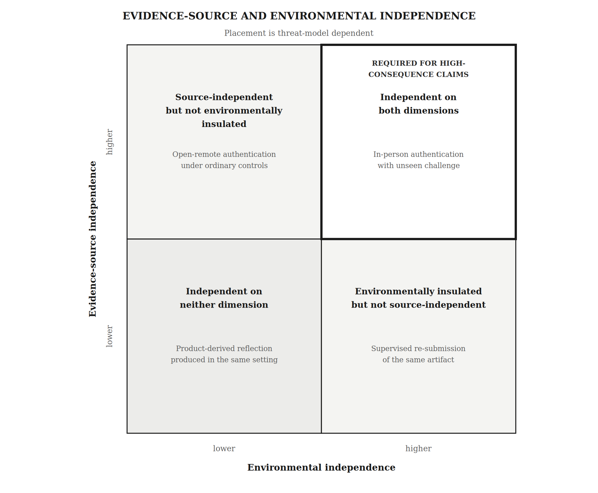

**From Task Design to Claim-Level Assurance**

**The Artificial Intelligence Assurance Protocol for AI-Mediated Higher Education**

*A methodological architecture for evidence planning, certification boundaries, and programme-level public claims*

**James McGaughran**

British University Vietnam | ORCID: 0009-0005-3324-7290

Correspondence: [james.mg@buv.edu.vn](mailto:james.mg@buv.edu.vn)

August 2026

*Canonical edition: AIAP Core Working Paper v6.5*

*Suggested citation: McGaughran, J. (2026). From task design to claim-level assurance: The Artificial Intelligence Assurance Protocol for AI-mediated higher education (AIAP Core Working Paper v6.5).*

**Core claim: Consequential assessment must specify what the student is claimed to know or do, what evidence supports that claim, and the conditions under which the inference is defensible.**

[[PAGEBREAK]]

# AIAP in 60 Seconds

AIAP asks one governing question: **What does this assessment allow an institution to claim about this student?** It requires programmes to identify the material capability, the conditions under which evidence is produced, the assurance mechanism, the evidence and combination rule, the permitted inference, and the programme or public use. The protocol does not try to make every assessment AI-free. It secures what must be demonstrated independently, authenticates consequential open work, makes non-certification explicit, and assesses AI-integrated professional practice where AI use is part of the construct.

*Figure 1. AIAP at a glance. The protocol decomposes an assessment into material claims, assigns each claim one of four assurance routes, and constrains what the resulting programme or public claim may say. The four certification objects are distinct: strength in one does not establish the others.*

**Taxonomy boundary.** The four lanes, four certification objects, and evidence objects used elsewhere in the paper are not parallel taxonomies and do not map one-to-one. Lanes classify the warrant or claim-status route; certification objects identify what is being claimed; evidence objects identify what is observed.

## Current evidence status

| **Axis** | **Current status and boundary** |
| --- | --- |
| Architecture | Specification-complete for scholarly evaluation and governed pilot preparation. |
| Operational | The version-matched standard, handbook, toolkit, workbooks, schema, pilot protocol, and verification records are included in the Release 6.5 package; public repository/DOI linkage remains pending. |
| Empirical | Integrated validation is not established. Lane 2A reliability, validity, equity, security, privacy, workload, and decision utility remain open. |
| Authority | Publication or conformance does not by itself authorize high-stakes assessment use, certification, or degree claims. |

# What AIAP Evidence Does and Does Not Establish

AIAP separates evidence objects that are routinely conflated. Each evidence source supports a bounded inference and leaves other claims unestablished unless additional, sufficiently independent evidence is supplied.

| **Evidence object** | **What it can support** | **What it does not establish by itself** | **Primary location** |
| --- | --- | --- | --- |
| Submitted product | Artifact quality under the declared open or controlled conditions. | Independent capability, complete production provenance, or accountable AI oversight. | [Section 7.7](#sec-7-7) / [Figure 4](#fig-4) |
| Lane 2A authentication | Present demonstrable competence: explanation, defence, verification, adaptation, or transfer. | Who or what produced every material element of the artifact, or unaided authorship. | [Sections 7.1–7.4](#sec-7) |
| Lane 3 workflow evidence plus authenticated judgement | Accountable AI-mediated capability, including verification, correction, override, and responsibility. | Unaided capability, complete provenance, or trustworthy oversight inferred from logs alone. | [Sections 7.1, 7.7, and 10](#sec-10) |
| Programme assurance map | Where and how programme outcomes are secured, authenticated, AI-integrated, non-certifying, or under-evidenced. | Individual certification beyond the mapped evidence or blanket claims about an entire degree. | [Sections 11–12](#sec-11) / [Appendix E](#app-e) |

## Reader paths

| **Reader** | **Fast path through the canonical edition** |
| --- | --- |
| New to AIAP | [AIAP in 60 Seconds](#aiap-in-60-seconds) → [Sections 4–5](#sec-4) → [Conclusion](#sec-16). |
| Lecturer or learning designer | [Sections 5–8](#sec-5) → [Appendix C](#app-c) → [Appendix D](#app-d). |
| Programme leader / quality assurance | [Sections 11–14](#sec-11) → [Appendix E](#app-e). |
| Researcher / psychometrician | [Sections 4](#sec-4), [7–10](#sec-7), and [15](#sec-15) → [Appendix G](#app-g). |
| Academic integrity, accreditation, or policy reader | [Section 3](#sec-3) → [Section 7.7](#sec-7-7) → [Section 10](#sec-10) → [Sections 12–14](#sec-12). |

[[PAGEBREAK]]

# Abstract

Generative artificial intelligence has weakened a common assessment inference: that an unsupervised submitted product reliably evidences the capability of the enrolled student. Task-design frameworks, especially the AI Assessment Scale (AIAS), have improved communication and redesign, but consequential certification still requires an explicit warrant linking the claim, production condition, evidence, decision rule, and programme use. This methodological paper develops the Artificial Intelligence Assurance Protocol (AIAP) through problem-driven design-science synthesis across assessment validity, security, oral authentication, programme assurance, AI-use evidence, and current sector frameworks. AIAP decomposes composite assessments into material claims and assigns one of four routes: secured assessment, competence-authenticated open assessment, open non-certifying assessment, or AI-integrated assessment. Its contribution is a claim-level evidence architecture that separates competence from provenance, requires predeclared product-authentication rules, treats modality as an evidence-strength variable, prevents dependent evidence from being double-counted, and constrains programme and public claims to what the evidence supports. The paper specifies a unified assurance-capacity gate, bounded use of process analytics and provenance technologies, temporal requalification, and a preregistration-ready pilot. AIAP is not empirically validated as an integrated institutional model. Its central falsifiable proposition is that competence-authenticated open assessment can add enough reliability, validity, equity, security, and decision utility to justify its privacy and workload costs. The normative standard and reference implementation are maintained as separate artifacts so scholarly claims, conformance requirements, and executable demonstrations are not conflated.

*Keywords: generative AI; higher education; assessment validity; assessment assurance; AI Assessment Scale; competence authentication; programme-level assurance; agentic AI; public-claim integrity*

[[PAGEBREAK]]

**Contents**

- [AIAP in 60 Seconds](#aiap-in-60-seconds)
- [What AIAP Evidence Does and Does Not Establish](#claim-boundary)
- [Abstract](#abstract)
- [Key Visual and Operational Index](#visual-operational-index)
- [Core Governing Rules Register](#rules-register)
- [1. Introduction: The assessment problem after generative AI](#sec-1)
  - [1.1 Methodological development and testable propositions](#sec-1-1)
- [2. AIAS as a foundational contribution](#sec-2)
  - [2.1 Steelmanning AIAS](#sec-2-1)
  - [2.2 What AIAP owes to AIAS](#sec-2-2)
  - [2.3 AIAS-adjacent and subsequent proposals](#sec-2-3)
  - [2.4 AIAS 2.1 and AIAP: convergence, compatibility, and remaining distinction](#sec-2-4)
  - [2.5 AIAP's delta: what this protocol adds](#sec-2-5)
- [3. The limits of task-level guidance as a complete assurance model](#sec-3)
- [4. From task design to claim-level assurance: the validity-centred reframing](#sec-4)
- [5. The Artificial Intelligence Assurance Protocol (AIAP)](#sec-5)
  - [5.1 Claim-level assurance profiles for composite assessments](#sec-5-1)
  - [5.2 Worked example: one open task, three defensible routes](#sec-5-2)
- [6. Boundary decision rule and AI roles and conditions](#sec-6)
  - [6.1 Decision rule for Lane 2A and Lane 3](#sec-6-1)
  - [6.2 AI roles and conditions as non-exclusive design lenses](#sec-6-2)
- [7. Evidence, AI-use records, and integrity standards](#sec-7)
  - [7.1 Authentication-event integrity](#sec-7-1)
  - [7.1.1 Prompt-bank security, live perturbation, and form equivalence](#sec-7-1-1)
  - [7.2 What Lane 2A authenticates, and what it does not](#sec-7-2)
  - [7.3 Product and authentication evidence-combination models](#sec-7-3)
  - [7.4 Evidence dependence and claim-evidence graphs](#sec-7-4)
  - [7.5 Process analytics and secure-provenance technologies](#sec-7-5)
  - [7.6 Evidence governance and data protection](#sec-7-6)
  - [7.7 What is no longer certified: programme, degree, and public-claim accounting](#sec-7-7)
- [8. Interactive oral assessment as authentication: validity, scale, and equity](#sec-8)
  - [8.1 Workload and the assurance-capacity signal](#sec-8-1)
- [9. Equity, access, accessibility, and transferability](#sec-9)
- [10. Agentic AI and near-horizon stress tests](#sec-10)
  - [10.1 Agentic-AI stress-test protocol](#sec-10-1)
- [11. Programme-level assurance: a worked example](#sec-11)
- [12. AIAP inside existing quality assurance regimes](#sec-12)
- [13. Comparing AIAS and AIAP](#sec-13)
- [14. Implementation, audit, risks, and safeguards](#sec-14)
- [15. Research agenda](#sec-15)
- [16. Conclusion](#sec-16)
- [Author declarations and evidence status](#author-declarations)
- [Appendices](#appendices)
  - [Appendix A. AIAP decision flow](#app-a)
  - [Appendix B. Student AI-use records](#app-b)
  - [Appendix C. Teacher assessment design sheet](#app-c)
  - [Appendix D. Example rubric templates](#app-d)
    - [Appendix D3. Worked equivalent alternative authentication route](#app-d3)
  - [Appendix E. Programme assurance map template](#app-e)
  - [Appendix F. Glossary of operational terms](#app-f)
  - [Appendix G. Minimum Lane 2A reliability and equity pilot](#app-g)
  - [Appendix H. Artifact roles, pilot readiness, and implementation pack](#app-h)
  - [Appendix I. Document history, canonical status, and artifact relationships](#app-i)
- [References](#references)

[[PAGEBREAK]]

# Key Visual and Operational Index

Use this selective retrieval map to jump directly to the highest-value figures, decision tables, and implementation instruments. It is intentionally not a complete list of every table or box.

| **Resource** | **Use it for** |
| --- | --- |
| [Figure 1. AIAP at a glance](#fig-1) | Whole architecture and the four distinct certification objects. |
| [Figure 2. Six-stage AIAP design workflow](#fig-2) | Stage 0 claim decomposition through Stage 5 programme mapping and public use. |
| [Figure 3. Evidence-source independence and environmental independence](#fig-3) | Source independence versus environmental independence. |
| [Figure 4. Forbidden inferential transfers](#fig-4) | Claims the evidence does not license by itself. |
| [Figure 5. Programme assurance spine](#fig-5) | How evidence is distributed across years, prompts, occasions, assessors, and modalities. |
| [Core Governing Rules Register](#rules-register) | Core protocol rules in one place, with their home sections; study-specific rules remain in Appendix G. |
| [Table 3. Validity argument structure](#tbl-3) | The six fields required for a defensible assessment claim. |
| [Table 4. AIAP assessment lanes](#tbl-4) | The four claim-level assurance routes and their bounded uses. |
| [Table 7. Authentication-event routing](#tbl-7) | How product and authentication mismatch is interpreted without automatic misconduct inference. |
| [Table 8. Evidence requirements by lane](#tbl-8) | Minimum and higher-stakes evidence for each route. |
| [Box 3. Product-authentication models](#box-3) | Hurdle, dual-score, and integrated-rubric combination rules. |
| [Table 9. Certification-claims matrix](#tbl-9) | What each lane may and may not support publicly. |
| [Section 7.1.1. Prompt security](#sec-7-1-1) | Cohort exposure, live perturbation, prompt rotation, retirement, and parallel-form equivalence. |
| [Table 10. Worked workload scenarios](#tbl-10) | Staff-hour and capacity implications of Lane 2A authentication. |
| [Table 11. Agentic AI stress-test logic](#tbl-11) | Near-horizon threats and the required assurance response. |
| [Box 1. Worked failure and repair](#box-1) | How a labels-only open task fails AIAP and how three defensible redesign routes differ. |
| [Box 5. Illustrative student-facing lane statements](#box-5) | Short, auditable wording that keeps student interpretive load low. |
| [Table 13. Programme-level architecture example](#tbl-13) | A worked three-year distribution of assurance evidence. |
| [Table 15. Lane 2B suitability and promotion triggers](#tbl-15) | When non-certifying work must move to stronger assurance. |
| [Appendix C. Teacher design sheet](#app-c) | Copy-ready claim, lane, evidence, equity, and public-wording fields. |
| [Appendix E. Programme assurance map](#app-e) | Versioned mapping of programme outcomes and evidence routes. |
| [Box 4. Three load-bearing limitations](#box-4) | The conditions under which AIAP must narrow, redesign, or withdraw claims. |
| [Appendix G. Minimum Lane 2A pilot](#app-g) | Reliability, validity, equity, security, privacy, and workload test design. |

[[PAGEBREAK]]

# Core Governing Rules Register

AIAP's core normative content is carried by named rules distributed across the protocol. This register collects the principal cross-cutting rules so they can be located, cited, and challenged directly. It restates rather than creates them; each governing statement remains in its home section. Study-specific rules for the minimum pilot remain in Appendix G because they govern that research design rather than the protocol as a whole.

| **Rule** | **Governing statement** | **Home** |
| --- | --- | --- |
| Evidence-plan authority rule | No lane, role, tier, or modality distinction has authority unless it changes the evidence plan or the claim status. If two categories support the same inference with the same evidence, the distinction is discursive and should be dissolved. | [Section 4](#sec-4) |
| Lane-modality rule | Lanes classify the kind of warrant used for a material claim; modality is an attribute of the evidence-producing condition. Modality may change controls, evidence strength, and the permitted inference without creating an additional lane. | [Section 4](#sec-4) |
| Claim-level application rule | Apply the boundary to each material claim. One task-level label may not erase a distinct construct or permit one evidence source to stand in for another. | [Section 6](#sec-6) |
| Lane 2A / Lane 3 decision rule | If the AI-mediated process is itself part of the certified capability, the claim uses Lane 3. If AI is a means to a non-AI-focused artifact and the capability remains disciplinary, the claim uses Lane 2A. | [Section 6.1](#sec-6-1) |
| Lane 2B discipline rule | Lane 2B is an explicit non-certifying claim-status decision, not a weaker authentication mechanism. It must record where the consequential capability is assured instead. | [Section 7](#sec-7) |
| High-stakes Lane 3 rule | Prompts, logs, screenshots, version histories, and reflective accounts can be generated, curated, or reconstructed, and cannot alone carry a high-stakes oversight claim. | [Section 7](#sec-7) |
| Prompt-security and form-equivalence rule | Consequential authentication must preserve the unseen or meaningfully perturbed status of its challenge through declared bank governance, exposure monitoring, rotation or event-generated perturbation, and evidence that parallel forms support comparable decisions. | [Section 7.1.1](#sec-7-1-1) |
| Individual-attribution rule | Group or collaborative formats may support an individual claim only when each student receives separately attributable evidence, a separately addressed challenge where needed, and an individual decision record. | [Sections 7 and 11](#sec-11) |
| Individual-certification rule | Every student must complete the declared minimum authentication when an individual consequential claim depends on it. Sampling supports moderation, calibration, audit, and research; it cannot replace individual certification evidence. | [Section 7](#sec-7) |
| Fail-closed combination rule | A failed load-bearing prerequisite cannot be compensated by strength elsewhere in a serial chain. Genuinely parallel evidence may be accumulated only when its dependence structure and aggregation rule are declared. | [Section 7.4](#sec-7-4) |
| Dual-independence rule | High-consequence claims require at least one evidence path sufficiently independent in both source and environment for the declared threat model. | [Section 7.4](#sec-7-4) |
| Assurance Capacity Gate | An assurance claim is not defensible when the mechanism cannot be delivered, moderated, accommodated, appealed, and requalified within declared operational limits. | [Section 14](#sec-14) |
| Capacity-degradation rule | If required capacity fails after assessment begins, the institution must pause, provide an equivalent governed fallback, narrow or delay the decision, or withhold the affected claim; it may not silently dilute the declared evidence standard. | [Section 14](#sec-14) |
| Public-claim accounting rule | A programme, degree, or credential claim must not imply unaided production or complete provenance when the programme did not collect evidence capable of supporting that inference. | [Section 7.7](#sec-7-7) |
| Pilot-readiness rule | A programme may not claim AIAP-Full implementation unless the selected mechanisms are understood, feasible, calibrated, accessible, mapped, and past the Assurance Capacity Gate. | [Appendix H](#app-h) |
| Standalone-sufficiency rule | This canonical edition is complete for scholarly evaluation and criticism. Operational implementation additionally requires locally completed instruments, approvals, staffing, and authority assignment. | [Appendix H](#app-h) |

# 1. Introduction: The assessment problem after generative AI

A conscientious student reads an assessment brief that says AI may be used for brainstorming but not drafting. The student follows the rule, spends longer producing the work, and submits with an honest declaration. A strategic student uses AI throughout the process, does not disclose it, and submits a polished artifact. If the task is unsupervised and the institution has no reliable way to observe or authenticate process, the assessment condition is no longer common across the cohort. The problem is not only cheating. The problem is that the institution may be making different inferences from superficially similar artifacts.

Universities are therefore no longer asking only whether students can access generative artificial intelligence. They are asking whether assessment claims remain valid when access to AI is ambient, embedded, multimodal, and increasingly agentic. The historical logic of coursework assumed that a submitted artifact could stand as a reasonable proxy for student capability. That assumption has always been imperfect. Students could receive tutoring, peer assistance, proofreading, translation support, template guidance, or contract cheating support before generative AI became widely available. The difference now is scale, speed, accessibility, plausibility, and integration into ordinary digital work environments.

A student can use a general-purpose model to understand the task, generate possible structures, locate sources, summarize readings, produce drafts, revise style, check grammar, generate code, create visuals, translate arguments, and rehearse an oral defence. In many environments, some form of AI support is also built into ordinary software. This does not mean every use of AI is misconduct. It means assessment design can no longer depend on unexamined assumptions about what happens between the assignment brief and the submitted artifact.

Generative AI did not create every weakness that AIAP addresses. It made older assessment problems harder to ignore: unequal support conditions, weak inference from product to capability, unverifiable process, and fragmented programme-level evidence. AIAP is therefore not only an AI-response framework. It is an assessment assurance architecture sharpened by AI-mediated conditions. Independent capability does not mean that no AI, tutoring, peer discussion, or resource support has touched the learning process. It means the student can personally demonstrate the relevant capability under conditions that make the inference defensible.

The AI Assessment Scale (AIAS), developed by Perkins, Furze, Roe, and MacVaugh, has been one of the most influential early attempts to give educators a usable vocabulary for this new environment. The original AIAS was presented as a practical and sufficiently comprehensive tool for integrating generative AI into assessment by selecting an appropriate level of AI use based on the learning outcomes being addressed (M. Perkins, Furze, et al., 2024). AIAS 2.1 now describes the scale as a five-level framework for deciding what role AI should play in a task and redesigning the task so that the decision is reflected in its evidence and marking criteria (AI Assessment Scale, 2026a, 2026b, 2026c). The official site reports use in more than 350 institutions and availability in more than 30 languages; these are provider-reported current-status figures rather than independently audited adoption estimates. The site also states that the framework is owned and maintained by Learning Innovation Practice Ltd (AI Assessment Scale, 2026a).

Those contributions are significant. AIAS helped many institutions move beyond the crude binary of "ban AI" or "allow AI." AIAS 2.1 is not a simple permission scale: it is a task-design and communication framework that asks educators to align learning outcomes, task conditions, evidence, rubrics, and AI use. The remaining assurance problem is narrower. Even a well-designed task label does not by itself specify which claim about a person, artifact, workflow, programme, or degree is warranted by the resulting evidence, how evidence sources affect certification, or when a claim must be narrowed or withheld.

This paper argues for a move from task-level guidance to claim-level assurance. The central question is not merely what role AI may play in a task, but what the student must demonstrate, what evidence supports that inference, and how the resulting claim may be used. This move does not reject AIAS. It preserves AIAS as a task-design and communication scaffold while locating AIAP behind it as an evidence and inference architecture for consequential certification. The relationship is layered rather than generational. The one-letter distinction is deliberate lineage rather than equivalence: AIAS names a task-design and communication scale; AIAP names a claim-level assurance protocol.

In this paper, assessment assurance means the defensible warrant that an assessment result means what it claims to mean about a specific student capability, given the conditions under which the evidence was produced. Assurance is therefore stronger than communication but weaker than certainty: it requires a transparent validity argument connecting the learning claim, assessment condition, assurance mechanism, evidence, inference, and programme-level use.

The proposed model is the Artificial Intelligence Assurance Protocol (AIAP). AIAP is not a new traffic-light scale. It is a protocol for aligning learning claims, assessment conditions, AI roles and conditions, evidence requirements, and programme-level assurance. It treats AI use not as a quantity to be permitted, but as a condition that changes the validity argument behind an assessment. Higher education cannot secure every assessment against AI, nor should it try. Institutions should instead be explicit about which claims require materially constrained demonstration, which can be authenticated through process, defence, or transfer, which are explicitly non-certifying in the present task, and which deliberately assess AI-integrated professional practice.

AIAP's specific contribution is not the existence or number of its lanes. Its strongest additions are claim-level rather than task-level decomposition; pre-declaration of how product and authentication evidence affect grading or certification; treatment of modality as an evidence-strength variable; explicit separation of competence from artifact provenance; and programme-level accounting of where consequential claims are actually assured. AIAS provides a communication scaffold, programme-level reform provides secured/open pathways, structural critiques show why labels without changed evidence produce enforcement illusion, and validity theory clarifies the inference chain. AIAP integrates these strands under the evidence-plan authority rule formalized in Section 4: distinctions earn authority only through the evidence or claim-status differences needed for the permitted inference.

## 1.1 Methodological development and testable propositions

AIAP was developed through a problem-driven design-science synthesis rather than a systematic review. The assurance problem was decomposed into observable failures: unverifiable production conditions, invalid inference from product to capability, declaration asymmetry, weak detection, programme fragmentation, inequitable burden, privacy risk, and unsustainable workload. Relevant source domains were then sampled from assessment validity, assessment security, AIAS and adjacent frameworks, programme-level assurance, oral and interactive assessment, disclosure research, AI detection, equity, and institutional quality assurance.

Design requirements followed from those failures: every category must alter evidence or claim status; every high-stakes claim must identify its production condition and warrant; open assessment must be differentiated; and assurance mechanisms must be proportionate to stakes. Candidate categories and mechanisms were compared against AIAS, two-lane approaches, structural-versus-discursive reform, FACT, risk frameworks, assessment twins, programmatic assessment, and recent sector guidance. Boundary tests removed any distinction that did not change the evidence plan.

**Illustrative boundary test.** A disclosure-only open category fails the evidence-plan rule. Disclosure can improve transparency, but without controlled production, authentication, or an explicit non-certifying claim it does not strengthen the warrant from artifact to capability. It therefore collapses into Lane 2B or requires redesign rather than becoming a fifth lane. Delivery modality is treated as an evidence-condition attribute rather than as a lane. In-person, invigilated-remote, and open-remote formats may change controls, evidence strength, and the permitted inference; those differences must be recorded in the evidence plan, but they do not create a separate lane unless the claim status or assurance mechanism changes.

The resulting protocol was stress-tested against remote and agentic AI, disclosure bias, construct-irrelevant oral-performance variance, Lane 2B drift, data-governance burden, evidence dependence, and implementation capacity. Explicit falsification conditions were then specified for reliability, equity, workload, modality, privacy, programme mapping, and evidence-plan compliance. This method yields testable design propositions, not proof of effectiveness; the integrated protocol remains subject to empirical validation.

The scholarly contribution is expressed through five propositions:

- **Traceability proposition.** In blinded comparison using a preregistered completeness-and-consistency rubric, trained reviewers using claim-level AIAP profiles will produce a higher proportion of adequate evidence plans than reviewers given task labels alone.

- **Incremental-validity proposition.** A reliable and equitable Lane 2A mechanism will add decision-relevant evidence of present competence beyond product-only evidence.

- **Evidence-dependence proposition.** Explicit independence groups and combination rules will reduce double-counting and false confidence relative to unstructured triangulation.

- **Public-claim proposition.** In blinded audit using a preregistered claim-evidence rubric, programmes using a versioned AIAP assurance map will produce fewer external capability statements rated as exceeding the mapped evidence than comparator programmes without the map.

- **Capacity proposition.** Programmes that fail one or more load-bearing Assurance Capacity Gate conditions will show higher rates of incomplete or cancelled authentication, unmet accessibility routes, rescheduling, unresolved appeals, capacity-driven claim narrowing, or public claims that exceed delivered evidence than otherwise comparable programmes that pass the gate.

# 2. AIAS as a foundational contribution

## 2.1 Steelmanning AIAS

A serious critique must begin by steelmanning AIAS rather than attacking its weakest implementations. In its original form, AIAS responded to a real institutional need. Educators were being asked to redesign assessment almost overnight after the public arrival of ChatGPT and related tools. Many institutions moved quickly toward prohibitions, detection tools, or generic integrity warnings. AIAS offered a more pedagogically nuanced alternative by proposing multiple levels of permitted AI use, ranging from no AI to full AI and AI exploration (M. Perkins, Furze, et al., 2024).

The original AIAS article described the framework as practical, simple, and flexible. Its purpose was not only to restrict AI but to help educators identify where generative AI might be pedagogically appropriate. It foregrounded transparency, ethical integration, and dialogue between staff and students. In this sense, AIAS had a constructive function: it encouraged teachers to articulate their assumptions about assessment rather than leaving students to infer hidden rules.

The pilot implementation at British University Vietnam strengthened AIAS as a practical framework. In the published AJET article, Furze et al. (2024) reported 112 AI-related penalties among 1,722 submissions in January 2023 (6.50%), 86 among 5,255 submissions in April 2023 (1.64%), four among 1,576 submissions in July 2023 (0.25%), and none among 3,996 submissions in October 2023. The different semester denominators mean that the counts and rates should be read together rather than as a constant-exposure time series. The same study reported relative increases of 5.9% in mean grades and 33.3% in overall module pass rates between October 2022 and October 2023; the source describes percentage increases rather than percentage-point changes. Those figures matter because AIAS has an empirical implementation signal that AIAP does not yet have, but they require careful interpretation. The authors note that the reporting decline was partly shaped by a policy change allowing some AI-related cases to be handled through grade adjustment rather than formal misconduct reporting. The misconduct and attainment series should therefore not be treated as independent causal effects: both were observed amid concurrent policy, assessment, and pedagogical changes. The study was also conducted in one institutional setting using a pre-post design without a control group, so it cannot establish that AIAS caused improved learning or that the findings generalize across disciplines and institutions. Still, the pilot demonstrated that AIAS could be operationalized in a real university and create a shared language for assessment redesign.

The revised AIAS is also stronger than many critiques acknowledge. M. Perkins et al. (2025a, 2025b) frame AIAS as a dialogue and assessment-redesign framework rather than an enforcement mechanism. AIAS 2.1 preserves the five levels but uses one statement per level, defines each level as a kind of task rather than a degree of permission, and states more explicitly what is assessed at Levels 2, 3, and 4. Level 1 places the obligation to exclude AI on the controlled environment. Levels 2–5 may also be delivered under secured conditions because the role assigned to AI and the security of the environment are separate design decisions (AI Assessment Scale, 2026a, 2026b, 2026c).

Taken in its strongest form, AIAS is not merely a policing tool or a permission framework. Its implementation guide begins with validity, requires structural changes to briefs, evidence, rubrics, and checkpoints, encourages faculty- and programme-level coordination, and treats equity, access, staff capability, and multiple evidence points as implementation conditions (AI Assessment Scale, 2026c). It also states that visible process materials do not verify the level at which a student actually worked. This is an important convergence with AIAP: drafts, logs, histories, and reflections may support judgement or professional accountability, but they do not automatically authenticate identity, competence, or production provenance.

AIAS 2.1 is also supported by an Advisor tool described by the official site as helping educators select a level, revise task wording, choose evidence, and sketch rubric criteria (AI Assessment Scale, 2026a). AIAS 2.1 separately describes the Level 3 design commitment as testable by running a brief through a model and marking the result (AI Assessment Scale, 2026b). These checks remain advisory: one model trial cannot establish assessment validity, resistance to current or future systems, or the reliability of student decisions.

## 2.2 What AIAP owes to AIAS

AIAP owes three major debts to AIAS. The similar acronyms reflect problem lineage rather than organizational or version continuity: AIAP is a distinct protocol, not an AIAS release or successor. First, AIAS normalized explicit assessment communication about generative AI. Before such frameworks, many students encountered vague warnings or total silence. AIAP preserves this commitment to transparency.

Second, AIAS helped shift the field away from detection-first responses. AIAP retains and strengthens that position by treating AI detection as unsuitable for primary or sole evidence in misconduct decisions.

Third, AIAS made assessment redesign visible to educators who may not otherwise have engaged deeply with validity theory. AIAS 2.1 asks educators to choose and communicate a task-design pattern, identify what the task assesses, redesign the evidence and rubric, and consider how the task fits within a wider programme. AIAP asks programmes to take the additional step of defending each consequential claim through an explicit condition, assurance or claim-status mechanism, evidence source, permitted inference, certification object, and programme-level use. The departure is therefore not from AIAS as a constructive project, but from treating task-design scale logic as a complete certification architecture.

A useful way to state the relationship is move, manage, optimize. AIAS helped higher education move beyond denial, paralysis, prohibition, and detection-centred responses. It also began the work of management by giving educators and students a shared set of levels for distinguishing different assessment relationships with AI. AIAP continues that trajectory by making the management layer more explicit: it links design patterns to assessment conditions, assurance lanes, evidence tiers, authentication routes, and programme-level maps. The eventual optimization stage will require comparative pilots, institutional learning, equity monitoring, and iterative improvement over time.

## 2.3 AIAS-adjacent and subsequent proposals

Four thematic clusters locate AIAP within the wider reform landscape.

**Framework adaptations and risk architectures.** CAIAF extends AIAS toward ethical guidance, educational-level differentiation, and more advanced AI capabilities (Kılınç, 2024). EAP-AIAS adapts the AIAS structure for English for Academic Purposes, where assessment must address both language development and academic acculturation (Roe, Perkins, & Tregubova, 2026). HEAT-AI applies risk-category logic inspired by the EU AI Act to higher-education governance (Temper et al., 2025). Nikolic et al. (2024) develop a risk-opportunity matrix by testing major GenAI tools against engineering assessments. FACT assessment combines AI-free foundational work with AI-assisted applied and critical-thinking tasks (Elshall & Badir, 2025). The Outcome Context Method avoids binary AI/no-AI choices by focusing on the relationship among the human, task, and AI system (RMIT University, 2025), while Corbin, Dawson, Nicola-Richmond, et al. (2025) address the unstable boundary between acceptable and unacceptable AI support. These proposals are useful design and governance architectures, but none removes the need to specify what evidence carries a consequential capability claim.

**Programme assurance and authentication mechanisms.** TEQSA identifies programme-wide, unit-level, and hybrid pathways for distributing assessment assurance across degree structures (Lodge et al., 2025). AIAP complements these pathways by specifying the claim carried by each assurance point. Assessment twins cross-verify the same outcomes through different evidence modes (Roe, Perkins, & Giray, 2026), and carefully designed verbal examinations offer a related authentication mechanism (G. Perkins, 2026). SOUR-examination critiques warn that high-stakes claims become vulnerable when summative online remote conditions are neither supervised nor adequately authenticated (Newton & Draper, 2025). Dawson (2021) similarly separates academic integrity from the combined requirements of authentication and control of circumstances. These mechanisms can instantiate Lane 1 or Lane 2A, but they do not by themselves determine the construct, combination rule, permitted inference, or programme use.

**Validity, capability, and evidence proxies.** Lodge et al. (2026) emphasize metacognitive regulation, ethical reasoning, learning-process evidence, and preservation of transferable human capabilities; Bearman et al. (2024) provide the evaluative-judgement foundation for assessing whether students can judge AI-mediated work. Ali and Maroulis (2026) distinguish risk-oriented, rule-based, and design-focused validity discourses. Ebrahimzadeh et al. (2026) shift attention from textual authorship to whether the student can understand, present, defend, and extend ideas, while acknowledging that their AI Viva remains a proof-of-concept rather than a validated high-stakes solution. Fawns et al.'s (2026) 4Ps framework distinguishes product, process, performance, and practice as different proxies for learning. Roe and Perkins (2026) show that GenAI may enhance, redistribute, or constrain learner and teacher agency depending on pedagogy, access, digital literacy, institutional conditions, and power relations. Together, these works reinforce AIAP's claim boundary: evidence supporting present capability does not automatically establish provenance, preserved agency, intellectual engagement, self-regulation, or future unaided capability.

**Implementation and structural reform.** M. Perkins et al. (2026) report that staff found AIAS useful as shared language, while enactment remained dependent on governance, tool access, confidence, workload, disciplinary context, and alignment with learning outcomes. Roe, Perkins, Bannister, et al. (2026) interpret AI humanizers as part of a surveillance-circumvention cycle and call for structural assessment reform rather than technological solutionism. Corbin, Dawson, and Liu (2025) distinguish discursive changes from structural changes to assessment, a distinction AIAS 2.1 itself now recognizes. In institutional commentary rather than a peer-reviewed empirical study, Steel (2024) argues that lane-count depends on the assessment problem being addressed. These contributions strengthen AIAP's insistence that labels, declarations, and detection cannot substitute for a governed evidence plan, while also warning that any architecture, including AIAP, can fail when implementation capacity is absent.

This landscape shows that AIAP is not the only response to AI-mediated assessment. Its distinctive claim is narrower and more operational: a common protocol for claim decomposition, evidence-producing conditions, assurance mechanisms, evidence combination, and programme or public use. The lanes instantiate that validity discipline; they are not the primary novelty claim.

**Positioning note.** AIAS 2.1 offers one of the strongest available task-design and communication systems for AI-mediated assessment: it connects learning outcomes, AI role, secured conditions, evidence, rubrics, equity, and programme sequencing. Risk frameworks classify AI use; empirical risk-opportunity studies test tool performance against assessment types; mixed-mode and twin models balance or cross-verify evidence; TEQSA's three pathways locate assurance across units and programmes; and programmatic-assessment scholarship distributes decisions across multiple evidence points. AIAP's narrower delta is a claim-level certification and programme-assurance protocol connecting these elements to identity, competence, provenance, permitted inference, and public claims.

## 2.4 AIAS 2.1 and AIAP: convergence, compatibility, and remaining distinction

Recent AIAS publications and the live AIAS 2.1 materials provide the clearest current statement of the framework. AIAS 2.1 is a five-level task-design and communication system, not a scale of increasing permission. It separates two decisions: what role AI should play in the task, and whether the environment should be secured. Level 1 requires controlled conditions, while Levels 2–5 may also be supervised where the task calls for it. Its implementation guidance requires validity auditing, evidence and rubric redesign, structural rather than merely discursive change, programme sequencing, equity planning, and staff capability (AI Assessment Scale, 2026a, 2026b, 2026c; M. Perkins et al., 2025a, 2025b).

Both AIAS 2.1 and AIAP reject detection-first practice, labels without redesign, and the fiction that unsupervised AI use can be controlled through instructions alone. Both foreground judgement, validity, transparency, equity, and assessment redesign. AIAS 2.1 also makes testable design commitments: Level 3 tasks should be designed so unedited AI output falls below the required standard, while Level 4 tasks should require a goal that neither a person nor AI can reach alone within the available time. These are capability- and version-sensitive propositions that should be retested against current systems, realistic prompting strategies, permitted tools, and the declared time constraint.

Accordingly, AIAP should not be read as an anti-AIAS framework. AIAS 2.1 and AIAP classify different things. AIAS primarily classifies the role AI plays in a task; AIAP determines what assurance claim, evidence warrant, and programme use follow. Level 1 will often align with Lane 1 when conditions are materially constrained. Level 2 may be Lane 2B for developmental work or Lane 1 or Lane 2A where planning competence is consequential. Levels 3 and 4 will often use Lane 3, with separate Lane 1 or 2A anchors where personally demonstrated capability is also certified. Level 5 may be Lane 3 or Lane 2B (open non-certifying) depending on stakes and claim status. These are compatibility patterns, not one-to-one equivalences. A university can use AIAS 2.1 as the task-design and student-communication interface while AIAP supplies claim-level certification, authentication distinctions, evidence-combination rules, modality limits, degree-level accounting, and empirical continuation or withdrawal criteria.

## 2.5 AIAP's delta: what this protocol adds

AIAP does not claim to invent secured assessment, competence-authenticated open assessment, AI-integrated assessment, oral defence, paired evidence, or programme-level assurance. Its contribution is to organize these established practices within a unified, evidence-plan-centred protocol connecting claims, conditions, mechanisms, evidence, inference, programme use, and explicit failure conditions. Lane 1 and Lane 2B provide necessary boundary conditions; Lane 2A and Lane 3 are the most demanding applications, not wholly novel mechanisms. The central falsifiable claim is narrower: competence-authenticated open assessment can carry a defined present-capability inference only when its construct, modality, evidence-combination rule, reliability, equity, privacy, and workload are explicitly governed and empirically supported.

Mapped to Kane's interpretation-and-use argument, AIAP is strongest on scoring and decision rules and on the implications and programme uses permitted by evidence. Its empirical programme must therefore make generalization and extrapolation explicit: whether performance generalizes across prompts, cases, occasions, raters, and modalities; and whether authenticated present competence predicts relevant later or professional performance. A high agreement coefficient for one brief event cannot establish either inference. This is why multi-prompt or multi-occasion sampling, criterion evidence, and bounded claims are central to the pilot rather than optional psychometric decoration (Kane, 2013; Downing, 2003).

AIAP is therefore best framed as a navigational assurance protocol, not as a comprehensive solution to the wider wicked problem of generative AI, assessment validity, and institutional assurance.

AIAP also responds to critiques of all-or-none lane thinking. Curtis (2025) argues that a rigid binary between prohibited and unrestricted GenAI use is insupportable. AIAP differentiates the open space by claim status and evidence: competence-authenticated open assessment, open non-certifying assessment, and AI-integrated assessment.

Table 1 summarizes AIAP's added operational delta in relation to adjacent frameworks.

Table 1. AIAP's delta in relation to adjacent frameworks

| **Existing contribution** | **What it already provides** | **AIAP's added delta** |
| --- | --- | --- |
| AIAS 2.1 (AI Assessment Scale, 2026a, 2026c; M. Perkins et al., 2025a, 2025b) | Shared vocabulary; five task-design patterns; validity auditing; separation of AI role from secured conditions; structural redesign of briefs, evidence, and rubrics; programme-sequencing guidance; equity and staff-capacity guidance; and implementation resources. | Adds claim-level certification objects, claim-status control, authentication distinctions, evidence-combination rules, modality-sensitive inference limits, degree/public-claim accounting, and empirical continuation, redesign, and withdrawal criteria. |
| Sydney two-lane approach (Bridgeman et al., 2024) | Programme-level thinking and a secured/open distinction for assessment in a GenAI environment. | Splits the open space into competence-authenticated open, open non-certifying, and AI-integrated; adds evidence tiers, AI-role logic, Lane 2B discipline, and authentication-event routing. |
| Corbin/Dawson/Liu structural critique (Corbin, Dawson, & Liu, 2025) | Distinguishes discursive changes from structural changes and exposes enforcement illusion. | Translates the distinction into concrete evidence requirements, lane selection, authentication routes, and programme audit fields. |
| Dawson et al. validity framing (Dawson et al., 2024) | Reframes cheating as a validity problem and places validity before detection or punishment. | Operationalizes validity through a claim-condition-assurance mechanism-evidence-inference-use sequence that can be embedded in assessment documentation. |
| TEQSA and quality-assurance guidance (Lodge et al., 2023, 2025) | Establishes programme-level assurance of learning as a sector-level concern. | Adds a usable protocol, templates, evidence tiers, and audit prompts for implementing AI-era assurance. |
| Risk-tier and domain frameworks (Kılınç, 2024; Nikolic et al., 2024; Temper et al., 2025) | Classify AI risk or adapt general AIAS principles to specific educational domains. | Provides a cross-domain assurance architecture that can host risk-tier and domain-specific tools without making risk or permission the primary logic. |
| Acceptable-use framework (Corbin, Dawson, Nicola-Richmond, et al., 2025) | Identifies the difficulty of drawing stable lines around acceptable AI support and proposes a framework for acceptable uses of AI in assessment. | Positions AIAP as an assurance protocol rather than another boundary list: acceptable uses matter, but high-stakes claims still require evidence conditions and validity warrants. |
| Steel multi-lane framing (Steel, 2024) | Shows that the number of AI assessment lanes depends on the assessment problem being addressed rather than a universal binary. | Explains AIAP's four-lane structure as a bounded design choice: enough differentiation to avoid all-or-none thinking, but not so many categories that governance becomes unusable. |
| RMIT Outcome Context Method (RMIT University, 2025) | Uses a Venn model to avoid binary AI/no-AI choices and focus on the human, task, and AI relationship. | Complements AIAP's protocol logic by supplying a design conversation tool; AIAP adds evidence tiers, authentication routes, and programme assurance fields. |
| Validity-centred critical review (Ali & Maroulis, 2026) | Identifies risk-oriented, rule-based, and design-focused discourses in the GenAI assessment-validity literature. | Positions AIAP explicitly within the design-focused strand and adds a governed chain from claim and condition to evidence, inference, and programme use. |
| Coauthorship Integrity and AI Viva (Ebrahimzadeh et al., 2026) | Reframes the problem from sole authorship to whether students can understand, present, defend, and extend ideas in AI-mediated work; develops an AI Viva proof-of-concept. | Treats competence/accountability evidence as one Lane 2A mechanism inside a broader claim-level, modality-sensitive, product-authentication, and programme-assurance architecture. |
| Assessment security literature (Dawson, 2021; Newton & Draper, 2025) | Defines assessment security in relation to authentication and control of circumstances, not only student honesty. | Supplies the security logic behind Lane 1 and the authentication logic behind Lane 2A, while AIAP connects those mechanisms to AI-mediated programme assurance. |

# 3. The limits of task-level guidance as a complete assurance model

AIAS 2.1 should not be classified as a simple permission framework. The critique in this section applies to permission-only frameworks and to implementations in which a label, declaration, or boundary rule is treated as evidence without corresponding task redesign, controlled conditions, authentication, or explicit limitation of the claim.

The most influential critique of AIAS-like implementations is not simply that they are too simple. The deeper critique is that communicated boundaries can be mistaken for real assessment boundaries when the task mechanics and evidence do not change. Corbin, Dawson, and Liu (2025) distinguish between discursive and structural changes to assessment. Discursive changes operate through instructions, labels, rules, declarations, or policy statements. Structural changes alter the mechanics of the task itself, such that validity does not depend solely on voluntary student compliance. AIAS 2.1 explicitly endorses structural redesign; the critique therefore applies to labels-only adoption and to any framework, including AIAP, when its categories are detached from evidence-producing mechanisms.

AIAP must apply this critique to itself. A lane label is also a discursive act unless it changes the task, the evidence, or the authentication mechanism. Calling an assessment Lane 2A does not make it structural; the structural element is the authentication event, source verification, live demonstration, staged sign-off, or other evidence requirement that follows from the lane. AIAP's claim is therefore not that labels are structural, but that labels are invalid unless tied to structural evidence requirements.

AIAP must also guard against the transparency trap. In an invited commentary, Gonsalves (2026) argues that transparency can itself create interpretive load. When institutions publish elaborate rules, declarations, and policy language, students must interpret unsettled terms and anticipate how staff will later adjudicate them, usually with the most at stake. That interpretive labour is co-produced across policy and instruction, but it is unevenly distributed, and students carry the highest consequence exposure. A framework can therefore be well-specified and still harmful if it pushes that labour onto the people least able to absorb it.

AIAP's proposed answer is not to deny interpretive load but to relocate and reduce it. Programme teams define the learning claim, lane, evidence requirement, and decision rule upstream; students should receive a short statement of what to produce, under what condition, and with what record. Whether this produces a net reduction in student-borne interpretive load is a testable hypothesis rather than an established effect. Student co-design, comprehension testing, disclosure-behaviour monitoring, and anxiety measures should therefore examine whether instructions are clearer, whether honest disclosure is chilled, and whether burdens fall unequally. AIAP fails this legitimacy test if student-facing instructions grow long, records become self-incriminating, or designer-side complexity is transferred to students.

Policy framing can also preserve an unstable originality proxy. Luo (2024), analysing GenAI assessment policies at 20 world-leading universities, shows that institutional problem representations frequently make the originality of student work a central concern and argues that originality should be reconsidered in AI-mediated assessment. AIAP addresses the downstream assurance problem by separating artifact originality and production provenance from present demonstrable competence, independent capability under stated conditions, and the public claims an institution is entitled to make.

The broader literature also frames generative AI and assessment as a wicked problem rather than a simple compliance issue, and it connects the challenge to postplagiarism and entangled pedagogy perspectives in which technology, task design, evidence, and judgement must be considered together (Corbin et al., 2026; Eaton, 2023; Fawns, 2022). Because wicked problems cannot be solved by a single framework, AIAP should therefore be read as a navigational protocol: a way to make assessment claims, evidence conditions, and assurance mechanisms inspectable and revisable, not a final settlement of the GenAI assessment problem.

This critique is strongest in unsupervised assessment. If an assignment brief says that AI may be used for brainstorming but not drafting, the teacher rarely has a reliable way to observe whether the student complied. The AI tool itself does not meaningfully separate brainstorming from drafting. Students do not always experience writing as a linear sequence of discrete stages. Planning, reading, questioning, drafting, revising, translating, testing ideas, and receiving feedback are intertwined. A student may ask AI for possible argument structures, select one, write original prose, ask for critique, revise the paragraph, ask for counterarguments, and then rewrite again. At what point did planning become drafting or editing become generation? In many cases, the distinction is not just unobservable. It is conceptually unstable.

Student declarations do not fully solve this problem. They can support reflection and transparency, but they should not be mistaken for reliable compliance infrastructure. In one business-school context, a single-institution result that should not be generalized, Gonsalves (2025) found that up to 74% of students across the studied undergraduate and postgraduate modules failed to complete a mandatory AI-use declaration appropriately. That finding does not show that declarations are useless. It shows that declaration systems must be designed with humility. Heavy declarations can create fear, ambiguity, time cost, and strategic non-disclosure. If honest students disclose extensively and are penalized, while strategic or non-compliant students remain silent, the declaration becomes a fairness problem rather than a fairness solution.

Artifact judgement was already an incomplete safeguard before generative AI. In a small blinded pilot, seven experienced markers assessed 20 second-year psychology assignments, six purchased from contract-cheating services; they detected the purchased work 62% of the time and correctly identified genuine student work 96% of the time (Dawson & Sutherland-Smith, 2018). The asymmetry suggests that marker judgement may contribute evidence but cannot reliably authenticate authorship or capability on its own. The study is small and task-specific, so the percentages should not be generalized as universal detection rates.

AI detection tools are also insufficient as a foundation for assurance. Weber-Wulff et al. (2023) found that AI-generated text detection tools vary substantially in accuracy and reliability, with performance degraded by obfuscation and paraphrasing. Liang et al. (2023) showed that GPT detectors can misclassify non-native English writing as AI-generated, raising serious fairness concerns. M. Perkins, Roe, et al. (2024) likewise found that simple adversarial techniques reduced detector performance and concluded that detectors could not be recommended for determining academic integrity violations. Detection may have narrow formative or investigative uses where no consequence flows from the score alone, but it should not be primary or sole evidence of misconduct.

The empirical context has also shifted since the 2025 student AI-use data. Table 2 summarizes the current sector indicators.

Table 2. Student AI-use indicators, HEPI Student Generative AI Survey 2026

| **Indicator** | **2026** | **Comparator / note** |
| --- | --- | --- |
| Uses AI in at least one way | 95% | 92% (2025); 66% (2024) |
| Uses generative AI to help with assessed work | 94% | 88% (2025); 53% (2024) |
| Directly includes AI-generated text in assessed work | 12% | 2026 report retrospectively states 8% (2025) and 3% (2024); the 2025 report separately reported 18% under its own wording, so this comparator is not treated as a harmonized time series. |
| Says assessment has changed significantly in response to AI | 65% | No earlier comparator used here |
| Regards AI skills as essential | 68% | No earlier comparator used here |
| Says their institution provides AI tools | 38% | No earlier comparator used here |
| Feels institutionally encouraged to use AI | 11% strongly agree; 26% agree | 2026 category sum = 37%; the report also gives a 36% aggregate in narrative text |
| Does not feel institutionally encouraged | 24% disagree; 12% strongly disagree | 2026 category sum = 36% |

*Source note.* Stephenson and Armstrong (2026), conducted by Savanta in December 2025 with 1,054 UK full-time undergraduate respondents. Overall-use and assessed-work comparators (92%/66% and 88%/53%) are from Freeman (2025). The 2026 report retrospectively states 8% (2025) and 3% (2024) for direct inclusion of AI-generated text, while the 2025 report itself reported 18% under its own item/summary wording; that series is therefore not treated here as a harmonized longitudinal measure. The 37% encouragement figure is the sum of the two published 2026 response categories, while the 2026 report also uses 36% in narrative text.

Three interpretive constraints follow. First, the report itself uses both 36% and 37% for the positive encouragement result, so the defensible inference is approximate: students are divided about institutional encouragement, not that one side clearly predominates. This near parity strengthens AIAP's equity concern about tool access and staff-supported AI literacy. Second, these figures are not a cheating rate. They establish AI use as an ambient baseline condition of student work, while the narrower direct-inclusion item should be used where the argument approaches misconduct. Third, they remain sectoral indicators rather than universal behavioural measurements because the sample is UK-only, undergraduate-only, self-reported, and survey-based.

The same logic applies to unsupervised remote examinations. Newton and Draper (2025) argue that widespread use of summative online unsupervised remote examinations raises ethical and quality-assurance concerns, especially where assessment claims depend on conditions that cannot be adequately supervised. AIAP incorporates this lesson by treating open unauthenticated conditions as appropriate for low-stakes or triangulated learning activity, not as a default basis for high-stakes independent-capability claims.

The correct conclusion is not that communication is worthless. Education depends on norms, expectations, and professional trust. Citation practice, collaboration boundaries, tutoring support, and proofreading rules are not perfectly enforceable either, yet they remain meaningful. The distinction is that communication should be treated as communication, not as assurance. A discursive mechanism can support learning and transparency. It cannot, by itself, secure a high-stakes claim about independent capability.

[Box 1](#box-1) shows how a labels-only open task fails this test, and how three different redesign routes repair it.

**Box 1. Worked failure and repair: a labels-only open task**

| **Design state** | **AIAP diagnosis** | **Defensible repair** |
| --- | --- | --- |
| A consequential take-home report says “AI may be used for brainstorming but not drafting,” but the production condition is open and no claim-targeted authentication is collected. The programme then treats the grade as evidence of independent strategic judgement. | The instruction is a communication rule, not evidence that the claimed production boundary held. Product quality may be validly scored, but the independent-capability inference exceeds the evidence. | **Lane 2A:** keep the open task but add claim-targeted authentication with at least one unseen or perturbed challenge element for consequential use. **Lane 3:** if accountable AI-mediated workflow is part of the construct, assess the workflow, verification, and human judgement directly. **Lane 2B:** if the activity is developmental, make non-certification explicit and map the consequential capability elsewhere. |

The repair is therefore not “more policing.” It is to align the claim with evidence the institution can actually defend.

# 4. From task design to claim-level assurance: the validity-centred reframing

Assessment assurance is the defensible alignment of six elements: the learning claim, the assessment condition, the assurance mechanism that supports the inference, the evidence produced, the inference made from that evidence, and the programme-level use of the result. In an AI-mediated environment, validity depends not only on what the task asks students to do, but on whether the conditions and assurance mechanisms under which evidence is produced allow the institution to make the claimed inference.

This framing builds on Dawson et al.'s (2024) argument that validity matters more than cheating. Cheating matters because it threatens the validity of the inference from assessment evidence to student capability. If anti-cheating measures narrow the construct, disadvantage students, or introduce unreliable accusations, they may reduce validity even while appearing to protect integrity. The goal should therefore be assurance of learning, not moralized surveillance.

The framework also draws on classic validity theory. Messick (1989) framed validity as an integrated evaluative judgement about the adequacy and appropriateness of interpretations and actions based on assessment evidence. Kane (2013) developed an argument-based approach in which validation requires evaluating the plausibility of the chain of inferences connecting observed performance to score interpretation and use. AIAP translates that logic into AI-mediated assessment design: the learning claim must be explicit, the condition must support the claim, the evidence must be relevant, the inference must be defensible, and the use of the result must be proportionate. The Standards for Educational and Psychological Testing further require interpretations and uses to be supported by accumulated validity evidence and to address fairness and accessibility as integral, not peripheral, conditions (American Educational Research Association et al., 2014).

Table 3 states the six elements that comprise the AIAP validity argument. These six validity-argument elements describe the warrant that must be defended; they are distinct from the six-stage design workflow in Figure 2 and Appendix A, which describes the order in which designers construct that warrant.

Table 3. AIAP validity argument structure (six elements)

| **Element** | **Question** | **Example** |
| --- | --- | --- |
| Learning claim | What capability is being certified? | A campaign-strategy task claims to certify strategic marketing judgement, not only polished writing. |
| Assessment condition | Under what conditions was the performance produced? | Open, unsupervised coursework with ordinary access to AI and other resources. |
| Assurance mechanism | What lane or mechanism supports the claim? | Lane 2A with a source table and short structured oral defence or live walkthrough. |
| Evidence | What evidence exists? | Final report, AI-use record, source table, and authentication response. |
| Inference | What can be inferred? | The student can justify choices, verify sources, and adapt the strategy. |
| Use | What decision follows? | Module grade and programme learning-outcome evidence. |

Figure 2 visualizes the complete evidence-plan architecture and the point at which the four lane mechanisms branch.

*Figure 2. Six-stage AIAP design workflow. Stage 0 decomposes material claims; Stages 1–5 then define the claim, condition, assurance route, roles/evidence/decision rules, and programme or public use. The feedback loop requires review, drift checks, capacity review, accessibility review, and temporal requalification. Table 3 contains the related six validity-argument elements; the two six-item structures serve different functions.*

**Governing rule:** no lane, role, tier, or modality distinction has authority unless it changes the evidence plan or the claim status.

**Lane-modality rule:** lanes classify the kind of warrant used for a material claim; modality is an attribute of the evidence-producing condition. Modality may change controls, evidence strength, and the permitted inference without creating an additional lane. An open-remote form of Lane 2A is therefore a modality-qualified variant, not a fifth lane, because the mechanism remains authentication of present competence. If that modality cannot meet the evidence threshold for the declared consequence, the route fails, must be supplemented, or is reclassified; taxonomy does not rescue inadequate evidence. A new lane is justified only if the claim status or assurance mechanism changes.

This structure clarifies why task guidance is not a complete assurance architecture. A task label can tell students what is expected, but it does not necessarily strengthen the inference from submitted work to student capability. A validity argument asks a more difficult question: what evidence justifies the claim that this student can do what the assessment says they can do?

Many assessments certify several capabilities at once. AIAP therefore assigns assurance logic to each material learning claim, not automatically to an entire task. A material claim affects grading, progression, accreditation, programme-outcome assurance, or another consequential decision. Designers must create a claim-level assurance profile recording the claim, stakes, evidence-producing condition, assurance mechanism, lane logic, evidence, evidence-combination model, permitted inference, and programme-level use. A single task-level lane label is allowed only when all material claims share the same assurance logic; otherwise the task has a composite profile. The former primary-claim shortcut is retained only as a workflow aid after all material secondary claims have been explicitly profiled.

The reframing also aligns with sector guidance on assessment reform for the age of artificial intelligence and with prior assessment-security work. Dawson (2021) treats assessment security as a design problem involving authentication and control of circumstances, which clarifies why unauthenticated open work cannot carry every high-stakes independent-capability claim. Lodge et al. (2023) emphasize that institutions must respond to generative AI by redesigning assessment in ways that manage risk while preserving learning quality. Liu and Bridgeman (2023) introduced the University of Sydney's broader future-of-assessment direction, and Bridgeman et al. (2024) later articulated the programme-level two-lane approach, with secured assessments validating attainment of programme learning outcomes at relevant progression points. AIAP adopts this programme-level logic but adds a more differentiated open-space architecture and a third lane for explicitly AI-integrated assessment.

AIAP also aligns with the logic of programmatic assessment, where high-stakes judgements are supported by multiple data points, meaningful aggregation, and quality-assured decision procedures rather than isolated assessment events (van der Vleuten & Schuwirth, 2005; van der Vleuten et al., 2012). This literature is especially relevant because AIAP treats assurance as a programme-level property, not merely a feature of individual assignments. In AI-mediated conditions, the question is not whether every task can independently prove every capability, but whether the programme has a defensible pattern of secured, authenticated, low-stakes, and AI-integrated evidence across time.

The assurance frame helps avoid a false binary. One extreme says universities should secure everything. That is unrealistic, expensive, and often pedagogically regressive. It risks turning diverse assessment into a narrow regime of invigilated tests. The other extreme says AI access is unavoidable, so institutions should simply allow it everywhere. That fails to protect essential claims about independent competence, especially in fields where professional safety, foundational knowledge, or public trust matter. The middle position is more difficult but more defensible: secure what must be independently demonstrated, authenticate complex open work when high-stakes claims are made, and deliberately assess AI-integrated practice where that is part of the graduate capability.

# 5. The Artificial Intelligence Assurance Protocol (AIAP)

AIAP is a six-stage protocol for designing and defending assessment in AI-mediated higher education, beginning with Stage 0 claim decomposition and continuing through Stages 1 to 5. It is intended for lecturers, programme leaders, academic integrity teams, learning designers, external examiners, professional-accreditation teams, and policy makers. Its purpose is not to replace disciplinary judgement but to structure it. A compact decision flow is provided in Appendix A.

Stage 0 decomposes the assessment into material claims. A material claim is one that affects grading, progression, accreditation, programme assurance, or another consequential decision. The flow is repeated for each material claim; a whole-task lane label is permissible only when all material claims share the same assurance logic.

Stage 1 defines the learning claim. An assessment must state what capability it claims to certify. Common claims include foundational knowledge, conceptual understanding, procedural skill, critical judgement, research literacy, communication ability, professional judgement, ethical reasoning, creative production, and AI-augmented work practice. Without a clear learning claim, AI policy becomes detached from assessment purpose.

Stage 2 identifies the evidence-producing condition. A controlled condition is supervised or structurally constrained enough for the institution to observe performance under materially constrained conditions. This strengthens, but does not guarantee, an inference of independent capability: identity, absence of covert assistance, construct validity, equal conditions, and complete process observation still require appropriate controls and evidence. An open condition permits ordinary access to resources, collaborators, and AI tools, so the environment alone cannot support the same inference. **Controlled** is the condition category; **materially constrained** describes the claim-relative strength of restriction within that condition; **Lane 1 (Secured)** is the assurance route that uses sufficiently controlled, materially constrained evidence for the declared inference. Control is a matter of degree and must be judged against the specific claim.

Stage 3 assigns an assurance lane to each material claim. Lane 1 uses materially constrained performance to strengthen an independent-capability inference. Lane 2A uses competence authentication to support a defined present-capability inference from open work. Lane 2B removes the consequential capability inference from that claim and records where it is assured elsewhere. Lane 3 makes responsible AI-mediated practice part of the construct. One assessment may therefore contain multiple lane logics when it certifies materially different capabilities.

Lane 2B is an explicit claim-status decision, not a weaker authentication mechanism: it records that a specified claim is non-certifying in this task and where the consequential capability is assured elsewhere. In this paper, **non-certifying** means that the activity may support learning, feedback, practice, or triangulation but does not carry primary certification authority for the corresponding capability. Its procedural vulnerability, drift test, and promotion triggers are specified in Section 7 and Table 15.

Stage 4 specifies AI roles and evidence requirements. AI roles describe what AI is doing in the task. They are not compliance categories. A single student workflow may move through multiple roles. The role taxonomy gives teachers and students a shared vocabulary for reflection and design. Evidence requirements include product evidence, process evidence, source evidence, reflection evidence, defence evidence, transfer evidence, error-detection evidence, and judgement evidence. Appendix B supplies proportionate record templates, while Appendix F provides the compact glossary used across the protocol.

Stage 5 maps assurance at programme level. Every programme should identify which lane carries or supports each of its key learning outcomes: secured in Lane 1, authenticated in Lane 2A, supported through open non-certifying work in Lane 2B without making independent-capability claims from that work alone, or AI-integrated in Lane 3. High-stakes claims about independent capability should not depend on every unit trying to police AI in isolation. They should be deliberately anchored at progression points in the programme, while Lane 2B activities should be triangulated by stronger evidence elsewhere. Appendix E provides the programme-map template.

Table 4 summarizes the four claim-level assurance lanes and their bounded uses.

Table 4. AIAP assessment lanes

| **Lane** | **Claim defended or limited** | **Condition and mechanism** | **Typical evidence and best use** |
| --- | --- | --- | --- |
| Lane 1: Secured | Certify independent human capability. | Materially constrained performance under supervision or structural controls; assurance remains probabilistic, not certain. | Live performance, exam script, oral response, or observed demonstration; best for foundational knowledge, safety-critical skills, and essential competence. |
| Lane 2A: Competence-authenticated open | Assess complex open work while authenticating present demonstrable competence and accountable engagement. | Open condition with claim-targeted competence authentication added. | Final product, AI-use record, source evidence, viva, checkpoint, walkthrough, or defended source choices; best for reports, portfolios, projects, coding, and research proposals. |
| Lane 2B: Open non-certifying | Support formative, remediable, or triangulated learning without certifying independent capability from the task. | Open condition with no claim-strengthening authentication; explicitly non-certifying and mapped elsewhere. | Final product and light record; best for drafts, practice, feedback cycles, and non-certifying activity that is assured elsewhere. |
| Lane 3: AI-integrated open | Assess responsible AI-mediated professional practice. | Open condition where AI-mediated process is expected, visible, and assessed. | Workflow record, prompts, verification, critique, and human improvement; best for AI literacy, professional simulations, audits, and agentic workflows. |

## 5.1 Claim-level assurance profiles for composite assessments

AIAP lanes attach to claim-evidence inferences, not automatically to whole artifacts. For every material claim, the designer records stakes, condition, assurance mechanism, lane logic, evidence, combination model, permitted inference, and programme use. A task may be described by one lane only when all consequential claims share that logic. Otherwise it has a composite assurance profile. This refinement preserves the four lanes while preventing a broad task label from hiding unsupported secondary claims.

The profile below illustrates an AI-integrated analytics project. It does not create four assignments; it makes explicit the different validity arguments carried by one assessment.

[Box 2](#box-2) illustrates how one composite assessment can carry distinct claim-level assurance profiles.

**Box 2. Example claim-level assurance profile for a composite assessment**

| **Material learning claim** | **Condition** | **Assurance mechanism** | **Lane logic** | **Evidence and decision rule** |
| --- | --- | --- | --- | --- |
| Independent statistical interpretation | Open product plus live unseen case | Competence authentication and transfer | Lane 2A | Artifact plus unseen interpretation; authentication floor predeclared. |
| AI workflow design | Open; AI expected and assessed | Workflow audit plus authenticated judgement/transfer | Lane 3 | Workflow record plus unseen output audit or defended new failure. |
| Professional communication | Live presentation and questions | Observed materially constrained performance | Lane 1 or Lane 2A | Separate communication score unless intentionally integrated with disciplinary criteria. |
| Practice draft | Open | Programme-accounting non-certification designation | Lane 2B | Feedback only; corresponding capability assured elsewhere. |

## 5.2 Worked example: one open task, three defensible routes

A marketing campaign strategy report illustrates why condition and lane must be separated. The evidence-producing condition is open in every route: students may use ordinary digital resources and AI. The assurance profile changes because the learning claim and required evidence change.

Lane 2B route. A formative draft or low-consequence practice submission may remain non-certifying when the programme records that no consequential competence inference is drawn from it and identifies where that capability is assured elsewhere.

Lane 2A route. A consequential claim about strategic interpretation may be competence-authenticated when the student must explain audience selection, defend source quality, interpret a new data point, and adapt the recommendation under materially constrained conditions.

Lane 3 route. A separate claim about responsible AI-workflow design may require tool-choice records, error and bias detection, justified human corrections, and an authenticated audit of a new AI output. One open artifact can therefore carry several claim-level lanes without receiving one misleading total label.

# 6. Boundary decision rule and AI roles and conditions

**Claim-level application rule.** A single task may use Lane 2A for disciplinary interpretation and Lane 3 for AI-workflow governance. Apply the boundary to each material claim; do not let one task-level label erase a distinct construct or permit one evidence source to stand in for another.

## 6.1 Decision rule for Lane 2A and Lane 3

One principle governs every boundary in AIAP. A distinction has authority only when a change in the permitted inference requires a corresponding, proportionate change in evidence or claim status. The evidence change must be necessary for the claim and no more burdensome than needed; it cannot be attached after the fact merely to preserve a preferred label. If two lanes support the same inference with the same evidence, the distinction is discursive and should be dissolved. Lane 1 changes the evidence-producing condition; Lane 2A adds competence authentication; Lane 2B explicitly removes a consequential capability inference from that claim in the present task and maps it elsewhere; Lane 3 makes accountable AI-mediated practice part of the construct. Lane 2B is therefore a claim-status lane rather than a positive authentication mechanism, but retaining it in the four-lane map makes non-certification visible and auditable rather than implicit.

Claim status is first-class in AIAP because it changes institutional decision authority and downstream obligations even when it adds no positive evidence object. A Lane 2B decision withdraws certification authority for the named capability, requires the programme to map where that capability is assured, constrains progression and public wording, and triggers promotion review when stakes or reliance increase. A separate certifying/non-certifying flag may prove sufficient; Section 15 therefore tests that simpler comparator. Until evidence decides, the lane keeps withdrawal of authority visible, owned, and auditable rather than optional metadata.

The most important architectural boundary in AIAP is the distinction between Lane 2A and Lane 3. If this boundary is not specified, reviewers can fairly argue that AIAP merely displaces the boundary-blur problem of permission scales. The decision rule is claim-specific: if the AI-mediated process itself is part of the capability being certified, that material claim uses Lane 3. If AI is permitted as a means to producing a non-AI-focused artifact and the capability remains disciplinary, professional, analytical, creative, or communicative, that material claim uses Lane 2A. The same assessment may contain both claim profiles. The claim-level design sheet in Appendix C operationalizes this boundary.

A borderline example clarifies the rule. A marketing campaign plan in which students may use AI to brainstorm audience personas, critique copy, generate alternatives, and polish visuals is Lane 2A if the rubric primarily assesses market analysis, strategic fit, evidence quality, and communication. AI use is permitted and disclosed, but the learning claim is not primarily about AI governance. The same campaign becomes Lane 3 if the rubric assesses prompt strategy, comparison of AI-generated campaign variants, hallucination or bias detection, human correction of AI output, data ethics, and the student's ability to design an auditable AI-assisted workflow. In Lane 2A, AI supports the artifact. In Lane 3, the AI-mediated process is itself part of what the student must demonstrate. The worked rubric and interpretation guidance are in Appendix D.

This is also where evaluative judgement becomes explicit. When students are asked to critique AI outputs, justify what they accepted or rejected, and improve tool-mediated work, the assessment is not merely checking disclosure; it is assessing the student's capacity to make quality judgements in an AI-mediated environment (Bearman et al., 2024).

This rule is intentionally functional, not technological. The same tool can appear in either lane. The difference is the learning claim and the evidence required to defend it.

## 6.2 AI roles and conditions as non-exclusive design lenses

A key weakness of permission scales is that their levels can be read as enforceable compliance categories. AIAP avoids that by treating AI roles as design vocabulary. Roles describe how AI participates in the work, not how much AI use is permitted. This distinction is essential because roles will blur in practice.

The roles are non-exclusive design lenses rather than enforceable levels. A single workflow can legitimately occupy R1, R2, R3, and R4 within a short period. The teacher design sheet should therefore identify the primary role that drives the assessment design and any secondary roles that materially affect evidence requirements. The student record should describe meaningful AI use without forcing the student to pretend the workflow was cleaner than it was. R0 is not an active AI role; it is the structurally excluded condition used when the claim requires controlled independent performance. R1 through R6 describe active forms of AI involvement.

Students should not normally be required to self-code their workflow into R0–R6 categories. The role taxonomy is primarily a designer-facing tool for determining evidence requirements. Student-facing records should use plain language unless the course explicitly teaches the taxonomy as part of the learning claim.

The primary role is the AI function that most directly affects the validity argument. In practice, this usually means the AI function that most directly shapes the assessed artifact, the function attached to the highest-weighted rubric criterion, or the function that creates the strongest evidence requirement. Secondary roles are recorded when they materially affect evidence, risk, or student reflection. For example, if a student uses AI to explain concepts (R1), critique a draft (R2), and format tables (R3), but the key risk is whether AI has substantively shaped the final argument through feedback, R2 is likely the primary role and R1/R3 are secondary. If AI co-produces the central analysis, R4 becomes primary. If the student is being assessed on the audit of AI output, R5 is primary and that material claim normally uses Lane 3. If an agentic workflow executes a significant portion of the task sequence, R6 is primary or co-primary and requires workflow-level evidence. Roles do not automatically determine the evidence tier.

R1–R3 uses may remain Tier 1 when they are peripheral, low-stakes, or do not materially shape the assessed claim; R4–R6 uses, and any AI role that substantially shapes the core assessed claim, normally require Tier 2 evidence or stronger authentication. The controlling question is whether the role changes validity risk and evidence need, not whether the role sounds advanced.

The supplementary AI Role Coding Manual provides inclusion and exclusion rules, ambiguous cases, primary and secondary role selection, and the evidence implications of each code.

These roles should never be used as a new traffic-light scale. A student who uses AI as a tutor, feedback partner, and tool in one workflow has not violated anything simply because roles overlap. The role taxonomy is most useful for designing assessment briefs, structuring student reflection, and aligning evidence requirements.

The seven-role granularity is justified developmentally rather than as a compliance ladder: R1 through R6 form a teachable progression of increasing AI involvement that is useful for designing and scaffolding AI literacy in Lane 3, where the relationship to AI is itself the construct. Whether this seven-fold granularity outperforms a simpler binary distinction between evidence-relevant and evidence-irrelevant AI use is itself an open empirical question, and AIAP treats role-taxonomy validation as part of its research agenda. R0–R6 should therefore be read as a design and teaching vocabulary whose optimal resolution remains to be tested, not as a validated compliance taxonomy.

The safeguard against role-label drift is that R0–R6 have no independent authority unless they change the evidence plan. In AIAP, a role is operationally meaningful only when it clarifies what evidence is needed, what validity risk is being managed, or how the learning claim will be defended. Roles without evidence requirements would collapse back into the discursive labelling problem that AIAP is designed to avoid.

For example, if a student uses AI only to resize images or format headings in a report where visual formatting is not assessed, that use may be recorded as a minor R3 tool use but should not drive a heavier evidence requirement. If, by contrast, AI generates the visual argument or data interpretation being graded, R3 or R4 becomes evidence-relevant and should trigger verification or explanation. The test is not whether AI appeared somewhere in the workflow; the test is whether the AI role changes the validity risk or the evidence needed to defend the learning claim.

Table 5 sets out the R0–R6 design vocabulary used throughout this paper. The vocabulary is provisional: its granularity is a design choice under empirical test, not a validated taxonomy.

Table 5. AI roles and conditions as design vocabulary

| **Role / condition** | **What AI is doing** | **Typical evidence implication** |
| --- | --- | --- |
| R0: Structurally excluded condition | AI is excluded because controlled independent performance is part of the claim. | Live or controlled evidence; accessibility arrangements recorded separately. |
| R1: Tutor | AI supports concept explanation, practice, revision, or study. | Brief reflection on what was clarified and how the student used that support. |
| R2: Feedback partner | AI reviews student-created work and suggests changes. | Draft, feedback summary, student decision rationale, revised version. |
| R3: Tool | AI performs specific procedural tasks such as translation, formatting, code support, summarization, data cleaning, or visualization. | Tool log, verification record, error checks. |
| R4: Generative co-production | AI co-produces substantial elements under student direction. | AI-use appendix, prompt/workflow summary, human contribution statement, source verification. |
| R5: Object of critique | AI output or process is evaluated, audited, corrected, or compared. | Captured AI outputs, evaluation criteria, errors identified, improvements made. |
| R6: Agentic workflow | AI acts through chained tools, agents, automations, or multimodal pipelines. | Workflow map, toolchain, delegated functions, retained human decision rights, override/stop points, rejected recommendations, independent verification, validation steps, risk controls, and accountability statement. |

# 7. Evidence, AI-use records, and integrity standards

AIAP distinguishes evidence of learning from evidence of misconduct. A final product remains important, but it is often insufficient by itself in AI-mediated conditions. Depending on the lane, evidence may include drafts, decision logs, source verification tables, version history, workflow maps, oral defence, live application to a new case, or a short reflection explaining what the student accepted, rejected, verified, or changed.

AIAP uses two evidence tiers to keep documentation proportionate. Tier 1 means low-burden supporting evidence and, where the selected lane requires authentication, a light authentication event such as a brief oral check, process explanation, artifact walkthrough, or short in-class explanation. A short AI-use record is included only when it serves a declared learning, professional-accountability, source-selection, prompt-selection, or other claim-relevant purpose; Lane 2A does not require self-reported production history merely to police provenance it does not certify. Tier 2 means fuller workflow evidence and stronger authentication where AI-mediated process is part of the construct or where stakes, uncertainty, or risk justify it. The tier is about evidentiary burden and assurance need, not suspicion.

Table 6 distinguishes the two proportional evidence tiers.

Table 6. Evidence tiers

| **Tier** | **Default use** | **Typical artifacts** | **Boundary rule** |
| --- | --- | --- | --- |
| Tier 1 | Low-burden supporting evidence for routine Lane 2A and Lane 2B claim profiles | For Lane 2A, a proportionate authentication event plus only the light contextual record needed for the declared claim; a 50–100-word AI-use record may be used when it serves an explicit learning or accountability purpose. For Lane 2B, optional reflection or discussion without certification of independent capability. | Minimize data collection; do not require production-history disclosure merely because AI may have been used. |
| Tier 2 | Higher-assurance evidence for Lane 3 and high-stakes or uncertain Lane 2A claims | Fuller workflow record where process is claim-relevant, representative prompts or steps, verification evidence, oral defence, live demonstration, unseen or perturbed application, or moderated reconstruction | Use when AI-mediated process, professional safety, programme-level assurance, or another declared validity risk justifies the additional burden. |

Where an AI-use record is justified, it should be lightweight by default. Heavy declarations risk low compliance, fear, and strategic silence. The mechanism behind a lighter record is straightforward: it reduces time cost, reduces self-incrimination anxiety, narrows the interpretive burden on students, and reframes the artifact as a learning reflection rather than a trap. This does not guarantee compliance, but it is a more plausible design response to the declaration problem identified by Gonsalves (2025).

In Lane 2A, a brief 50–100-word record may be sufficient as a practical default when the programme has declared why the record is needed, for example to support reflection, source selection, prompt selection, or professional accountability; it is not mandatory merely to reconstruct production provenance. In Lane 2B, such a record is optional unless it serves the learning activity. In Lane 3, a fuller record is appropriate because AI-mediated process is part of the learning claim. That fuller record may include tools, purposes, workflow description, representative prompts, verification steps, errors found, human contribution, and a responsibility statement.

**Lane 2B has a strict discipline rule.** It should not become the default status for recurring, summative, heavily weighted, programme-critical, or high-stakes claims. If a claim profile designated Lane 2B becomes repeated, heavily weighted, central to a programme learning outcome, or used as primary evidence of independent capability, the programme should add proportionate authentication and reassign the claim to Lane 2A, assess AI-mediated practice through Lane 3 where that is the construct, or remove the consequential use. Programme review should record where the corresponding capability is secured, competence-authenticated, or assessed as AI-integrated elsewhere. This prevents supportive open work from drifting into unassured certification.

This self-application has one honest limit worth stating plainly. Lane 2B is the one AIAP category whose discipline is procedural rather than structural: it depends on programme teams documenting a non-certification decision and triggering review when low-stakes work drifts into high-stakes use. Lane 2B drift cannot be prevented structurally, only detected procedurally. This is a genuine asymmetry in a framework that otherwise privileges structure over discourse, and it makes Lane 2B the most abuse-prone part of the architecture. AIAP therefore treats Lane 2B drift as a primary pilot falsification target rather than a minor implementation nuisance.

The record is primarily a learning artifact and secondarily an integrity artifact. Failure to complete a record should normally trigger clarification or a teaching response, not an automatic misconduct finding. Misconduct arises when a student deceives, fabricates evidence, violates Lane 1 controls, or outsources work contrary to an explicit production-authorship or production constraint. In Lane 2A, outsourcing is not misconduct merely because production delegation occurred when production authorship lies outside the declared certification object; the student is judged against the published competence-authentication requirement. Difficulty explaining or defending work should normally be treated first as a validity concern unless it is accompanied by independent evidence of deception, fabrication, identity breach, prohibited outsourcing, or breach of declared conditions.

Disclosure-blind marking should be understood as a partial safeguard, not a complete solution to the declaration problem. Universal disclosure-blind marking is unlikely to be realistic, because AI-use records may be part of the evidence in Lane 3. However, random-sample moderation can be designed so that markers first evaluate the product against core criteria, then evaluate the AI-use record separately. Programme teams can compare disclosure-visible and disclosure-blind samples to test whether honest AI disclosure is unintentionally penalized. In Lane 3, where AI-use evidence is part of the construct, disclosure-blind marking is not appropriate for the whole task; moderation should instead focus on whether criteria are applied consistently.

**High-stakes Lane 3 rule.** Prompts, logs, screenshots, version histories, and reflective accounts can be generated, curated, or reconstructed. Where the programme certifies accountable human oversight, professional judgement, error detection, or risk control, documentary workflow evidence alone is insufficient. Require an authenticated judgement or transfer component such as an unseen AI-output audit, live explanation of a consequential workflow choice, correction of a new failure, defended risk-control decision, or supervised adaptation to a changed case. The mechanism authenticates the human capability claimed; it does not prove an unbroken history of every workflow step.

**Individual-certification rule.** Every student must complete the declared minimum authentication when an individual consequential claim depends on it. Sampling may support moderation, calibration, programme audit, research validation, or additional integrity review, but it cannot replace the evidence required to certify the individual. Risk-based or random sampling supplements rather than substitutes for minimum claim-dependent authentication.

## 7.1 Authentication-event integrity

AIAP distinguishes three forms of authentication that must not be collapsed. Identity authentication asks whether the performance or submission is connected to the enrolled student. Competence authentication asks whether the student can personally explain, defend, adapt, verify, or transfer the capability being claimed. Provenance authentication asks whether the production history of an artifact is established, including who or what produced its material elements and under what assistance conditions. Most Lane 2A events are primarily competence authentication and may support identity assurance; they do not become provenance authentication merely because the student performs well. Naming the form prevents oral checks, staged sign-offs, and live demonstrations from being treated as vague integrity rituals or as proof of a production history they did not observe.

Authentication events require their own integrity design. A remote oral defence that allows a student to read AI-generated answers from a second screen is not a structural assurance mechanism; it is merely another unsupervised text environment. Minimum safeguards should therefore be proportionate to stakes and context: identity confirmation, live prompts, short unseen or perturbed follow-up questions, prohibition of unauthorized support during the event, and only those camera, screen-sharing, recording, or moderation controls justified by the declared threat model. Remote-proctoring research reports substantial student concerns about privacy, technological burden, fairness, and stress; AIAP therefore requires the least intrusive control set capable of supporting the inference, an accessible equivalent route, clear retention rules, and student involvement in implementation rather than treating surveillance intensity as assurance strength (Marano et al., 2024; Mutimukwe et al., 2026).

Pre-event AI rehearsal is a different threat from covert real-time assistance. Rehearsal, including AI-supported preparation, is legitimate learning unless the brief expressly restricts it; fluent answers to predictable questions therefore do not by themselves establish flexible competence. For consequential Lane 2A claims, at least one material part of the authentication must require unrehearsed performance through a genuinely unseen or meaningfully perturbed case, constraint, evidence item, error, source, or transfer demand. The load-bearing inference is the student's capacity to respond to novelty, not the absence of preparation.

Authentication failure should also be routed carefully. A weak oral defence does not automatically prove misconduct. It may indicate anxiety, language barriers, inadequate preparation, poor assessment design, or a genuine mismatch between submitted work and student understanding. AIAP therefore distinguishes three outcomes. First, if the authentication event is a graded component, weak performance affects the grade according to the rubric. Second, if performance raises a validity concern but not clear evidence of misconduct, the student may receive a second authentication opportunity, an alternative format, or further review. Third, if there is strong inconsistency combined with fabricated evidence, deceptive records, or violation of Lane 1 controls, the case may enter the academic-integrity process. Operationally, markers should route cases in this order.

**Minimum appeal rights.** Where an authentication result affects a consequential claim, the student must have access to the applicable rubric, the decision rationale, and the recording or assessor notes where they exist and may lawfully be disclosed; review by a suitably qualified assessor not involved in the original decision; and an equivalent rehearing or reassessment where material procedural unfairness, accessibility failure, or technology failure is established. Local law and policy may add rights but should not remove these minimum evidentiary protections.

Record or grade the authentication result where it is part of the assessment design; investigate validity where the artifact and demonstration do not align; refer to misconduct only when independent evidence indicates deception, fabrication, outsourcing, or breach of declared conditions. Appeals must be available where anxiety, disability, language, technology failure, or procedural unfairness plausibly affected performance. For example, a student who struggles to explain a method used in a polished report may present a validity concern requiring a second check, alternative format, or remediation; a student who also submits fabricated process evidence, denies documented outsourcing, or breaches Lane 1 controls presents a misconduct concern that should proceed through normal due-process channels.

Table 7 routes authentication outcomes without equating weak performance with misconduct.

Table 7. Authentication-event routing

| **Product evidence** | **Authentication evidence** | **Provisional interpretation** | **Required route** |
| --- | --- | --- | --- |
| Strong | Strong | The defined capability claim is supported. | Use the result as specified in the assessment design. |
| Strong | Weak | Validity concern: the product alone may overstate present demonstrable competence. | Use a second check, remediation, or reassessment. Do not infer misconduct automatically. |
| Weak | Strong | Product quality is weak, but personal capability may still be present. | Grade product and capability separately where the construct permits; provide targeted feedback. |
| Weak | Weak | The defined capability claim is not supported. | Use remediation, reassessment, or an alternative evidence point. |
| Any | Independent evidence of deception or fabrication | A separate academic-integrity question exists. | Route through the institution's integrity process using evidence beyond weak authentication alone. |

Table 8 states the minimum and higher-stakes evidence requirements for each lane.

Table 8. Evidence requirements by lane

| **Lane** | **Minimum evidence** | **Additional evidence for high-stakes use** | **Assurance function / bounded inference** |
| --- | --- | --- | --- |
| Lane 1: Secured | Live or controlled performance. | Second marker, recording where policy permits, standardized prompt bank. | Strengthens an inference of independent capability under the specified constraints. |
| Lane 2A: Competence-authenticated open | Final product or other open-work artifact, claim-relevant source evidence, and at least one claim-targeted competence-authentication event. A short AI-use record is included only when it serves a declared purpose. | For consequential or high-stakes use, require at least one material unseen or perturbed challenge element, with additional controls or evidence as the threat model requires: discipline-specific oral defence, live demonstration, staged sign-off, defended source choices, unseen application, or moderated reconstruction. | Supports present demonstrable competence and accountable engagement; does not establish complete artifact provenance. |
| Lane 2B: Open non-certifying | Explicit non-certifying designation and a programme map showing where any consequential capability is assured. | Triangulating learning or product evidence may support feedback and review, but cannot silently acquire certification authority. | No primary certification of independent capability from this claim here; claim status is explicit and auditable. |
| Lane 3: AI-integrated | Final product, Tier 2 AI-use record, workflow or prompt record, verification evidence. | Live walkthrough, agentic workflow audit, unseen follow-up task. For high-stakes claims of accountable human oversight, require an authenticated judgement or unseen transfer component; workflow records alone are insufficient. | Supports accountable AI-mediated capability, verification, judgement, and oversight. |

Under AIAP, misconduct standards are grounded in evidence and judgement, not tool anxiety. Potential misconduct includes false authorship, fabricated evidence, violation of Lane 1 controls, deceptive records, unsafe or unethical data handling, and undisclosed outsourcing where a declared production constraint forms part of the assessed claim. In Lane 2A, outsourcing is misconduct only when the brief has explicitly made production authorship or a production constraint part of the claim; otherwise production delegation falls outside the Lane 2A certification object and the student is judged on the declared competence-authentication requirement. Inability to explain or adapt submitted work during authentication is normally a validity concern, not misconduct by itself; it becomes misconduct-relevant only when combined with evidence of deception, outsourcing, fabrication, or breach of declared conditions. By contrast, using AI to understand a concept, brainstorm, receive feedback, polish language, translate, or generate alternatives in an open lane is not misconduct by itself. The decisive question is whether the student met the learning claim honestly and demonstrably.

### 7.1.1 Prompt-bank security, live perturbation, and form equivalence

A materially unseen or meaningfully perturbed challenge is a load-bearing claim, not a label. For every consequential authentication design, the evidence plan must record the prompt-generation method, cohort size, scheduling or exposure window, construct blueprint, allocation rule, item or form use counts, rotation and retirement schedule, exposure indicators, response to suspected circulation, and the interval between submission and authentication. AIAP does not impose one universal prompt-to-student ratio; the programme must instead justify why the available bank, live-perturbation method, or hybrid design preserves challenge integrity for the declared cohort, delivery window, and consequence.

Where feasible, prefer a live, artifact-specific perturbation - a changed constraint, new data point, planted error, new source, changed audience, or transfer demand - over a small static bank that can circulate through a cohort. Banked prompts may still be used when allocation is governed, forms are rotated, use counts are monitored, and compromised items are retired. A prompt that has credibly circulated is no longer safely described as unseen until the effect on affected decisions is reviewed.

Different students must not receive materially different decision difficulty without a defensible equivalence route. Parallel forms therefore require a common construct blueprint, content and accessibility review, comparable scoring criteria, and evidence appropriate to the stakes: expert review and bounded pilot evidence at minimum, with item/form, prompt, rater, and occasion effects estimated when the sample permits. If equivalence is not established, the programme must narrow the decision, use a common live-perturbation method, or treat form as a source of uncertainty rather than pretending interchangeability.

The submission-authentication interval must also be recorded and justified. A long interval may weaken the connection to the submitted artifact or allow additional learning and rehearsal; a very short interval can create scheduling and accessibility burdens. No universal interval is prescribed, but the permitted inference must be bounded by the interval actually used.

## 7.2 What Lane 2A authenticates, and what it does not

Lane 2A must be precise about the construct it certifies, because an imprecise authentication claim is itself a validity threat. It is tempting to describe Lane 2A as verifying that the student independently produced the submitted artifact. That description is too strong. A live oral defence, source walkthrough, staged sign-off, or supervised reconstruction cannot fully recover the provenance of the original work. It cannot establish who typed each sentence, how many AI iterations shaped the artifact, or which forms of feedback entered the final submission.

What Lane 2A authenticates is narrower and more defensible: present demonstrable competence at the moment of authentication. The student must show that they can explain, defend, verify, adapt, and transfer the work in relation to the learning claim. The inference is not "no AI produced this artifact." The inference is "this student can currently demonstrate the capability that the artifact is being used to evidence."

**Competence-profile rule.** Present demonstrable competence is a declared profile, not an assumed unitary trait. The programme must name which of five components - explain, defend, verify, adapt, and transfer - are load-bearing for the specific claim, score or decide them separately where they are materially distinct, and avoid interpreting a composite until dimensionality is supported. A mathematics derivation, source-verification task, and design rationale need not assign the same evidentiary weight to each component.

This narrowing must be stated without euphemism. Lane 2A does not detect, prevent, or penalize undisclosed AI use during production, and it is not designed to. A student who delegated substantial production to AI in an open condition but can genuinely explain, defend, verify, adapt, and transfer the work has met the Lane 2A claim as defined, because that claim is about present competence rather than provenance. Lane 2A does not solve the production problem; it changes what is certified, so undisclosed production-stage AI use becomes less consequential rather than being caught. Where the stronger claim of unaided authorship is required, that claim requires Lane 1 evidence or a separate secure-provenance architecture.

This distinction protects AIAP from assurance theatre. If a programme needs strict evidence of unaided production, it should use Lane 1 or secure-provenance mechanisms. If it needs evidence that a student can stand behind complex open work, Lane 2A is appropriate, provided the authentication event is reliable, equitable, and proportionate. Weak authentication performance should be treated first as a validity concern requiring clarification, second authentication, remediation, or grade adjustment. It becomes a misconduct concern only where there is evidence of deception, fabrication, outsourcing, or violation of controlled conditions.

## 7.3 Product and authentication evidence-combination models

As Table 7 shows, the product × authentication routing matrix identifies mismatch, but programmes must also specify how the two evidence sources determine grades and certification. Before assessment begins, select one model and declare the construct, thresholds, compensation limits, score reporting, mismatch route, reassessment, appeal, and separate integrity-referral standard.

Product evidence and authentication evidence may support different but related constructs. Product quality can evidence the quality of an output produced under declared open conditions; authentication can evidence present demonstrable competence, judgement, or transfer. AIAP does not treat successful authentication as proof, or probabilistic re-attribution, of the artifact's production history unless provenance is separately defined and evidenced as a distinct claim. An integrated rubric is permissible only when a criterion-by-evidence-source map shows which source informs each criterion, the composite construct is declared, and the same evidence is not counted twice. Where those conditions cannot be defended, use a hurdle or dual-score model and report product quality separately from authenticated competence.

[Box 3](#box-3) defines the three permitted ways to combine product and authentication evidence without obscuring the certification decision.

**Box 3. Permitted product-authentication combination models**

| **Model** | **Decision logic** | **Compensation rule** | **Required declaration** |
| --- | --- | --- | --- |
| Hurdle model | The artifact is judged, but the consequential capability claim is certified only if authentication reaches a stated minimum. | Artifact strength cannot compensate for failure to meet the authentication floor. | Construct, threshold, second check, reassessment, and grade/certification consequence. |
| Dual-score model | Product quality and demonstrated competence receive separate scores or decisions. | The programme declares whether both must pass and how divergent scores are reported. | Weights/pass rules, progression logic, reporting, moderation, and appeal. |
| Integrated rubric model | Product and authentication evidence inform pre-defined criteria through an explicit criterion-by-source map. | No criterion or evidence source may be counted twice; declare non-compensatory minima where a capability is essential. | Composite construct, criterion-source mapping, weights, minima, mismatch route, moderation, and reporting. |

For Lane 2B, no product-authentication combination model applies because the corresponding capability claim is non-certifying in that task; the machine-readable record encodes this state as `non_certifying`. Weak authentication creates a validity concern, not automatic proof of misconduct. Reassessment must use an equivalent mechanism addressing the same construct, with attempts and timing declared in advance. Integrity referral requires independent evidence of deception, fabrication, outsourcing, identity breach, or rule violation.

## 7.4 Evidence dependence and claim-evidence graphs

AIAP treats an evidence set as a claim-evidence graph rather than as a pile of artifacts. Each evidence object should record its source, method, time, claim scope, directness, independence group, uncertainty, accessibility route, retention rule, and challenge status. Separate files generated by the same underlying process are not independent corroboration merely because they appear in different formats.

AIAP distinguishes two dimensions of independence. **Evidential or source independence** asks whether an evidence path arises from a process materially different from the submitted product. **Environmental independence** asks whether the authentication setting is sufficiently insulated from the same assistance channels or production tools that threaten the inference. A live remote event may satisfy the first dimension while failing the second.

Figure 3 separates the two independence dimensions that the combination rule depends on.

*Figure 3. Evidence-source independence and environmental independence. An open-remote authentication event under ordinary controls typically occupies the upper-left quadrant: evidentially independent of the submitted product, but not environmentally insulated from the same assistance channels. Placement remains threat-model dependent.*

The combination rule is fail-closed, but two inferential regimes must be distinguished. **Serial validity and adversarial-assurance links** are conjunctive: if identity, construct coverage, environmental control, decision authority, or another load-bearing prerequisite fails, strength elsewhere cannot repair that missing link. In that sense, the defensible claim is bounded by the weakest load-bearing link in the serial validity chain. **Parallel measurement evidence** behaves differently. Genuinely distinct observations of the same construct can improve precision, generalization, and decision consistency when their dependence structure, scoring model, and aggregation rule are declared and justified. AIAP therefore does not prohibit psychometrically valid accumulation of repeated evidence; it prohibits silent double-counting, unsupported independence assumptions, and compensation for a failed prerequisite.

Operationally, no evidence object may carry a claim outside its validity domain; product evidence and competence-authentication evidence remain distinct; contradictory evidence is preserved and routed to adjudication rather than averaged away; and missing prerequisite evidence remains missing rather than neutral. High-consequence claims require at least one evidence path sufficiently independent in both source and environment for the declared threat model. When an open-remote authentication event cannot meet that threshold, it cannot serve as the sole high-consequence warrant: the programme must add a materially independent anchor, narrow the claim, reduce the consequence, or reclassify the route. The normative standard and machine-readable schema define the record fields; this paper supplies the methodological rationale.

## 7.5 Process analytics and secure-provenance technologies

Writing-process analytics include version histories, revision trajectories, keystroke patterns, cursor activity, draft sequences, and related workflow traces. These tools may contribute evidence about process or identity under a declared threat model, but they are not self-authenticating. Kundu et al. (2024) reported promising condition-dependent results for keystroke-based classification, while Condrey (2026) showed that timing-only systems can be defeated by copy-type and timing-forgery attacks because motor presence is not the same as content origin. AIAP therefore permits process analytics only as bounded supporting evidence with predeclared false-positive, false-negative, privacy, accessibility, and adversarial limits; they cannot replace claim-targeted authentication or a separate provenance claim.

In AIAP, a **secure-provenance architecture** means a distinct technical or procedural system that binds an asset or workflow record to signed credentials, manifests, trusted hardware, or an audited chain of custody. The C2PA specification, for example, validates whether provenance assertions are associated with an asset, correctly formed, and tamper-evident; it does not judge whether the assertions are true, and embedded manifests may be removed (Coalition for Content Provenance and Authenticity, 2026). Such systems may strengthen chain-of-custody evidence, but they do not by themselves prove student competence, unaided authorship, or the truth of the content. Detailed cryptographic implementation is outside the scope of this methodological paper and belongs in a separately validated provenance standard.

## 7.6 Evidence governance and data protection

AIAP may generate recordings, screenshots, version histories, AI-use records, identity-confirmation data, disability or accommodation information, and integrity-routing notes. These data should be collected only when they materially support the validity claim, quality assurance, appeal protection, or a lawful institutional obligation. Where UK law applies, institutions must identify an appropriate lawful basis under the UK GDPR and Data Protection Act 2018, identify an Article 9 condition where special-category data such as health or disability information are processed, and complete a data protection impact assessment when processing is likely to be high risk; other jurisdictions require their own equivalent analysis (Information Commissioner's Office, n.d.). For every evidence type, the programme should declare purpose, minimum necessary form, retention period, authorized access roles, security controls, student access and correction route, appeal route, deletion or disposal rule, and an equivalent pathway where recording or surveillance would create inequitable burden. Logs, screenshots, version histories, prompt records, and recordings are not automatically trustworthy: they may be incomplete, curated, reconstructed, generated, or detached from the relevant decision. Documentary abundance is not assurance. The companion Data Protection and Evidence Governance Sheet operationalizes these requirements; local legal and institutional review remains necessary.

## 7.7 What is no longer certified: programme, degree, and public-claim accounting

AIAP's claim-boundary discipline has an institutional consequence: narrowing a task-level inference changes what a programme, degree, or public credential may honestly claim. Four positive assurance objects must remain distinct. Artifact quality concerns how strong the submitted output is under the declared conditions. Present demonstrable competence concerns what the student can currently explain, defend, verify, adapt, or transfer. Production provenance or unaided authorship concerns who or what produced each material part and under what assistance conditions. AI-integrated capability concerns the student's accountable use, governance, critique, correction, and oversight of AI-mediated work. Lane 1's independent-capability wording is a condition-qualified form of present demonstrable competence, while Lane 2B is a non-certifying claim-status route. The machine-readable record encodes these separately as `independent_capability` and `non_certifying_learning_support` so every lane decision is representable; they do not create fifth and sixth positive certification objects. Strength in one object does not automatically establish the others.

A grade may legitimately include an output-quality judgement where producing a high-quality deliverable under declared open conditions is part of the curriculum. That judgement is not automatically a person-capability or provenance claim. Programmes must therefore declare the decision weight and consequence attached to output quality, authenticated competence, materially constrained performance, and AI-integrated capability. For progression-bearing, award-bearing, safety-critical, or accreditation-bearing decisions, the programme must justify why the person-attributable evidence is sufficient for the public capability claim. AIAP does not impose a universal percentage ceiling because the defensible balance is construct- and profession-dependent; it requires visible accounting, external review, and evidence proportionate to the consequence.

At degree level, programmes must maintain a versioned assurance map showing which programme learning outcomes are secured, competence-authenticated, AI-integrated, or supported but non-certifying in the present task; which claims remain under-evidenced; and where progression and award decisions depend on each evidence route. A degree-level claim must not silently imply unaided production or complete authorship provenance when the programme did not collect evidence capable of supporting that inference. Where broad competence is claimed, the map should show distributed evidence across prompts, occasions, modules, and assessors rather than relying on one brief event.

**Assurance-composition rule.** The programme must also publish or make available for review the proportion of mapped credit or decision weight whose person-attributable warrant rests primarily on materially constrained performance, present-competence authentication, AI-integrated capability, or non-certifying work. This is not an aggregate quality score. It is an auditable composition profile that must be justified against the learning outcomes, professional and regulatory expectations, and the public wording of the award.

The same map should be translated into audience-appropriate language for students, external examiners, accreditors, employers, professional bodies, regulators, quality-assurance reviewers, programme specifications, transcripts, and digital credentials. Appropriate public wording states the capability and the conditions under which it was evidenced; it does not disclose unnecessary student-level process data or create a surveillance-heavy provenance regime. Honest claim specification is the default response to uncertainty, not the pretence that every production process can be reconstructed.

Programme review is mandatory when accumulated Lane 2B work becomes materially grade-bearing or progression-relevant; Lane 2A carries a broader certification burden than its reliability and generalization evidence support; public or accreditation language claims unaided authorship or independent capability beyond the collected evidence; or redesign changes the balance among secured, authenticated, non-certifying, and AI-integrated claims. The response may be stronger evidence, narrower wording, redistributed assurance, reduced stakes, or removal of the unsupported claim.

Table 9 makes the certification boundary explicit for each lane.

Table 9. Certification-claims matrix: what each lane can and cannot support

| **Assurance route or lane** | **Defensible claim** | **Claim not established** | **Minimum evidence** | **Programme-map requirement** | **Appropriate external wording** |
| --- | --- | --- | --- | --- | --- |
| Lane 1: Secured | Independent capability under materially constrained conditions, bounded by the quality of control and construct coverage. | Perfect process observation, absolute unaidedness, or complete historical provenance. | Observed or controlled performance; identity and access controls; construct-valid scoring; accommodations. | Record the outcome, stakes, control strength, modality, and any residual limitations. | The student demonstrated [capability] under materially constrained [named] conditions. |
| Lane 2A: Competence-authenticated open | Present demonstrable competence and accountable engagement connected to specified open work. | Complete artifact provenance, unaided production history, or proof that the student produced every material element. | Open artifact plus claim-targeted competence authentication, decision rule, reliability evidence, and equivalent route. | State the weight borne by output quality and authenticated competence; identify where broader capability is triangulated. | The student demonstrated current ability to explain, defend, verify, adapt, or transfer [capability] in connection with open work. |
| Lane 2B: Open non-certifying | Support for learning, feedback, practice, or triangulation without primary certification of the corresponding capability in this task. | Independent or present capability from this claim, unless supported by separate evidence elsewhere. | Explicit non-certification decision, student-facing wording, low-burden evidence, and mapped assurance elsewhere. | Identify the secured, authenticated, or AI-integrated evidence point that carries the consequential claim; flag drift. | This activity supported learning and feedback but was not used as primary certification of [capability]. |
| Lane 3: AI-integrated open | Accountable AI-mediated capability where human judgement, verification, correction, control, transfer, and responsibility are themselves evidenced. | Unaided human production, complete provenance, or accountable oversight inferred from logs alone. | Workflow evidence plus authenticated judgement or transfer for consequential claims; decision-rights and risk-control record. | Map the AI-integrated outcome, independent-practice anchors, progression relevance, and dependency monitoring. | The student demonstrated accountable AI-mediated [disciplinary/professional] capability, including [named human judgement and controls]. |

Table 9 states what each lane may claim. Figure 4 states the converse: the inferential shortcuts that the evidence does not license.

*Figure 4. Forbidden inferential transfers. Each arrow marks a move that is not warranted by the evidence on its left. The wording is deliberately conditional: additional independent evidence can establish the target claim, but the source evidence alone does not.*

# 8. Interactive oral assessment as authentication: validity, scale, and equity

Because AIAP relies partly on interactive oral assessment, viva, live walkthroughs, or defended source choices as authentication mechanisms, these mechanisms require their own validity argument. Oral assessment has long been discussed as a distinctive mode rather than a simple add-on to written work (Joughin, 1998). Recent evidence on interactive oral assessment and authentic assessment suggests that well-designed oral components can support integrity, skill development, employability, and realistic professional judgement (Sotiriadou et al., 2020; Ward et al., 2024). G. Perkins (2026) likewise argues for carefully designed verbal examinations as resilient assessment in business education. None of this licenses careless deployment: oral authentication can improve assurance only if it is designed, resourced, calibrated, and made equitable. A recent 700-student cohort implementation provides direct large-scale evidence that oral replacement can be studied in relation to performance, integrity, and staff experience, while remaining a context-specific implementation rather than validation of AIAP (Ogle & Jarrett, 2026).

The historical prior should be skeptical rather than celebratory: unstructured oral examinations have long raised reliability, bias, and construct-irrelevant-variance concerns, and modern systematic review evidence does not justify treating oral assessment as inherently valid merely because it is interactive (Nallaya et al., 2024). AIAP's intervention is therefore the **structured, claim-targeted, quality-assured authentication event**, not “oralness” itself. Its burden is justified only if it adds meaningful validity beyond existing evidence.

Reliability is a central concern. If two markers would reach substantially different judgements from the same oral performance, the authentication event may trade one validity problem for another. Programmes should therefore use structured prompts, shared rubrics, marker calibration, sample double-marking, and, where policy permits, recording for moderation. For high-stakes uses, oral events should be treated as assessable instruments with their own quality assurance, not as informal conversations.

Case and content specificity are a second psychometric risk. Performance on one prompt, case, or occasion may not generalize to the wider capability the programme wishes to claim. The assessment literature on case specificity shows why broad competence claims require sampling across content rather than simply adding more confidence to one observed event (Norman et al., 2006). AIAP therefore treats multiple prompts, occasions, or independent evidence points as a generalization problem, not merely a rater-reliability problem.

Construct-irrelevant variance is the main psychometric risk in oral or live authentication. If an authentication event rewards confidence, verbal speed, accent familiarity, native-language fluency, extroversion, or performance style rather than the capability being certified, it weakens the validity argument it is meant to strengthen. AIAP therefore treats oral authentication as a structured validity instrument, not as an informal impressionistic interview: prompts should target explanation, adaptation, source defence, transfer, or error detection; rubrics should separate disciplinary understanding from presentation style unless oral performance is itself part of the construct; and alternative formats should be available where a live oral format would add construct-irrelevant burden. This point follows directly from validity theory and from the oral-assessment literature's emphasis on standardization, reliability, and equity (Messick, 1989; Joughin, 1998; Nallaya et al., 2024).

## 8.1 Workload and the assurance-capacity signal

Scale is also a design constraint. For 300 students, a five-minute authentication event requires 25 live-event staff-hours with one live assessor. Table 10 makes the companion calculator's assumptions visible in the paper rather than leaving a large residual unexplained. It shows both a research-grade validation configuration and a lighter **illustrative operational scenario**. The operational scenario is not an AIAP default and is not empirically validated; it changes only the independent second- and third-rating proportions while keeping the same non-rating assumptions so that readers can see the burden trade-off transparently.

Table 10. Worked workload scenarios: 300 students, five-minute Lane 2A authentication event

| **Component** | **Research-grade validation** | **Illustrative operational** | **Basis** |
| --- | ---: | ---: | --- |
| First rating / live event | 25.00 h | 25.00 h | 300 × 5 minutes |
| Independent second rating | 25.00 h | 5.00 h | 100% versus 20% of events |
| Third rating | 2.50 h | 0.50 h | 10% versus 2% of events |
| **Rating subtotal** | **52.50 h** | **30.50 h** | Rating burden only |
| Scheduling and administration | 6.25 h | 6.25 h | 25% of live-event hours |
| Replacement / no-show administration | 2.00 h | 2.00 h | Calculator assumption |
| Per-cycle recalibration | 1.50 h | 1.50 h | Recurring calibration |
| Moderation review | 5.00 h | 5.00 h | 20% sample × 5 minutes |
| Moderation discussion | 2.00 h | 2.00 h | Moderation follow-up |
| Accessibility / alternative-format allowance | 2.50 h | 2.50 h | 5% × 10 minutes |
| Decision recording | 5.00 h | 5.00 h | 1 minute per student |
| Asynchronous evidence review | 3.00 h | 3.00 h | 10% × 6 minutes |
| Recording and data handling | 5.00 h | 5.00 h | 3 h review + 2 h data handling |
| Appeals and follow-up | 4.50 h | 4.50 h | 3% × 0.5 h |
| **Recurring total** | **89.25 h** | **67.25 h** | 0.30 versus 0.22 staff-hours per student |
| One-off design, training, and initial calibration | 38.00 h | 38.00 h | 30 h design + 6 h training + 2 h initial calibration |
| **First-cycle total** | **127.25 h** | **105.25 h** | Recurring + one-off setup |

*Reading note.* The research-grade scenario uses full independent second rating plus a 10% third-rating sample because it is designed to study the instrument, not to prescribe routine operations. The illustrative operational scenario uses 20% second rating and a 2% third-rating sample. Local programmes must replace these assumptions with their own reliability evidence, stakes, workforce, accessibility requirements, and moderation rules. Parallel staffing can reduce elapsed calendar time but does not reduce total staff-hours.

**Workload decision signal.** Under these assumptions, recurring staff burden is approximately 3.6 times the nominal live-event hours in the research-grade scenario and 2.7 times live-event hours in the illustrative operational scenario. The first cycle is higher because design, training, and initial calibration are real costs. This is the comparison AIAP requires: assurance gain versus total burden, not a single universal “minutes per student” constant.

Student burden is separate from staff burden. The five-minute events alone total 25 student-hours across 300 students, but preparation, waiting, travel or technology setup, accommodation, rescheduling, appeal, and anxiety costs are not included in Table 10. Pilots must measure these directly rather than treating student time as zero.

The relevant decision is comparative rather than absolute: programmes should compare reliability, incremental validity, educational impact, acceptability, student burden, and total staff cost across feasible designs, such as a short viva, distributed checkpoints, an existing secured task, or a redesigned AI-integrated assessment (van der Vleuten, 1996). Sampling may support moderation, calibration, audit, or research, but it cannot replace the declared minimum evidence for an individual certification claim. AIAP does not recommend universal vivas; it requires proportionate, mechanism-plural assurance where the expected validity gain justifies the measured burden.

Equity must be built into oral and live authentication. These formats can disadvantage students with anxiety, speech disorders, neurodivergent profiles, disability-related communication needs, or English as an additional language. AIAP therefore treats oral authentication as one mechanism, not a universal default. Programmes should prespecify equivalent alternative mechanisms, additional time, pause rules, prompt clarification, familiarization practice, second-marker review, and appeal routes, and should test whether alternatives address the same construct. Accessibility is part of construct validation rather than an after-the-fact accommodation.

A further qualification bears directly on AIAP's central empirical risk. The assurance value of live authentication is not uniform across delivery modality. In-person authentication conducted under physical supervision constrains covert real-time assistance; remote authentication does not, and is therefore structurally weaker. Because Lane 2A's viability is the framework's load-bearing question, the modality of authentication must be treated as part of the evidence plan, not as an administrative detail. Section 10 develops this point in the context of agentic AI, where the in-person/remote distinction becomes urgent rather than incidental.

# 9. Equity, access, accessibility, and transferability

AIAP must be judged not only by conceptual coherence but by its distribution of benefits and burdens. Equity is not an add-on. It is part of the validity argument, because an assessment that disadvantages particular groups for reasons unrelated to the learning claim produces weaker and less defensible inferences.

Differential tool access is the most obvious risk. Students with paid access to stronger AI systems, integrated productivity tools, or private tutoring around AI use may have advantages over students limited to weaker free tools or shared devices. Institutions that assess AI literacy or AI-integrated practice should provide equitable access to required tools, specify minimum supported tools, and avoid making paid subscriptions the hidden curriculum. The HEPI 2026 report explicitly recommends that institutions ensure necessary or advantageous AI tools are accessible to all students (Stephenson & Armstrong, 2026).

Language and international student considerations are equally important. Liang et al. (2023) show that AI detectors may misclassify non-native English writing, but the equity issue extends beyond detection. International and ESL/EAL students may use AI for translation, language polishing, vocabulary support, and comprehension scaffolding in ways that are educationally legitimate. AIAP should not treat these uses as suspicious by default. Instead, assessment briefs should distinguish language support from substitution of disciplinary judgement.

Workload burden is another equity issue. Process logs, draft histories, oral defences, and reflective records can improve assurance, but they can also increase pressure on students with employment, caring responsibilities, disability, or limited time. AIAP therefore tiers evidence requirements by stakes. Low-stakes formative work should not carry heavy documentation requirements. High-stakes programme assurance may justify stronger evidence, but only when the added burden is proportionate and resourced. AI-use records should also follow data protection principles: collect only what is necessary for the assessment purpose, avoid unnecessary prompt transcript retention, define who may access records, set clear retention periods, and do not repurpose records for surveillance beyond the stated assurance need.

Accessibility in Lane 1 requires special care. AIAP does not endorse removing accessibility-enabling AI from disabled students simply because an assessment is secured. If assistive technologies are necessary for equitable participation, the assessment condition should document the accommodation and the rubric should focus on the underlying capability being assessed. The goal is not to create a fantasy of identical conditions. The goal is to create defensible, fair, and transparent conditions for valid inference.

Equity also applies to staff. Lane 2A and Lane 3 assessment can increase marker workload because evaluating AI-mediated work often requires attention to process, judgement, verification, and defence. If institutions do not adjust workload models, provide training, and support marker calibration, AIAP may become another unfunded reform. A valid framework that cannot be implemented fairly will fail in practice.

Transferability matters because AIAP is designed for higher education systems that differ in quality-assurance language, accreditation pressure, class size, assessment culture, student demographics, and available technology. The protocol should therefore travel as a set of functional tests rather than as a single institutional template: decompose material claims, classify the assessment condition for each claim, assign the lane logic, define proportionate evidence and combination rules, and map the result at programme level. Local implementations may adapt terminology, authentication formats, accessibility arrangements, and moderation practices while preserving the core assurance logic. A large public university may reduce burden through group walkthroughs, staged sign-offs, technology-supported scheduling, or shorter claim-targeted events, but every student must still complete the declared minimum authentication when an individual consequential claim depends on it. Sampling remains appropriate for moderation, calibration, programme audit, and research validation, not as a substitute for individual certification evidence. A professional programme may use observed practice or simulation rather than a conventional oral defence where that better matches the capability. Relabelling high-stakes open work as Lane 2B because authentication is inconvenient breaks the protocol.

# 10. Agentic AI and near-horizon stress tests

Agentic AI is the largest near-horizon pressure on any assessment framework. AIAP assumes that generative AI is not limited to conversational drafting tools. Increasingly, AI systems can operate through chained prompts, tool calls, browser actions, code execution, multimodal generation, and workflow automation. The student may not simply ask for a paragraph; the student may delegate a research, drafting, formatting, or analysis workflow. This agentic direction is consistent with the broader literature on large-language-model-based autonomous agents (Wang et al., 2024).

This matters because agentic systems can collapse the distinction between process and product. A student can appear to have completed many stages of a task, while an automated workflow performed most of the actual work. This is why Lane 2B, open non-certifying assessment without authentication, should not be used for high-stakes claims about independent capability. In AIAP, high-stakes open work should move toward Lane 2A, with authentication events, or Lane 3, where the agentic workflow itself becomes visible and assessable. For Lane 3, visibility of the workflow is therefore insufficient unless the evidence plan also identifies which functions were delegated, which decisions remained human, where the student could interrupt or override the system, which recommendations were rejected and why, what was independently verified, and what consequences remained the student's responsibility.

AI-supported rehearsal must be separated from covert live assistance. A student can legitimately use AI before an in-person viva to anticipate questions, identify weaknesses, and practise explanations. That preparation does not defeat a present-competence claim if the student can respond flexibly when the event introduces materially unseen or perturbed demands. For consequential Lane 2A use, predictable defence alone is therefore insufficient: the event must contain at least one new case, changed constraint, new source or data point, planted error, or transfer demand that could not simply have been memorized in advance.

One of the strongest currently available authentication mechanisms against current agentic AI is live human interaction with unseen follow-up questions. Interactive oral assessment, viva, live code walkthrough, live application to a new case, or live defence of source choices can require the student to demonstrate flexible understanding in a way static submitted artifacts cannot. This claim, however, must be qualified by modality, because in-person and remote authentication do not offer the same assurance. AIAP therefore distinguishes them explicitly.

In-person authentication, such as a viva, live walkthrough, or observed demonstration conducted in a controlled physical space, remains comparatively robust because covert real-time AI assistance is constrained by physical supervision. Remote authentication is structurally weaker. A student completing a remote oral defence can, in principle, receive low-latency assistance from a second device, earpiece, or on-screen transcription-and-suggestion tool, converting the event into another unsupervised text environment of the kind Section 3 warns against. Camera-on requirements, controlled screen-sharing, and identity confirmation may raise the cost of such assistance but cannot reliably defeat it.

AIAP therefore treats open-remote Lane 2A as a lower-assurance modality of the same lane: the mechanism remains authentication of present competence, but the environment can prevent that mechanism from meeting a high-consequence threshold. An open-remote event may be evidentially independent from the submitted artifact while remaining environmentally dependent on the same devices and assistance channels. Unless a modality-specific threat model and controls establish sufficient environmental independence, open-remote Lane 2A must not be the sole warrant for a high-consequence independent-capability claim. Use an in-person or independently invigilated anchor, distributed supervised evidence, workplace- or practicum-observed performance, another materially independent path, or narrow or reclassify the claim.

This rule does **not** imply that fully online provision is incapable of making consequential claims by definition. It implies that the programme must supply an evidence path whose environmental independence is adequate for the claim: for example an authorized local test centre or proctor, a validated invigilated-remote design that actually meets the threat model, supervised workplace or practicum evidence, distributed synchronous observed performance, or another independent anchor. If an online-only programme has no such route, it must narrow or withhold the high-consequence independent-capability claim rather than treat ordinary open-remote authentication as equivalent to controlled evidence.

No single in-person event should be treated as the permanent endpoint of assurance. Where a claim is intended to generalize broadly, the stronger long-run architecture is distributed, longitudinal, relational evidence accumulated across prompts, occasions, and assessors, with high-stakes decisions based on a programme of evidence rather than one moment (van der Vleuten & Schuwirth, 2005; van der Vleuten et al., 2012). AIAP also prefers construct redesign over escalation where responsible AI use is legitimately part of the capability: Lane 3 can remove the need to police assistance by making judgement, verification, override, and accountability the assessed construct. Authentication escalation is reserved for claims that genuinely require personally demonstrated or materially constrained capability.

This modality distinction also changes AIAP's stated failure condition. The framework's failure condition is not only that future agents may reliably pass live, discipline-specific oral defences and adapt to unseen follow-up questions. For remote authentication, agent-assisted live performance is a near-horizon risk and may already be feasible under some conditions. For in-person authentication, the threat is more contained but not eliminated, since it depends on supervision quality and may be pressured by future wearable or ambient assistance. The honest position is that the half-life of competence authentication as a defence against agentic AI is uncertain and possibly short, especially in remote modalities. If remote agent-assisted performance becomes reliable, programmes must escalate to in-person observed performance, longitudinal supervised practice, workplace-integrated assessment, secure-provenance architectures, or new assessment architectures not yet developed.

Table 11 applies the agentic-AI stress test to common assessment mechanisms.

Table 11. Agentic AI stress-test logic

| **Threat** | **Risk to assessment** | **AIAP response** |
| --- | --- | --- |
| Automated research and drafting agent | Student submits coherent artifact without engaging deeply. | Use Lane 2A authentication or Lane 3 workflow audit. |
| Agent-generated source summaries | Fabricated or shallow evidence enters the work. | Require source verification table and defended source choices. |
| AI-generated code or technical solution | Student cannot modify or debug submitted work. | Require live walkthrough, test cases, and unseen modification task. |
| Agentic workflow across multiple tools | Process evidence becomes difficult to interpret. | Require workflow map, delegated functions, retained human decision rights, override/stop points, toolchain log, independent verification, accountability statement, and risk controls. |
| AI-rehearsed defence script | Student gives fluent, memorized answers without demonstrating flexible competence. | Treat rehearsal as legitimate preparation, but require at least one material unseen or perturbed challenge element for consequential Lane 2A claims. |
| Future agents capable of passing routine written defences | Static reflection becomes weak assurance. | Prioritize live oral defence, observed performance, and programme-level secured anchors. |
| Future agents capable of passing live oral authentication | Lane 2A authentication itself weakens. | Escalate to observed performance, longitudinal supervised practice, secure provenance, or new assurance architecture. |
| Real-time covert AI assistance during remote authentication | The authentication event itself becomes another unsupervised AI-mediated environment. | Treat open-remote authentication as lower-assurance; do not use it as the sole high-stakes warrant unless sufficient environmental independence is established. Add an independent anchor or reclassify. |

## 10.1 Agentic-AI stress-test protocol

The agentic-AI stress test should be treated as a lightweight research and quality-assurance protocol rather than as a speculative warning. A programme identifies a high-stakes open assessment, selects a representative agentic threat model, attempts to complete the task using an available AI workflow under documented conditions, and then tests whether the planned evidence requirements would distinguish deep student understanding from delegated production. The purpose is not to teach students how to bypass assessment, but to test whether the assessment claim remains defensible under plausible near-horizon tool use. Where remote authentication is used, the stress test should also attempt to defeat the authentication event itself through covert real-time assistance. The assessment passes only if neither delegated production nor covert delegated performance is sufficient for success. For R6 workflows, the stress test must also verify the student's retained decision rights: authority to pause or stop the workflow, inspect intermediate outputs, reject recommendations, change tools or goals, document accountability, and recover when the system fails.

Table 12 gives a lightweight sequence for testing whether an assessment claim remains defensible under plausible agentic-AI use.

Table 12. Agentic-AI stress-test protocol

| **Protocol step** | **Question** | **Example output** |
| --- | --- | --- |
| Threat model | What could an agent plausibly do without the student understanding the work? | Research, draft, cite, format, generate slides, or produce code. |
| Assessment claim | What capability is the assessment claiming the student has demonstrated? | Strategic judgement, source evaluation, data interpretation, code understanding, or ethical reasoning. |
| Evidence test | Would the current evidence reveal shallow delegation? | Source defence, unseen follow-up, live modification, workflow audit, or observed performance. |
| Pass criterion | What would count as adequate assurance? | Student can explain, adapt, critique, and transfer the work under live or authenticated conditions. |
| Fail criterion | What would trigger redesign? | The planned evidence would allow an agent-generated artifact to receive high credit without requiring the student to explain, adapt, critique, or transfer the work under authenticated conditions. |

A worked example is a capstone analytics report. If an agent can locate sources, clean data, generate charts, write the interpretation, and produce slides, then a static report alone is weak evidence. The AIAP response is not to ban all AI in the capstone. It is to require a workflow map, source-verification table, live chart interpretation, an unseen data-modification task, and a short defence of strategic choices. The assessment passes the stress test only if those evidence requirements make delegated production insufficient for success. Programmes can operationalize this as a short red-team exercise: select one high-stakes assessment, ask a small staff team to attempt the task with available agentic tools under documented conditions, then check whether the planned evidence would still require the student to explain, adapt, critique, or transfer the work. In law this might involve an AI-generated case brief; in computer science it might involve AI-generated code that the student must debug, modify, and justify live.

# 11. Programme-level assurance: a worked example

A framework that operates only at assignment level cannot fully solve the assurance problem. AIAP therefore requires programme-level mapping. The example below shows a realistic three-year digital media, marketing, and analytics programme. It is illustrative rather than prescriptive, but it demonstrates how AIAP distributes secured, authenticated open, and AI-integrated assessment across a curriculum.

The programme-level goal is not to make every assessment AI-proof. The goal is to ensure that key programme learning outcomes are assured at appropriate points while AI literacy develops progressively. Early assessments focus on foundational knowledge and responsible use. Middle assessments authenticate complex work. Advanced assessments deliberately assess AI-integrated professional practice. Credit weight also matters. A programme should not depend on a single low-weight exit viva to assure graduate capability. It should use redundancy: multiple pieces of evidence, distributed across years, mapped to programme learning outcomes, with remediation or follow-up when an anchor is failed.

Figure 5 shows the programme assurance spine; Table 13 then provides a worked three-year architecture.

*Figure 5. Programme assurance spine. Assurance is distributed across time, prompts, occasions, assessors, and modalities; Lane 2B supports learning but does not silently acquire certification authority, and degree or public claims remain bounded by the evidence actually collected.*

Table 13. Programme-level architecture example

| **Stage** | **Main learning claim** | **Lane** | **AI role progression** | **Representative assessment and assurance mechanism** |
| --- | --- | --- | --- | --- |
| Year 1, early foundation | Students understand core concepts, terminology, and basic ethical rules. | Lane 1 | R0 in secured task; R1 allowed for preparation. | In-class concept test and short supervised explanation; 10–15% of module; supervised performance validates baseline knowledge. |
| Year 1, applied practice | Students can produce a simple evidence-based analysis with transparent support. | Lane 2A | R1–R3 | Short media audit or marketing mini-report; 20–30% of module; Tier 1 AI-use record, source table, short in-class explanation. |
| Year 2, disciplinary integration | Students can evaluate evidence, compare alternatives, and justify strategic choices. | Lane 2A | R2–R4 | Digital campaign strategy or analytics report; 30–40% of module; draft checkpoint, source verification, five-minute oral defence. |
| Year 2, AI literacy focus | Students can evaluate and improve AI-generated outputs. | Lane 3 | R5 | AI critique assignment comparing generated campaign variants; 20–30% of module; captured outputs, evaluation criteria, human improvement log. |
| Year 3, professional simulation | Students can manage an AI-mediated workflow responsibly in realistic conditions. | Lane 3 | R4–R6 | Capstone consultancy project or integrated campaign; 40–60% of capstone; workflow map, risk controls, live client-style presentation, unseen follow-up questions. |
| Year 3, exit assurance | Students can independently defend professional judgement. | Lane 1 or Lane 2A | R0 during defence; prior roles documented. | Oral defence or live case response connected to capstone; pass/fail hurdle or substantial criterion; observed performance validates graduate-level judgement. |

This example shows why programme-level architecture matters. A unit-level permission model might label each assessment separately and assume the problem is solved. AIAP asks whether the programme as a whole has a coherent validity argument. Foundational competence is secured early. Complex authentic work is authenticated rather than treated as AI-free. AI literacy becomes a graduate capability rather than a side issue. Exit-level judgement is observed or defended under conditions that allow the programme to make a credible claim about graduate capability.

The example is not meant to impose one credit formula. Instead, it shows the logic of distributed assurance. If a student performs poorly on an exit authentication event after strong Lane 2A and Lane 3 work, the programme should not automatically discard the whole record or automatically pass the student. It should have a predeclared response: second defence, focused remediation, additional observed task, or integrity review where evidence suggests deception. The point is not one decisive gate in isolation. The point is a coherent portfolio of evidence with appropriate redundancy.

Discipline variation matters. In theoretical physics, a Lane 1 anchor may involve live derivation, problem solving, or explanation of mathematical reasoning. In philosophy, it may involve oral defence of argument structure and response to objections. In nursing or education, it may involve observed practice, simulation, or scenario-based judgement. AIAP does not prescribe one assessment type. It requires programmes to articulate which evidence, in that discipline, can support the learning claim.

**Group and collaborative assessment.** A shared artifact may evidence collaborative production, team coordination, or group-level output quality, but it cannot by itself carry an individual capability claim. Where an individual consequential claim is made, each student must receive separately attributable evidence, a separately addressed challenge where needed, and an individual score or decision record. A group walkthrough can reduce scheduling burden only when every student's contribution and response are individually observed and decided. Collaborative process may be treated as a Lane 3 construct when accountable AI-mediated teamwork is assessed, or as Lane 2B when it supports learning without individual certification.

# 12. AIAP inside existing quality assurance regimes

AIAP should not become a parallel compliance layer that sits beside existing quality assurance. Universities already have programme approval, periodic review, external examining, assessment boards, professional accreditation, and curriculum management systems. The purpose of AIAP is to enrich those mechanisms with AI-era assurance fields, not to create another disconnected bureaucracy. In England, this positioning is directly compatible with Office for Students Condition B4, which requires effective assessment, valid and reliable assessments, and credible awards; across the UK, the 2024 UK Quality Code provides a sector-led reference point for securing standards and assuring quality (Office for Students, 2022; Quality Assurance Agency for Higher Education, 2024). AIAP is an assessment-assurance method that can be mapped into such regimes, not a replacement regulator or quality code.

At programme approval or reapproval, AIAP asks programmes to record both the assessment condition and the assurance lane for key assessments, and to show where programme learning outcomes are secured in Lane 1, authenticated in Lane 2A, assessed as AI-integrated practice in Lane 3, and supported by low-stakes open work in Lane 2B without making independent-capability claims from that work alone. At periodic review, programmes should report whether the assessment map remains defensible given changes in AI capability, student practice, professional standards, and evidence from moderation or student surveys. External examiners should be asked not only whether marking is appropriate, but whether the evidence generated by assessment conditions supports the programme's claims about graduate capability.

Professional accreditation requires a further conversation. Some professional bodies may initially prefer secured assessment for all high-stakes competence claims. AIAP can accommodate this where independent performance is genuinely required. However, in professions where AI-mediated work is becoming normal, accrediting bodies may also need Lane 3 evidence: the graduate can use, audit, challenge, and be accountable for AI-assisted work. AIAP provides a vocabulary for separating these claims rather than collapsing them into a single permission label.

A practical implementation therefore adds a small number of fields to existing assessment documentation: learning claim, assessment condition, assurance lane, primary and secondary AI roles, evidence requirement, authentication mechanism, AI-use record tier, equity/accessibility arrangements, and programme learning-outcome mapping. These fields make the validity argument inspectable without requiring every lecturer to write a new policy from scratch.

Because authentication modality materially changes the strength of the inference, programme assurance maps should record each Lane 2A anchor's modality: in-person, invigilated-remote, or open-remote. Modality is part of the evidence plan because it changes the strength of the assurance mechanism. Under the evidence-plan rule, an open-remote authentication event that cannot reliably defeat covert assistance should not be credited as though it were equivalent to an in-person event.

# 13. Comparing AIAS and AIAP

The honest comparison is not that AIAS is simply permission and AIAP is simply assurance. Revised AIAS and recent AIAS author publications already move toward several assurance-oriented positions: they warn against labels without redesign, discourage detection-first practice, encourage light process evidence, emphasize judgement-focused criteria, and foreground equity. Similarly, the Sydney two-lane approach already centers programme-level assurance, and Corbin, Dawson, and Liu (2025) already make the structural-versus-discursive distinction that AIAP adopts. AIAP's distinctive move is therefore architectural and operational rather than moral: it converts these converging insights into a four-lane, evidence-tiered, role-sensitive, authentication-aware, agentic-stress-tested protocol.

Table 14 summarizes the principal areas of convergence and distinction between AIAS and AIAP.

Table 14. AIAS and AIAP compared

| **Dimension** | **AIAS 2.1** | **AIAP** |
| --- | --- | --- |
| Primary question | What role should AI play in this task, what is the task designed to assess, and should the task operate under secured conditions? | What learning claim is being made, and under what conditions can that claim be trusted? |
| Core logic | Task-design and communication framework. The five levels are non-hierarchical task types; security is a separate design decision except that Level 1 requires controlled conditions. | Validity and assurance protocol. AIAS-style design patterns may be useful communication tools, but structural and authenticated mechanisms carry high-stakes assurance. |
| Best contribution | Shared vocabulary, validity audit, task/evidence/rubric redesign, programme sequencing, equity and capacity guidance, implementation resources, and published implementation experience. | Alignment of learning claims, conditions, evidence, roles, programme-level assurance, audit mechanisms, and stress-testing. |
| Main weakness | Does not itself provide a complete claim-level certification architecture, distinguish identity, competence, and provenance authentication, prescribe product-authentication decision models, or state what a programme or degree may publicly certify from the resulting evidence. It may become a compliance layer where capacity and structural redesign are absent. | More complex and not yet validated as an integrated model; requires institutional capacity, programme mapping, authentication design, modality-specific controls, staff development, and empirical evidence of reliability, equity, incremental validity, comparative utility, privacy, and workload. Lane 2B remains procedurally vulnerable to drift. |
| Programme architecture | Programme consistency, faculty-level implementation, multiple evidence points, and assessment mapping are explicitly encouraged, but are not formalized as a versioned claim-and-certification map. | Explicitly anchored in programme-level assurance and progression points. |
| Evidence treatment | Calls for process, artifact, reflective, demonstration, or live evidence and aligned rubric criteria. It does not claim that process records prove the actual boundary of AI use. | Evidence requirements are lane-dependent and tied to the validity argument. |
| AI roles | AI role is described through five task types, while secured conditions are treated as a separate decision; Level 1 alone requires security. | AI roles and conditions are non-exclusive design lenses nested inside the assurance decision, not compliance levels. |
| Future-readiness | Includes AI Exploration, task stress-testing, implementation cautions, and a rebuilt Advisor; design claims still require retesting as system capability changes. | Explicitly includes ambient, embedded, multimodal, and agentic AI stress testing. |
| Empirical status | Broad uptake, translation infrastructure, published BUV pilot evidence, and policy-sector visibility, including reported attainment and pass-rate gains that require cautious interpretation. | Conceptual and operational proposal requiring multi-institution piloting; stronger architectural claim but weaker empirical base at present. |
| Adoption burden | Lower interface burden: five task types and implementation resources support communication and redesign, although genuine structural adoption still requires staff capability and programme coordination. | Higher implementation load: four lanes, AI roles, evidence tiers, programme mapping, and authentication require training and resourcing. |

This comparison should not be read as a claim that AIAP simply defeats AIAS. AIAS may remain preferable where an institution needs a fast, low-friction starting vocabulary, especially in settings where the immediate alternative is silence, prohibition, or detection-first panic. The revised AIAS already moves toward several AIAP concerns by warning against unenforceable labels, discouraging detection-first responses, encouraging assessment redesign, and foregrounding equity. AIAP is more demanding. It is a stronger candidate for programme-level assurance, policy design, and high-stakes assessment reform, but it requires more capacity.

The most defensible path is therefore not abandonment of AIAS. It is layered integration with AIAS. AIAS can remain a communication scaffold alongside AIAP, while the larger assurance protocol determines when communication is sufficient and when structural assurance is required.

A practical implementation could therefore run in two layers. AIAP supplies the institutional assurance layer: learning claim, assessment condition, assurance lane, evidence tier, authentication mechanism, AI role, and programme map. AIAS or AIAS-like labels can then supply a simplified communication layer for students and staff, provided the label is explicitly tied to the underlying evidence and redesign requirements. In this arrangement, a level or label is never the source of validity; it is a shorthand for an assurance decision already made.

# 14. Implementation, audit, risks, and safeguards

AIAP should be implemented in stages rather than imposed as a compliance template. In the first year, a university should adopt shared policy language, train programme leaders, identify secured anchors for key programme learning outcomes, pilot Lane 2A authentication events, provide equitable access to supported AI tools, and reduce reliance on AI detection as primary evidence. In the second year, the framework can be integrated into curriculum management systems, marker training, external examiner guidance, and assessment review processes. In the third year, programme-level assessment plans can become part of routine quality assurance.

To reduce interpretive load, implementation should distinguish AIAP-Lite from AIAP-Full. AIAP-Lite is the minimum viable adoption pathway: define the learning claim, identify the assessment condition, select the assurance lane, specify the evidence requirement, and give students a short instruction plus a lightweight AI-use record where needed. AIAP-Full adds programme mapping, evidence tiers, authentication-event routing, agentic-AI stress testing, disclosure-bias moderation, workload modelling, and annual review processes. In most institutions, AIAP-Lite is the starting point; AIAP-Full is the governance layer for high-stakes assessment reform.

AIAP is therefore not cost-neutral compared with AIAS. A shared communication scale can be introduced quickly; AIAP additionally requires programme mapping, staff preparation, marker calibration, authentication-event design, accessibility planning, data governance, and quality-assurance integration. Local planning should therefore decompose one-off design costs from recurring delivery costs rather than import a universal institutional-hour estimate. At minimum, the budget should separately identify institution-wide orientation, programme mapping, module and authentication design, calibration and moderation, accessibility and alternative formats, data-protection review, scheduling and rescheduling, appeals, and recurring delivery. The companion Workload Calculator is the required planning instrument. AIAP should be adopted only where the stronger validity argument justifies the measured burden, not as a performative compliance layer added without resourcing.

Institutional capacity is therefore a validity condition, not merely an implementation detail. AIAP uses one fail-closed **Assurance Capacity Gate**, not parallel tiering systems. The executable feasibility model implements thirteen fail-closed conditions (G01–G13): an approved claim map; governed prompt security; supported or explicitly bounded parallel-form equivalence; a justified submission-authentication interval; qualified and calibrated assessors; sufficient reviewer and panel capacity; controlled independence and conflicts; an operational accessible-equivalent route; an operational appeal and second-review route; approved data governance; a declared capacity-degradation fallback; an acceptable modality-specific threat model; and no unresolved high-severity exception. The complete requirements are specified in Normative Assurance Standard §11 and operationalized in the companion Assurance Feasibility Model. Any failed or unassessed condition blocks the assurance claim or requires redesign, reduced stakes, delay, narrower wording, or reclassification. A controlled pass is available only when feasibility remains intact after explicit, owned, monitored, and time-bounded controls. Appendix H defines the companion-instrument and pilot-readiness boundary.

**Capacity-degradation rule.** The gate remains active after delivery begins. Assessor illness, mass rescheduling, technology failure, prompt compromise, recording loss, accessibility-route failure, or a data incident must trigger a documented response. Permitted responses are to pause, provide an equivalent governed fallback, reschedule, narrow or delay the decision, or withhold the affected claim. Silent dilution of the declared evidence standard is prohibited. The incident, affected students and claims, fallback, delay, appeal implications, and requalification decision must be recorded.

Every consequential assurance claim must be time-bounded. The record identifies the protocol version, assessment version, scope, period, evidence set, assessor or authority, exceptions, review date, and requalification triggers. Requalification is required after material changes to the learning outcome, assessment design, model or tool environment, delivery modality, threat model, student population, evidence method, institutional policy, or observed failure pattern. Historical assurance may remain as provenance but may not be presented as current after expiry.

The audit process should focus on assessment validity rather than student surveillance. Each programme should be able to show where key learning outcomes are secured, authenticated, or AI-integrated, and where Lane 2B activities support practice or triangulation without carrying primary certification; how AI literacy develops across the curriculum; and what evidence supports high-stakes claims. Unit-level audits should check whether student-facing instructions match actual assessment conditions and assurance lanes. Student experience surveys should examine clarity, fairness, workload, and confidence. Marker calibration should test whether AI disclosure affects marks in unintended ways.

Lane 2B requires particular discipline. It should not become a hidden route for unassured high-stakes certification. A claim profile is suitable for Lane 2B only when the claim is clearly formative, remediable, not a sole source of evidence for programme-level competence, and not used to certify independent capability. Where those conditions do not hold, programmes should add proportionate authentication and assign the claim to Lane 2A, assess AI-mediated practice through Lane 3 where that is the construct, or remove the consequential use.

Table 15 states when Lane 2B is suitable and when a claim must move to a stronger assurance lane.

Table 15. Lane 2B suitability and promotion triggers

| **Question** | **Lane 2B suitable if yes** | **Promotion trigger** |
| --- | --- | --- |
| Is the task formative, low credit-weight, or remediable? | Yes. It can support practice and feedback without carrying the main validity burden. | If the specified claim becomes summative, heavily weighted, or non-remediable, add assurance and reassign it to Lane 2A or Lane 3 as construct-appropriate. |
| Is it the sole or primary evidence for an independent-capability claim? | No. Lane 2B should be triangulated by stronger evidence elsewhere. | If it becomes primary evidence for a PLO or graduate capability, add authentication or secure the condition. |
| Does the task recur across the programme as a major evidence source? | Only if supported by programme-level redundancy and clear non-certifying purpose. | Recurring reliance without structural assurance should trigger review and redesign. |
| Is AI-mediated practice itself part of the learning claim? | No. Lane 2B is not designed to assess AI workflow governance. | If AI process is assessed, redesign as Lane 3. |

Table 16 consolidates the main implementation risks and corresponding safeguards.

Table 16. Risks and safeguards

| **Risk** | **Why it matters** | **Safeguard** |
| --- | --- | --- |
| False fairness | Honest students may disclose AI use while others remain silent. | Disclosure-blind random moderation where feasible; clear policy that honest disclosure does not reduce marks where lane-appropriate. |
| Assessment inflation | Process evidence and defences can increase student and staff workload. | Tier evidence requirements by stakes; use light records by default; revise workload models. |
| Tool inequality | Paid tools may create hidden advantage. | Institutional access to supported tools; clear minimum tool policy. |
| Accessibility conflict | Lane 1 control may conflict with assistive technology needs. | Document accommodations and assess the underlying capability, not tool absence. |
| Oral authentication unreliability | Vivas or live defences can introduce marker variance or oral-specific disadvantage. | Structured prompts, rubrics, calibration, accommodations, recording/moderation where policy permits. |
| Remote authentication compromise | Students may receive unauthorized support during remote authentication. | Identity checks, live prompts, unseen follow-ups, camera/screen policy where lawful and equitable. |
| Programme drift | Units may look rigorous individually while the programme fails to assure key outcomes. | Programme-level assessment maps and annual audit. |
| Agentic AI | Agents may produce sophisticated artifacts without student engagement. | Lane 2A authentication, Lane 3 workflow audit, secured anchors for critical outcomes. |
| Marker burden | AI-mediated work requires judgement-heavy marking. | Training, norm-referencing, realistic time allocation, moderation samples. |

# 15. Research agenda

AIAP should be treated as a researchable framework, not as a finished solution. Its empirical programme proceeds in two explicit phases. **Phase 1** is the minimum single-institution or tightly governed feasibility study specified in Appendix G and the Pilot and Validation Protocol: approximately 120 students across two or three modules, with the final sample size determined by the primary estimand and precision target. **Phase 2** is the multi-institution comparator: at least two and preferably three or more institutions with different profiles implementing AIAP across selected programmes and collecting evidence over at least two academic cycles. Phase 1 determines whether the mechanism is safe, measurable, and feasible enough to scale; Phase 2 tests transportability, comparative utility, and programme-level claims. Both phases should compare AIAP with realistic alternatives, including Sydney-style secured/open implementation and AIAS-style communication and design frameworks, rather than with a strawman of permission-only practice.

The central empirical limitation should be stated plainly: AIAP scales immediately as a reasoning and design tool, but it scales as an assurance mechanism only if Lane 2A authentication proves reliable, equitable, and administratively feasible. Until that evidence exists, AIAP should be used as a protocol for disciplined assessment design and pilot testing, not as a validated institutional solution.

[Box 4](#box-4) consolidates the three limitations that determine whether AIAP remains defensible.

**Box 4. Three load-bearing limitations and their falsification conditions**

| **Limitation** | **What it means** | **Required response / falsification condition** |
| --- | --- | --- |
| Provenance blindness | Lane 2A changes what is certified; competence authentication does not reconstruct production history. | Separate identity, competence, and provenance claims; narrow public wording or collect distinct provenance evidence where genuinely required. |
| Authentication half-life | Remote and increasingly agentic assistance may weaken mechanisms that work under current conditions. | Record modality, red-team mechanisms, use longitudinal anchors, and withdraw authority from defeated mechanisms. |
| Unmeasured incremental validity | Reliability does not show that authentication measures the intended capability or adds enough value over existing evidence. | Preregister a minimum practical increment and comparator; redesign, narrow, replace, or reject the mechanism if the gain is negligible or disproportionate. |

The first measurement priority is criterion-related, incremental, and convergent evidence for Lane 2A. A reliably scored event could still measure fluency, rehearsal, or assessor expectations rather than the intended capability. Pilots should compare authentication with at least one independent source addressing the same construct, preferably a secured unseen transfer task scored blind to product and authentication outcomes. They should preregister the minimum practically important incremental validity of authentication over product-only evidence. If authentication adds negligible explanatory or classification value relative to its cost, the Lane 2A mechanism has failed its central empirical test even if implementation is procedurally correct.

The Phase 1 minimum pilot design should specify the institution, programmes, modules, markers, students, conditions, prompts, occasions, authentication events, and comparison designs before data collection. Approximately 120 students may be a feasibility target, not a validated sample-size requirement. For claims intended to generalize beyond one observed event, the design should include at least two prompts, cases, or occasions for a planned subsample so student, rater, prompt/case, occasion, module, modality, and interaction variance can be estimated. Sample size must follow the primary estimand and precision target. Small subgroup analyses remain exploratory, and non-significant differences must not be interpreted as equivalence.

The second measurement priority is validity, usability, and comparative utility. A preregistered comparator study should include at least: AIAP's four-lane architecture; a Sydney-style secured/open two-lane architecture; an AIAS-style communication and design framework; and a parsimonious three-condition model with a separate certifying/non-certifying claim-status flag. Outcomes should include classification agreement, staff and student comprehension, category confusion, design burden, evidence-plan quality, Lane 2B or non-certification drift, programme-map completeness, incremental validity, educational impact, acceptability, and marginal staff time. If a simpler architecture preserves the same evidence and claim-status distinctions with less confusion or burden, AIAP should merge or redesign categories rather than defend four lanes by identity.

The third measurement priority is the reliability and generalizability of Lane 2A at the decision boundary. Inter-rater agreement remains necessary, but it is not sufficient when claims generalize across prompts, cases, occasions, or contexts. The primary generalization analysis should therefore use a generalizability study or cross-classified mixed model where the design permits, followed by a decision study estimating how many prompts, occasions, or raters are required for the intended use. The pilot must also pre-declare a defensible standard-setting method for any hurdle (such as modified Angoff, contrasting groups, or borderline regression where appropriate), document judge selection, uncertainty and review, and report classification consistency, false-positive and false-negative patterns, and consequences at the cut (Norcini, 2003). If a single brief event cannot support the intended inference, the correct result is to narrow the claim or move toward distributed programme-level sampling.

The fourth measurement priority is validation of the AI role-and-condition vocabulary. Staff and students should classify real workflows using R0 through R6 and compare results with a simpler secured/open or evidence-relevant/evidence-irrelevant alternative. The question is whether the vocabulary improves inter-designer agreement, evidence selection, student communication, and programme mapping enough to justify its complexity. If it does not, the roles should be simplified without altering the claim-evidence discipline.

AIAP should define theory-level as well as implementation-level failure conditions. It would fail if authentication added negligible incremental validity or decision utility over product-only evidence; if four-lane claim assignment produced no better agreement or evidence plans than a simpler secured/open alternative; if the product-authentication combination model double-counted the same evidence; if generalization across prompts or occasions was inadequate for the intended claim; or if costs and anxiety outweighed validity and educational benefit. It would also fail through implementation if Lane 2B became unassured high-stakes certification, remote modalities retained authority after successful red-team defeat, privacy or accessibility controls failed, or programme maps became paperwork rather than living validity arguments.

Further research should examine Tier 1 and Tier 2 record behaviour, subgroup effects, workload, professional-accreditation acceptance, and red-team testing. Student co-design should test the hypothesis that AIAP reduces interpretive burden, while pilot outcomes should include assessment anxiety, disclosure chilling, perceived fairness, and willingness to seek clarification. Agentic stress tests should use staff-only attack roles unless separate ethics approval justifies student participation; exploit details should be access-restricted and excluded from public reporting. The goal is not to prove AIAP correct in advance, but to generate evidence that allows adoption, modification, or rejection of components responsibly.

Table 16A. Empirical claim-to-test crosswalk

| **AIAP claim or proposition** | **Primary measurement priority** | **Falsification / failure condition** | **Phase / Appendix G research question** | **Decision consequence** |
| --- | --- | --- | --- | --- |
| Claim-level profiles improve evidence-plan traceability. | Blinded completeness and consistency of evidence plans. | No meaningful improvement over task labels or a simpler comparator. | Phase 2 — RQ2 / architecture-comparison secondary analysis. | Simplify or redesign the profile architecture. |
| Lane 2A adds incremental evidence of present competence. | Reliability, independent criterion evidence, incremental validity, generalization, and dimensionality. | Negligible increment, unstable decisions, prompt/form non-equivalence, or poor generalization relative to burden. | Phase 1 — RQ1 and RQ2. | Narrow, replace, redistribute, or reject the Lane 2A mechanism. |
| Independence groups reduce false confidence. | Dependence coding, contradictory evidence handling, and comparison with unstructured triangulation. | Double-counting persists or dependence coding does not change decisions. | Phases 1–2 — RQ2 / evidence-dependence secondary analysis. | Revise combination rules or remove unsupported confidence claims. |
| Programme maps constrain public claims. | Blind audit of external wording against mapped evidence and assurance composition. | Claims continue to exceed mapped evidence or the map becomes paperwork without decision effect. | Phase 2 — RQ2 / programme-map secondary analysis. | Narrow wording, strengthen evidence, or retire the mapping requirement. |
| The Assurance Capacity Gate predicts operational integrity. | Authentication completion, accessibility delivery, rescheduling, appeals, capacity incidents, and claim narrowing. | Gate status does not distinguish unsupported delivery or produces disproportionate burden without decision value. | Phase 1 — RQ3. | Revise thresholds, controls, or gate architecture; pause affected use. |
| AIAP's load-bearing limitations remain controlled. | Provenance boundary, authentication half-life, and incremental-validity monitoring. | Production provenance is inferred from competence; red-team defeat persists; or added evidence fails to justify burden. | Phases 1–2 — RQ2 and RQ3. | Narrow claims, move to Lane 1 or Lane 3, or withdraw mechanism authority. |

# 16. Conclusion

If higher education treats task guidance as sufficient assurance, it risks offering students and staff a false sense of control. It may communicate rules that cannot be verified, encourage honest students to disclose more than strategic students, increase reliance on weak detection practices, and allow programme-level assurance to drift. The cost is not merely administrative confusion. The cost is weakened trust in what assessment results mean.

The gain from claim-level assurance is different. AIAP asks programmes to define the learning claim, specify the assessment condition, select appropriate AI roles, require proportionate evidence, state what is and is not certified, and map assurance across the curriculum. It preserves the best of AIAS, especially transparency, shared vocabulary, and openness to redesign, while clarifying that labels are not the same as structural assurance and that degree or public language must not exceed the evidence collected.

AIAS helped educators talk about AI use and redesign tasks through a shared scale of design patterns. Sydney two-lane and structural-assessment approaches helped the sector see that communication alone is not enough. AIAP aims to integrate these contributions into a navigational assurance protocol: one that asks what claim is being made, what condition supports it, what evidence can defend it, what authentication is required, and how the programme as a whole can sustain that claim under ambient and agentic AI conditions.

The main limitation is equally clear. AIAP is structurally persuasive only to the extent that its authentication mechanisms, especially Lane 2A, can be shown to work in practice. If authentication is unreliable, inequitable, too costly, or reduced to paperwork, AIAP would reproduce the very assurance theatre it is designed to prevent. The next scientific step is therefore not another label, but a reliability, equity, and workload pilot that tests whether Lane 2A authentication can carry the validity burden assigned to it.

# Author declarations and evidence status

Funding. This work received no external funding. Ethics approval. Not applicable because the paper reports no human-participant research or new empirical data. Data availability. No new dataset was generated or analysed for this methodological paper.

Author identification and rights. James McGaughran, British University Vietnam; ORCID 0009-0005-3324-7290. Copyright © 2026 James McGaughran. All rights reserved. This canonical edition is circulated for scholarly review, citation, teaching, and criticism. No broader licence is granted unless the author states one separately; derivative editions prepared for repository deposit or journal submission carry the terms of their respective venues.

Generative AI and AI-assisted technologies. OpenAI ChatGPT and Anthropic Claude were used as assisted review, source-checking, language-editing, adversarial-analysis, coding, and document-production tools. The author independently evaluated and accepted or rejected all suggestions, verified citations and calculations, determined the conceptual architecture and claims, retained material prompts and outputs, and accepts full responsibility for the originality, accuracy, integrity, and final content. No AI system is listed as an author.

Conflict of interest and positionality. The author is affiliated with British University Vietnam (BUV), the institution in which the AIAS pilot reported by Furze et al. (2024) was conducted, and is a co-author on related AIAS-adjacent work (M. Perkins, Roe, et al., 2024). This working paper engages critically with AIAS and proposes an alternative architecture. The author has no financial interest in AIAS or AIAP and reports no other competing interests.

The manuscript has not yet been represented as endorsed by the AIAS authors. Any future author response, correction, or disagreement should be documented transparently and must not be treated as a prerequisite for independent scholarly critique.

Evidence status. This canonical AIAP edition is a methodological and operational protocol paper. It synthesizes evidence from assessment validity, assessment security, AIAS and adjacent frameworks, AI detection research, student AI-use research, oral-assessment literature, programme-level assurance, and quality-assurance practice. It reports no new empirical dataset and does not claim that AIAP has been validated as an integrated institutional model. Current-status sector and framework sources, including the AIAS 2.1 website, implementation guide, FAQ wording, ownership statement, resources, and publication list, were verified as of 14 August 2026; this date-bounded check does not convert them into permanent facts.

# Appendices

## Appendix A. AIAP decision flow

Table 17 provides the six-stage sequence. The lane-selection branch that follows Stage 3 is shown in Figure 2.

Table 17. AIAP six-stage decision sequence

| **Stage** | **Question** | **Output** |
| --- | --- | --- |
| 0. Claim decomposition | Which material capabilities are consequential? | Claim-level assurance profile; repeat the flow for each material claim. |
| 1. Learning claim | What capability is being certified? | Explicit learning claim mapped to module and programme outcomes. |
| 2. Assessment condition | Is the task environment controlled or open? | Condition identified as controlled or open. |
| 3. Assurance lane | Given that condition, which claim will the programme defend, limit, or relocate? | Lane 1, Lane 2A, Lane 2B, or Lane 3. |
| 4. Roles and evidence | Which AI roles matter, and what evidence is needed? | Primary/secondary AI roles; evidence requirements; record tier. |
| 5. Programme mapping | Where does this assessment sit in the programme validity argument? | PLO map, assurance anchor, quality assurance record. |

## Appendix B. Student AI-use records

Tier 1 supporting record: For Lane 2A, a short AI-use record is used only when the programme has declared a claim-relevant purpose such as reflection, source selection, prompt selection, professional accountability, or contextualizing an authentication prompt. A practical 50–100-word format may ask which tools were used, what they were used for, what the student did with outputs, and what the student personally contributed. Lane 2B may use the same format for learning or reflection, but the record is not required merely to document non-certification.

Tier 2 record, default for Lane 3 and where a high-stakes Lane 2A design genuinely requires richer process context: Students provide the minimum workflow evidence needed for the construct, which may include tools, purposes, representative workflow steps, verification methods, errors found, human contribution, and responsibility statement.

An AI-use record never substitutes for Lane 2A competence authentication and is not treated as proof of artifact provenance. Data minimization controls whether a record is required at all.

**Box 5. Illustrative student-facing lane statements**

| **Lane** | **Short student-facing statement** |
| --- | --- |
| Lane 1: Secured | “This assessment is used to demonstrate your capability under materially constrained conditions. During the assessed event, use only the resources and assistive technologies specifically authorized in the brief. Preparation outside the event may use ordinary learning support unless the brief states otherwise.” |
| Lane 2A: Competence-authenticated open | “You may use ordinary resources and AI as permitted by the brief. Your submitted work is not treated as proof that you produced every element unaided. You must also complete a short authentication in which you explain, verify, adapt, or transfer the assessed capability, including at least one new or changed challenge where the claim is consequential.” |
| Lane 2B: Open non-certifying | “This activity supports learning, practice, or feedback. It is not being used as primary certification of the corresponding independent capability in this task. The programme identifies separately where that capability is assured.” |
| Lane 3: AI-integrated | “AI-mediated practice is part of what is being assessed. Use the permitted tools, keep only the workflow and verification evidence named in the brief, and be prepared to explain consequential choices, errors, corrections, retained human decisions, and when AI should be limited or rejected.” |

These are templates, not universal policy text. Local language must preserve the lane's claim boundary while remaining shorter and clearer than the designer-facing specification.

## Appendix C. Teacher assessment design sheet

Table 18 provides a copy-ready teacher assessment design sheet.

Table 18. Teacher assessment design sheet

| **Field** | **Prompt** |
| --- | --- |
| Material claims | List every graded, progression-relevant, accreditation-relevant, or programme-assurance claim. |
| Learning claim | What capability does this assessment certify? |
| Assessment condition | Is the task environment controlled or open? |
| Programme mapping | Which programme learning outcome does this assessment support or assure? |
| Assurance lane | Lane 1, Lane 2A, Lane 2B, or Lane 3. |
| Primary and secondary AI roles/conditions | Which role drives the evidence requirement? Which secondary roles are material? |
| Evidence requirement | What product, process, source, reflection, defence, or transfer evidence is required? |
| AI-use record tier | Tier 1 or Tier 2, and why? |
| Authentication mechanism | If the selected lane requires or uses authentication, what mechanism will be used, who runs it, how long will it take, and how will it be secured or moderated? |
| Prompt security and form equivalence | State bank or live-perturbation method, cohort, exposure window, allocation, rotation/retirement, monitoring, form-equivalence evidence, and response to compromise. |
| Submission-authentication interval | Record the planned interval and why it supports the permitted inference without disproportionate burden. |
| Assessor qualification and session controls | State construct competence, calibration, maximum continuous session, breaks, drift monitoring, and escalation. |
| Equity/accessibility | What accommodations, tool access, and workload safeguards are needed? |
| Equivalent alternative route | Map the alternative mechanism criterion-by-criterion to the same load-bearing construct and decision rule. |
| Group / individual attribution | If the artifact is collaborative, identify each student's separate evidence, challenge, and individual decision record. |
| Appeal and capacity-degradation plan | State evidence access, non-involved review, rehearing conditions, mid-cycle failure triggers, fallbacks, and claim-withholding rule. |
| Student-facing statement | What exact instruction will students receive? |
| Marker guidance | How will markers use the AI-use record and avoid disclosure penalties? |
| Claim-level assurance profile | For each material claim, record stakes, condition, mechanism, lane, evidence, combination model, inference, programme use, reassessment, and appeal. |
| Evidence-combination model | Select hurdle, dual-score, or integrated rubric; state thresholds, compensation limits, mismatch route, and reporting. |
| High-stakes Lane 3 authentication | Where accountable human oversight is certified, add an unseen judgement/transfer component; workflow documentation alone is insufficient. |
| Positive assurance object(s) / routing status | For each material claim, identify whether the decision concerns artifact quality, present competence, provenance/unaided authorship, or AI-integrated capability; record Lane 1 independent capability and Lane 2B non-certification as routing values rather than additional positive objects. |
| Degree/public claim wording | What may the programme, transcript, credential, accreditation submission, or employer-facing statement honestly claim from this evidence? |
| Assurance composition | State the proportion of mapped credit or decision weight carried by Lane 1, Lane 2A, Lane 2B, and Lane 3, and justify the mix. |
| Programme assurance dependency | Where is the claim assured elsewhere if this task is non-certifying or if broader generalization is intended? |

## Appendix D. Example rubric templates

The worked rubrics below illustrate two different evidence-combination designs; they are not universal AIAP weights. Lane 1 uses discipline-specific criteria for the live or materially constrained task. Lane 2A criteria must assess the declared capability, evidence, judgement, adaptation, and accountability rather than confidence, accent, speed, or personal style. Lane 3 criteria assess AI-mediated judgement and control only when those elements are part of the construct. AI-use records are threshold or interpretive evidence unless reflective AI judgement is itself an assessed learning claim.

Table 19. Worked rubric D1: Marketing campaign strategy, Lane 2A dual-score example

| **Criterion** | **Evidence source** | **Weight** | **Observable standard** |
| --- | --- | --- | --- |
| Strategic analysis and audience fit | Open product | 20% | The report uses relevant market evidence to define the audience, problem, and strategic logic. |
| Evidence and source quality | Open product | 15% | The report uses traceable, appropriate sources and represents their limits accurately. |
| Recommendation coherence | Open product | 15% | The report connects evidence, objectives, channel choices, resources, and evaluation measures. |
| Professional communication | Open product | 10% | The report communicates the strategy clearly for the intended professional audience. |
| Defence of consequential choices | Authentication event | 15% | The student explains why the central choices were made and identifies credible alternatives and limitations. |
| Unseen transfer and adaptation | Authentication event | 15% | The student revises the strategy coherently when given a new audience, budget, constraint, or data point. |
| Source verification and error detection | Authentication event | 10% | The student verifies a key source or claim, identifies a planted weakness, and corrects its consequence. |

Interpretation for worked rubric D1. Report the product score out of 60 and authenticated-competence score out of 40 separately. For this illustrative module, the predeclared floors are 30/60 for the product and 24/40 for authenticated competence; neither score compensates for failure of the other. The example deliberately sets the person-attributable authentication floor above a simple 50% product floor to demonstrate a non-compensatory certification requirement; it does **not** claim that 60% is an empirically optimal cut. These numbers are worked examples, not AIAP defaults: consequential use requires a local standard-setting argument, marker calibration, classification-consistency evidence, an equivalent reassessment route, and an appeal route. Strong product with authenticated competence below 24/40 triggers one equivalent second authentication before the claim is withheld; it does not by itself trigger misconduct. Authenticated competence at or above 24/40 with product below 30/60 supports a separate present-capability report but does not pass the product requirement.

Table 20. Worked rubric D2: Marketing campaign AI-workflow claim, Lane 3 authenticated-hurdle example

| **Criterion** | **Evidence source** | **Weight** | **Observable standard** |
| --- | --- | --- | --- |
| AI-workflow design | Workflow map and decision-rights record | 15% | Selects tools and delegated functions purposefully and records retained human decisions, override points, and stop conditions. |
| Documentary evaluation of AI output | Captured outputs and written evaluation | 10% | Applies explicit criteria to identify material factual, strategic, representational, or bias-related weaknesses. |
| Unseen evaluation audit | Authenticated unseen audit | 10% | Detects and explains consequential weaknesses in a new or altered AI output without relying on the submitted workflow record. |
| Documentary evidence verification | Source table and verification record | 10% | Checks consequential claims, records corrections, and states residual uncertainty. |
| Unseen verification audit | Authenticated unseen audit | 10% | Verifies or rejects a consequential claim in a new case and explains the evidential basis. |
| Human improvement | Product and change rationale | 20% | Makes substantive, traceable improvements rather than accepting or cosmetically editing generated output. |
| Risk-control analysis | Risk-control note | 5% | Identifies affected parties, data and fairness risks, accountability, and proportionate controls. |
| Authenticated ethical and professional defence | Authenticated defence | 10% | Defends risk judgements, accountability allocations, and the limits or rejection of AI use under challenge. |
| Unseen transfer and adaptation | Authenticated changed case | 10% | Explains what transfers, what changes, and when AI should be limited or rejected in a materially different case. |

Interpretation for worked rubric D2. The total is reported out of 100. The authenticated-judgement subscore has an explicit maximum of 40 points: unseen evaluation audit (10), unseen verification audit (10), authenticated ethical and professional defence (10), and unseen transfer and adaptation (10). In this illustrative module, the authenticated hurdle is 24/40, equivalent to 60%, with a criterion floor of at least 5/10 on both unseen verification and authenticated ethical and professional defence. The 5/10 criterion floors are illustrative safeguards against a total-score pass that hides failure on a load-bearing component; they are not evidence-based AIAP defaults. Documentary outputs, workflow records, source tables, products, change rationales, and risk-control notes contribute only to their separately weighted criteria and are excluded from the authenticated subscore. Workflow records alone cannot clear the hurdle, and no evidence contribution may be counted twice. These weights and floors are examples rather than AIAP defaults; local implementation must provide a standard-setting argument, marker calibration, an equivalent reassessment route, and an appeal route.

### Appendix D3. Worked equivalent alternative authentication route

The following route illustrates construct-equivalent accommodation rather than a universal substitute. A student for whom a live oral format creates construct-irrelevant burden completes a supervised written unseen-transfer task, with selective live or asynchronous clarification only where needed. The route uses the same claim, prompt-security controls, time-bounded condition, load-bearing competence components, hurdle, moderation, and appeal standard as D1.

Table 20A. Criterion mapping for a supervised written unseen-transfer alternative

| **D1 load-bearing component** | **Equivalent evidence in alternative route** | **Equivalence safeguard** |
| --- | --- | --- |
| Explain | Written explanation of the central strategy and evidence chain under supervision. | Same analytic rubric; language polish is not separately rewarded unless part of the construct. |
| Defend | Written response to two material objections or competing recommendations. | Same objection blueprint and decision threshold as the oral route. |
| Verify | Verification of a new source or claim, including uncertainty and correction. | Same source-quality and error-detection criteria. |
| Adapt | Revised recommendation after a changed audience, budget, constraint, or data point. | Randomized or live-generated perturbation from an equivalent form. |
| Transfer | Application of the strategic principle to a materially different case. | Same transfer criterion, time boundary, and moderation rule. |

Construct equivalence remains an empirical question. Pilots must compare score distributions, decision consistency, student burden, subgroup effects, and any construct-irrelevant variance across routes. An alternative route is not equivalent merely because it is easier to schedule.

## Appendix E. Programme assurance map template

Table 21 provides the programme assurance map template.

Table 21. Programme assurance map template

| **Programme learning outcome** | **Condition and assessment evidence** | **Claim-level lane logic** | **Credit/weight** | **Redundancy or follow-up** | **Quality assurance review** |
| --- | --- | --- | --- | --- | --- |
| PLO 1: Foundational knowledge | Controlled task, supervised explanation, or secured checkpoint evidence. | Lane 1 | Enter credit/weight or hurdle status. | At least one later checkpoint or follow-up task. | External examiner or programme board confirms evidence remains sufficient. |
| PLO 2: Disciplinary judgement | Open complex task plus source evidence and authentication, or secured case response. | Lane 2A or Lane 1 | Enter credit/weight and progression point. | Triangulate with another module or capstone defence. | Moderation checks whether judgement is personally demonstrated. |
| PLO 3: Research/source literacy | Source table, defended bibliography, verification task, or supervised source critique. | Lane 2A or Lane 3 | Enter credit/weight and source-evidence threshold. | Repeat source-verification expectation across levels. | Audit hallucinated, inaccessible, or weak-source handling. |
| PLO 4: AI literacy and accountable AI use | Workflow record, AI-output critique, prompt/process evidence, and human improvement log. | Lane 3 | Enter credit/weight and required evidence tier. | Require transfer to a new prompt, case, or tool context. | Review tool access, bias checks, and verification standards. |
| PLO 5: Professional communication | Presentation, oral defence, live walkthrough, client-style briefing, or portfolio explanation. | Lane 1, Lane 2A, or Lane 3 | Enter weight and whether communication is a criterion or hurdle. | Cross-check written product with live explanation where high stakes. | Check accommodations, language fairness, and disclosure-blind moderation where feasible. |
| Degree/public claim summary | Versioned distribution of secured, authenticated, non-certifying, and AI-integrated evidence. | Programme-level profile | State progression/award dependence and decision weights. | List under-evidenced claims and planned assurance response. | Approve external wording; review after material redesign. |
| Assurance composition profile | Proportion of mapped credit or decision weight carried by Lane 1, Lane 2A, Lane 2B, and Lane 3. | Programme-level profile | Report shares without treating them as a quality score. | Justify against professional, regulatory, and public-claim expectations. | Review after curriculum, modality, or capability change. |

## Appendix F. Glossary of operational terms

Table 22 defines the protocol's operational terminology in alphabetical order.

Table 22. Glossary of operational terms

| **Term** | **Definition** |
| --- | --- |
| Adoption burden | The staff time, training, calibration, mapping, moderation, scheduling, and documentation required to implement a framework in practice. |
| AI-integrated capability | A capability involving accountable, critical, transparent, and effective use of AI tools as part of professional or disciplinary practice. |
| AIAP | Artificial Intelligence Assurance Protocol; the proposed assessment-assurance protocol for aligning learning claims, assessment conditions, AI roles, evidence requirements, and programme-level assurance. |
| AIAP-Full | The extended adoption profile: condition/lane mapping, programme mapping, evidence tiers, authentication-event routing, agentic-AI stress testing, and quality-assurance audit fields. |
| AIAP-Lite | The minimum viable adoption profile: learning claim, assessment condition, assurance lane, evidence requirement, short student instruction, and lightweight AI-use record where needed. |
| AIAS | AI Assessment Scale; a scale-based communication and design-pattern framework that can work alongside AIAP as a useful student-facing scaffold. |
| Assessment assurance | The defensible warrant that an assessment result means what it claims to mean about a specific student capability, given the conditions under which the evidence was produced. |
| Assessment condition | The conditions under which evidence is produced. AIAP distinguishes two: a controlled condition, in which performance is observed under materially constrained conditions that strengthen an independence inference, and an open condition, in which the environment alone cannot support that inference. Authentication, non-certifying designation, and AI integration are assurance decisions made at the lane stage, not conditions. |
| Assurance Capacity Gate | Fail-closed set of design, workforce, accessibility, governance, security, and operational prerequisites that must hold before an assurance claim may be issued, together with a declared response if capacity degrades after delivery begins. |
| Assurance composition | Proportion of mapped credit or decision weight whose warrant is carried by Lane 1, Lane 2A, Lane 2B, or Lane 3; not an aggregate quality score. |
| Assurance mechanism | The structural, procedural, claim-status, or programme-level mechanism that governs the inference from evidence to learning claim. Lane 2B is an explicit non-certifying claim-status mechanism rather than positive authentication. |
| Assurance routing value | A machine-readable value used to represent the primary lane decision. `independent_capability` encodes Lane 1 as a condition-qualified form of present demonstrable competence; `non_certifying_learning_support` encodes Lane 2B claim status. These values are not fifth and sixth positive certification objects. |
| Assurance theatre | Appearance of assurance without evidence capable of supporting the claimed inference. |
| Authentication event | A structural check that supports a learning claim, such as an interactive oral assessment, viva, live walkthrough, staged sign-off, or defended annotated bibliography. |
| Authentication half-life | The expected decline in the assurance value of an authentication mechanism as remote access and agentic assistance advance. It is the reason modality must be recorded, mechanisms red-teamed, and defeated mechanisms retired. |
| CAIAF | Comprehensive AI Assessment Framework, an AIAS-evolved framework emphasizing ethical AI integration and educational-level differentiation. |
| Certification object | One of four positive objects about which an assurance claim may be made: artifact quality; present demonstrable competence, including the condition-qualified Lane 1 inference of independent capability; production provenance or unaided authorship; or AI-integrated capability. Machine-routing values for Lane 1 and Lane 2B do not create additional positive objects. |
| Claim-evidence graph | The representation of an evidence set in which each evidence object records its source, method, time, claim scope, directness, independence group, uncertainty, accessibility route, retention rule, and challenge status. It replaces treating evidence as an undifferentiated collection of artifacts. |
| Claim-level assurance profile | The record created for each material claim, stating the claim, stakes, evidence-producing condition, assurance mechanism, lane logic, evidence, evidence-combination model, permitted inference, and programme-level use. A task certifying several materially different capabilities carries a composite profile. |
| Competence authentication | Evidence that the student can explain, defend, verify, adapt, or transfer the capability the work is claimed to demonstrate. |
| Competence profile | Declared set of load-bearing present-competence components - explain, defend, verify, adapt, and transfer - for a specific claim. |
| Degree-level assurance map | A versioned programme record showing which outcomes are secured, competence-authenticated, AI-integrated, non-certifying, or under-evidenced, and how each route contributes to progression, award, accreditation, and public wording. |
| Discursive mechanism | A communication mechanism such as a label, policy statement, instruction, or declaration. It can guide behaviour but does not by itself secure assessment validity. |
| Environmental independence | Whether the authentication setting is sufficiently insulated from the same assistance channels or production tools that threaten the inference. A live remote event may satisfy source independence while failing environmental independence. |
| Estimand | The precisely defined quantity or decision property a study intends to estimate. |
| Evidence-plan authority | The governing rule that a lane, role, tier, modality, or other distinction has authority only when the permitted inference requires a corresponding, proportionate change in evidence or claim status. If two categories support the same inference with the same evidence, the distinction should be dissolved. |
| Evidence-producing condition | The Stage 2 classification of the circumstances under which evidence is generated, either controlled or open. It is distinct from modality, which qualifies the condition, and from the assurance lane, which is chosen at Stage 3. |
| Fail-closed combination rule | The rule that a missing or failed load-bearing prerequisite cannot be compensated by strength elsewhere in a serial validity chain. It prohibits silent double-counting and unsupported independence assumptions, while permitting declared and justified accumulation of genuinely parallel measurement evidence. |
| Form equivalence | Evidence that different prompt or assessment forms support sufficiently comparable interpretations and decisions for the declared use. |
| HEAT-AI | Higher Education Act for AI, a risk-category framework for higher education inspired by the EU AI Act. |
| Identity authentication | Evidence that the submitted work is connected to the enrolled student who receives credit for it. |
| Independent capability | A capability the student must demonstrate personally under conditions that make the inference defensible. |
| Interpretive load | The cognitive and practical burden created when students must interpret complex rules, declarations, or policy requirements before they can understand what the assessment expects. |
| Lane 1: Secured | Assessment under supervised or structurally controlled conditions, used when materially constrained performance is needed to strengthen an inference of independent capability. Such conditions do not guarantee identity, unaided production, construct validity, equal conditions, or complete process observation. |
| Lane 2A: Competence-authenticated open | Open assessment completed outside full supervision but supported by authentication such as oral defence, staged sign-off, live walkthrough, defended source choices, or an unseen transfer task. Lane 2A supports a bounded inference of present demonstrable competence; it does not by itself establish complete artifact provenance or unaided production history. |
| Lane 2B drift | Procedural failure in which work designated non-certifying becomes materially grade-bearing, progression-relevant, or programme-claim evidence without stronger assurance. |
| Lane 2B: Open non-certifying | Open, unauthenticated, non-certifying assessment suitable for formative, remediable, or triangulated work; not primary evidence of independent capability. Repeated or accumulated Lane 2B work should trigger programme review if it becomes materially grade-bearing, progression-relevant, or programme-outcome relevant in aggregate. |
| Lane 3: AI-integrated open | Assessment in which AI-mediated process is itself part of the capability being assessed, such as AI critique, workflow governance, or agentic tool use. |
| Learning claim | The capability an assessment claims to certify, such as independent conceptual understanding, professional judgement, source literacy, or AI-integrated practice. |
| Material claim | A capability claim that affects grading, progression, accreditation, programme-outcome assurance, or another consequential decision. Stage 0 decomposes an assessment into its material claims, and the protocol is applied to each one. A whole-task lane label is permissible only when all material claims share the same assurance logic. |
| Materially constrained | A condition in which access to assistance, resources, identity substitution, timing, communication, or external tooling is restricted and observed to the degree needed for the declared inference. It is claim-relative and does not mean perfectly assistance-free or fully observed. |
| Minimum Lane 2A pilot | A focused empirical study testing whether competence-authenticated open assessment can support reliable, equitable, and feasible competence authentication. It tests the load-bearing mechanism of AIAP rather than the whole framework. |
| Modality | The delivery form of an assessment or authentication event, such as in-person, invigilated-remote, or open-remote. Modality is an attribute of the evidence-producing condition rather than a lane. It may change controls, evidence strength, and the permitted inference without creating an additional route. |
| Non-certification decision | A documented decision that a task is not being used to certify independent capability. Lane 2B depends on this discipline: the task may support learning, practice, or feedback, but the programme must carry any high-stakes capability claim elsewhere. |
| Non-certifying learning support | The Lane 2B routing status for learning, practice, feedback, or triangulation that does not carry primary certification authority for the corresponding capability in the present task and must be mapped to stronger evidence elsewhere. |
| PLO | Programme learning outcome; a capability the programme claims graduates will possess. |
| Primary AI role | The AI role that most directly affects the validity argument, the assessed artifact, the highest-weighted criterion, or the strongest evidence requirement. |
| Programme-level assurance | The mapping of assessment evidence across a programme so that key outcomes are secured, authenticated, or assessed as AI-integrated at defensible points, while Lane 2B activities support practice or triangulation without carrying primary certification. |
| Prompt bank | Governed set of versioned authentication prompts or perturbation forms with declared blueprint, allocation, exposure, rotation, retirement, and equivalence controls. |
| Provenance authentication | Evidence that establishes the material production history of an artifact, including who or what produced its components and under what assistance conditions. Competence authentication does not become provenance authentication merely because performance is strong. |
| R0–R6 AI roles and conditions | Non-exclusive design lenses describing how AI participates in the work: excluded, tutor, feedback partner, tool, generative co-production, object of critique, or agentic workflow. |
| Red-team test | Authorized attempt to defeat an assessment or authentication mechanism under a declared threat model. |
| Secondary AI role | An AI role that materially affects evidence, risk, or reflection but does not drive the main assessment design. |
| SOUR examination | Summative online unsupervised remote examination; a form of open remote assessment that raises quality-assurance and integrity concerns when used for high-stakes claims. |
| Source independence | Also evidential independence. Whether an evidence path arises from a process materially different from the submitted product. It is one of the two independence dimensions governing the combination rule. |
| Structural mechanism | A task-design mechanism that changes assessment conditions, such as supervision, viva, live demonstration, staged checkpoint, or authenticated performance. |
| Submission-authentication interval | Time between submission of the open artifact and the authentication event; part of the inference boundary. |
| Temporal requalification | The scheduled re-examination of whether an assurance mechanism still supports its claim under current conditions, together with withdrawal of authority from mechanisms that have been defeated. |
| Threat model | The explicit, versioned account of plausible assistance, substitution, compromise, model-capability, accessibility, privacy, and failure pathways against which independence, control strength, and evidence sufficiency are judged. |
| Tier 1 evidence | Low-burden, claim-relevant evidence. It may include a short AI-use record when that record serves a declared interpretive, reflective, source-context, or professional-accountability purpose, plus proportionate authentication where the selected lane requires it. |
| Tier 2 evidence | Higher-burden evidence for higher stakes or risk, such as full workflow records, oral defence, supervised reconstruction, or unseen application. |

## Appendix G. Minimum Lane 2A reliability and equity pilot

Registration status at the date of this canonical edition: not yet preregistered or registered. This appendix and the version-matched Pilot Readiness Pack form a preregistration-ready specification; the study team must complete local estimands, thresholds, sampling, comparators, approvals, analysis code, and governance fields before registration and before any data collection.

Purpose. This appendix specifies the smallest empirical study that would test AIAP's central unresolved mechanism. The study does not test whether AIAP improves learning overall. It tests whether a Lane 2A competence-authentication event supports a defined present-capability inference reliably, equitably, and at feasible cost, and whether its outcomes show defensible convergence with evidence external to the authentication event. Reliability alone is insufficient because a consistently scored event may still measure the wrong construct.

Primary research questions. The minimum Phase 1 pilot has three primary questions. **RQ1: reliability and generalization** asks whether independent assessors reach sufficiently consistent scores and decisions, and whether the intended inference survives the planned sampling of prompts, cases, or occasions. **RQ2: incremental and convergent validity** asks whether Lane 2A authentication adds a preregistered, practically meaningful amount of explanatory, classification, or decision value beyond product-only evidence and converges appropriately with an independent construct-relevant criterion. **RQ3: feasibility, equity, and security** asks whether the mechanism can be delivered within preregistered staff- and student-burden limits without unacceptable subgroup, accessibility, privacy, modality, or red-team failure signals.

Secondary and exploratory questions cover student acceptability and anxiety, disclosure behaviour, agency and evaluative judgement, remote attack resistance, Lane 2B drift, the R0–R6 role vocabulary, and whether the four-lane architecture improves evidence plans and programme maps relative to simpler preregistered comparators. These remain scientifically important, but a feasibility-scale cohort is not asked to carry dispositive conclusions across eight co-primary estimands.

Agency and learning-integrity outcomes are secondary educational outcomes, not an additional lane or part of the primary reliability estimand. A Phase 1 pilot may use validated agency or self-regulation measures, interviews, independent critique-and-correction tasks, recorded override decisions, secured transfer, performance-withdrawal comparisons, and delayed follow-up. Small pilots should report estimates and feasibility signals rather than causal claims about long-term agency.

External criterion evidence. Preregister at least one independent criterion source relevant to the same capability. Prefer a short secured unseen transfer task scored by assessors blinded to product and authentication results. Where infeasible, use a second assessment twin, later controlled performance, practicum/workplace evidence, or structured expert judgement based on independent evidence. Do not treat the criterion as a perfect gold standard: specify construct coverage, reliability, timing, contamination risk, and the expected relationship with Lane 2A. Collect it for all participants where feasible or a pre-specified validation sample sized for the criterion-related estimand; this research sample does not replace individual certification evidence.

Design. A Phase 1 pilot can be run in one institution across one or two programmes and two or three modules already using complex open coursework. Approximately 120 students may be a feasible starting cohort, but this is not a power claim. Before recruitment, the protocol must identify the primary reliability estimand, number of raters, expected reliability range, target confidence-interval width or minimum acceptable lower confidence bound, and derive the required sample size using validated software or simulation. The planning record must also project subgroup counts from local prevalence for EAL status, accommodation status, assessment anxiety, tool access, modality, and alternative-format use. Where a subgroup cannot support the preregistered precision target, its findings must be reported as exploratory or hypothesis-generating; failure to detect a difference must not be interpreted as evidence of equivalence. The first phase remains a feasibility, measurement, and signal-detection study, not a definitive test of subgroup equivalence.

Authentication event. Each selected Lane 2A claim is addressed by a mapped authentication mechanism attached to the existing assessment. One event may address several claims only when the construct-to-prompt and construct-to-rubric mapping is explicit. The default pilot mechanism may be a five-to-seven-minute structured oral check, but a second arm or later replication should test a lower-burden alternative such as supervised reconstruction, staged sign-off, annotated version-history defence, or asynchronous screen/video walkthrough with selective live follow-up. Each mechanism should use a structured prompt bank, at least one material unseen or meaningfully perturbed challenge element, and a published analytic rubric focused on capability rather than confidence, accent, speed, or verbal polish.

The bank or live-perturbation method must be governed under Section 7.1.1. Record form and prompt identifiers, use counts, exposure window, suspected circulation, retirement, submission-authentication interval, and form-equivalence evidence. Treat prompt/form as a facet in the generalizability analysis where the design permits; a challenge whose circulation is not monitored cannot be assumed unseen.

Criterion-related analysis. Estimate association and cross-classification between authentication outcomes and the independent criterion, with confidence intervals and adjustment for product quality where appropriate. Report convergence and divergence, investigate whether either measure introduces construct-irrelevant variance, and avoid treating one correlation or cut-score comparison as proof of validity. Interpret results within the full validity argument (Kane, 2013; Messick, 1989).

Reliability analysis. Each event should be independently double-marked, with a randomly selected subset triple-marked to diagnose marker drift. The **primary score-reliability estimand** is a two-way random-effects, absolute-agreement ICC for the single-assessor authenticated-competence score, with the average-assessor ICC, confidence intervals, and variance components reported secondarily where operationally relevant. The **primary decision-consistency estimand** is raw agreement at the preregistered operational hurdle or classification, accompanied by the full cross-classification and false-positive/false-negative consequences. Quadratic-weighted kappa and Gwet's AC2 are prespecified sensitivity analyses for ordered decisions rather than competing statistics from which the most favorable is selected. Report category prevalence, number of assessors and cases, calibration results, and drift over time (Gwet, 2008, 2014; Shrout & Fleiss, 1979; Vach & Gerke, 2023). Vach and Gerke analyse AC1 rather than AC2; the citation is used to motivate reporting properties and sensitivity rather than to treat AC2 as a kappa substitute.

**Dimensionality analysis.** Report the load-bearing explain, defend, verify, adapt, and transfer component scores separately. Examine subscore correlations at minimum and factor or multivariate structure where sample size and design permit. Do not interpret one composite authenticated-competence score as a unitary trait unless the evidence supports that interpretation.

Equity analysis. Frame the first pilot as estimation and signal detection. Preregister the smallest effect size of practical concern with stakeholder justification rather than adopting a universal 0.2 or 0.4 SD threshold. Estimate adjusted differences across EAL status, accommodation status, anxiety, tool access, modality, and alternative-format use, with confidence intervals and sensitivity analyses. Specify missing-data handling, clustering by module and rater, marker drift, and tests of whether alternative formats address the same construct. Report the projected and achieved sample size for every subgroup and state which analyses meet the preregistered precision target. Non-significant results do not establish subgroup equivalence.

**Feasibility and decision rule.** Record one-off design costs separately from recurring delivery costs, including scheduling, marking, moderation, accommodation, data governance, rescheduling, appeals, and follow-up. Lane 2A should be considered provisionally viable only if reliability is acceptable for the intended use, equity signals are not severe, workload is proportionate to stakes, privacy requirements are met, and authentication improves the validity inference rather than adding noise. Preregister stopping and redesign triggers. A registered report would strengthen the study because null or adverse results would remain publishable and useful.

Preregistered decision rules. Before data collection, the pilot must state the thresholds or minimum practically important differences that would support continued use, redesign, narrowing of the Lane 2A claim, replacement of a mechanism, or rejection of a component. The decision record must cover criterion- and final-decision reliability; generalization and classification consistency; incremental validity over product-only evidence; convergence with an independent construct measure; subgroup precision and measurement invariance; oral-performance construct-irrelevant variance; modality and red-team outcomes; false-positive and false-negative consequences; student acceptability, accessibility, appeal, and remediation; staff-hours and elapsed delivery burden; privacy, retention, access, minimization, and incident outcomes; and comparative utility against realistic alternatives. AIAP does not supply universal numerical thresholds: the intended use, stakes, precision target, external standards, and consequences must justify them in advance. A procedurally complete pilot is insufficient if authentication adds negligible validity at disproportionate cost. For consequential certification use, a reliability lower confidence bound below the preregistered minimum, or an equity signal exceeding the preregistered maximum practically acceptable difference, blocks continued Lane 2A authority until the mechanism is redesigned and retested; an underpowered subgroup null result cannot clear this condition.

Data governance and adverse-event monitoring. Preregister what evidence will be recorded, who can access it, how long it will be retained, and how deletion or correction requests will be handled. Record complaints, privacy incidents, rescheduling burdens, accommodation failures, and appeals as implementation outcomes rather than treating them as administrative noise.

**Agentic stress-test rule.** At least one high-stakes open assessment per pilot should be attempted using available agentic AI tools under documented conditions. Where remote authentication is used, the pilot should also attempt to defeat the authentication event through covert real-time AI assistance, such as a second device, off-screen prompting, transcription-and-suggestion tools, or simulated earpiece support where lawful and ethical. Attack roles should be staff-only unless separately ethics-approved; exploit details and student data should be held under restricted access; public reporting should describe failure classes and controls rather than operational attack instructions. The assessment passes only if delegated production and covert delegated performance are insufficient for success because the evidence plan still requires explanation, adaptation, critique, verification, or transfer by the enrolled student.

**Lane 2B drift rule.** Any recurring, summative, progression-relevant, or programme-outcome-bearing use of Lane 2B must trigger review. The review must identify where the corresponding capability is secured, authenticated, or assessed as AI-integrated elsewhere in the programme.

**Disclosure-bias rule.** AI-use records must not become a penalty system for honest students. Where feasible, moderation should test whether disclosed, lane-appropriate AI use is being marked more harshly than equivalent undisclosed work.

**Workload rule.** Staff workload is not an administrative afterthought. It is a validity condition. A Lane 2A or Lane 3 design that cannot be scheduled, moderated, accommodated, and appealed fairly does not supply stable assurance. The workload model must separately calculate total rating staff-hours, live elapsed delivery time, live assessors per panel, independent post-event raters, double- and triple-marking proportions, moderation, rescheduling, recording review, appeals, accessibility, one-off design, and recurring delivery. Parallel staffing reduces elapsed time; it does not reduce total staff-hours.

## Appendix H. Artifact roles, pilot readiness, and implementation pack

AIAP-Lite and AIAP-Full describe implementation breadth, not competing assurance-strength profiles. AIAP-Lite is the minimum adoption workflow for a bounded use case. AIAP-Full adds programme mapping, governance, workload modelling, stress testing, requalification, and public-claim accounting. Neither label permits a claim to bypass the Assurance Capacity Gate.

Three artifact roles are separated: the scholarly paper, the AIAP Normative Assurance Standard, and the reference implementation. Appendix I defines each role and the relationships among them. No additional low/standard/high profile system operates in parallel to AIAP-Lite and AIAP-Full.

**Pilot-readiness rule.** A programme should not claim AIAP-Full implementation unless selected mechanisms are understood by students, feasible for staff, calibrated among markers, accessible to affected learners, mapped to programme outcomes, and passed through the Assurance Capacity Gate. Otherwise it may claim only the narrower adoption actually evidenced.

**Standalone-sufficiency rule.** This canonical edition is complete for scholarly evaluation and criticism. Operational implementation additionally requires locally completed instruments, approvals, staffing, accessibility routes, data-governance decisions, and authority assignment; companion files provide implementation detail rather than hidden theoretical rules.

Minimum pilot pack components include an AIAP-Lite student brief, instructor design worksheet, programme assurance map, lane-selection decision tree, role-coding manual, Lane 2A construct and rubric, prompt bank, evidence templates, data-protection sheet, accessibility plan, moderation plan, reliability specification, workload calculator, and agentic stress-test protocol.

AIAP is specification-complete for publication and governed pilot preparation, but it is not empirically validated. Appendix I records the canonical status of this edition and its relationship to the normative standard, pilot instruments, schema, and workload model. The version-matched Release 6.5 package supplies the implementation handbook, student and instructor toolkit, role-coding manual, evidence-governance standard, programme-map workbook, pilot protocol, machine-readable schema, and release-verification records.

## Appendix I. Document history, canonical status, and artifact relationships

**Canonical status.** Release identifier: **AIAP Core Working Paper v6.5 - Canonical Edition (August 2026)**. This is the canonical public and study edition of the AIAP paper. It is the reference text for scholarly evaluation, citation, and criticism. Derivative editions prepared for repository deposit or journal submission are generated from this edition according to venue rules and do not supersede it. The paper is specification-complete for publication and for governed pilot preparation. It is not empirically validated as an integrated institutional model, and no edition of this paper confers deployment authority.

**Major intellectual milestones.** The work developed through four architectural stages. It began as a critique of task-level permission framing, arguing that a communicated boundary is not an assessment boundary. It then moved to the validity-centred reframing that governs the present text: the assurance question is what claim is warranted by the evidence, not what AI use is permitted. The third stage introduced claim-level decomposition, replacing whole-task labelling with material-claim profiling and establishing that one assessment may carry several lane logics. The fourth stage added the certification-boundary and public-claim accounting layer, which connects a narrowed task-level inference to what a programme, degree, or credential may honestly assert.

**Material architecture changes.** Five changes altered the structure rather than the wording of the protocol. The evidence-plan authority rule was made governing: no lane, role, tier, or modality distinction has authority unless it changes the evidence plan or the claim status. Lane 2B was reclassified from a weak authentication mechanism to an explicit claim-status decision. Modality was reclassified from a candidate fifth lane to an attribute of the evidence-producing condition, which is what permits open-remote Lane 2A to be treated as a lower-assurance variant rather than a separate route. Evidence independence was split into source independence and environmental independence, and the combination rule was made fail-closed. Parallel capacity-tiering schemes were consolidated into the single Assurance Capacity Gate described in Section 14.

**Communication and navigation architecture.** Earlier canonical editions introduced, and Release 6.5 preserves, a layered reader interface: AIAP in 60 Seconds, an early claim-boundary page, a fully hyperlinked contents system, reader paths, a visual and operational index, and a programme assurance spine. These changes do not alter the four lanes or the evidence-plan authority rule. They reduce search cost and make the same architecture easier to inspect, teach, implement, and challenge. Repository and journal derivatives may simplify this front matter to comply with venue requirements without changing the canonical argument.

**Relationship to companion artifacts.** Three artifact roles are distinct and are not interchangeable. This **scholarly paper** states the problem, method, propositions, supporting evidence, limitations, and research agenda; it carries the argument and is the citable object. The **AIAP Normative Assurance Standard** states conformance requirements in SHALL, SHOULD, and MAY language and defines responsible roles, records, gates, exceptions, and requalification; it carries obligation, not argument. The **reference implementation**, comprising the machine-readable schema, the workload and feasibility model, and the worked examples, demonstrates computability; it confers neither institutional authority nor empirical validity. The pilot instruments, including the readiness pack, prompt bank, role-coding manual, data-protection sheet, and accessibility and moderation plans, are locally completed operational documents. Conformance with the standard is not a claim about this paper's argument, and agreement with this paper's argument is not conformance with the standard.

**Complete technical provenance.** Version lineage, file-level manifests, cryptographic hashes, semantic validation tests, and release-verification records are distributed with the version-matched Release 6.5 package rather than reproduced in this paper. They should be mirrored to the public repository when that repository is established. Readers requiring byte-level provenance should consult the release manifest; readers requiring the argument need only this edition.

**Release 6.5 finalization boundary.** This release completes the canonical publication set without changing the four lanes, six-stage protocol, evidence-plan authority rule, or validation boundary. It makes the Phase 1/Phase 2 research sequence explicit, harmonizes the misconduct rule with Lane 2A's certification boundary, explains why non-certifying claim status is treated as a first-class governed decision, adds directly relevant policy-originality and pre-GenAI contract-cheating evidence, corrects the correspondence display, and extends Unicode and cross-format regression checks across the release.

**AIAP self-requalification.** This edition is scheduled for formal review no later than **31 August 2027**, or earlier after a material pilot result, successful red-team defeat, major change in agentic or covert-assistance capability, material legal/professional requirement, or observed accessibility, privacy, burden, or capacity failure. If Lane 2A does not meet its preregistered reliability, generalization, incremental-validity, equity, security, privacy, and burden conditions, its consequential claims revert to **specified but untested** and programmes must narrow public wording, strengthen Lane 1 anchors, redesign the construct toward Lane 3 where appropriate, or withhold the affected claim. Publication age alone cannot preserve authority.

# References

AI Assessment Scale. (2026a). The AI Assessment Scale: Designing assessment for the GenAI era. Retrieved August 14, 2026, from [https://aiassessmentscale.com/](https://aiassessmentscale.com/)

AI Assessment Scale. (2026b). Frequently asked questions. Retrieved August 14, 2026, from [https://aiassessmentscale.com/faqs/](https://aiassessmentscale.com/faqs/)

AI Assessment Scale. (2026c). Implementation guide. Retrieved August 14, 2026, from [https://aiassessmentscale.com/implementation-guide/](https://aiassessmentscale.com/implementation-guide/)

Ali, R., & Maroulis, J. (2026). Assessment validity in the age of generative artificial intelligence: A critical review. Assessment & Evaluation in Higher Education. Advance online publication. [https://doi.org/10.1080/02602938.2026.2683046](https://doi.org/10.1080/02602938.2026.2683046)

American Educational Research Association, American Psychological Association, & National Council on Measurement in Education. (2014). Standards for educational and psychological testing. American Educational Research Association. [https://www.testingstandards.net/open-access-files.html](https://www.testingstandards.net/open-access-files.html)

Bearman, M., Tai, J., Dawson, P., Boud, D., & Ajjawi, R. (2024). Developing evaluative judgement for a time of generative artificial intelligence. Assessment & Evaluation in Higher Education, 49(6), 893–905. [https://doi.org/10.1080/02602938.2024.2335321](https://doi.org/10.1080/02602938.2024.2335321)

Bridgeman, A., Liu, D., & Weeks, R. (2024, September 12). Program level assessment design and the two-lane approach. Teaching@Sydney. [https://educational-innovation.sydney.edu.au/teaching@sydney/program-level-assessment-two-lane/](https://educational-innovation.sydney.edu.au/teaching@sydney/program-level-assessment-two-lane/)

Coalition for Content Provenance and Authenticity. (2026). C2PA technical specification (Version 2.4). [https://spec.c2pa.org/specifications/specifications/2.4/specs/C2PA_Specification.html](https://spec.c2pa.org/specifications/specifications/2.4/specs/C2PA_Specification.html)

Condrey, D. (2026). On the insecurity of keystroke-based AI authorship detection: Timing-forgery attacks against motor-signal verification [Preprint]. arXiv. [https://doi.org/10.48550/arXiv.2601.17280](https://doi.org/10.48550/arXiv.2601.17280)

Corbin, T., Bearman, M., Boud, D., & Dawson, P. (2026). The wicked problem of AI and assessment. Assessment & Evaluation in Higher Education, 51(4), 736–752. [https://doi.org/10.1080/02602938.2025.2553340](https://doi.org/10.1080/02602938.2025.2553340)

Corbin, T., Dawson, P., & Liu, D. (2025). Talk is cheap: Why structural assessment changes are needed for a time of GenAI. Assessment & Evaluation in Higher Education, 50(7), 1087–1097. [https://doi.org/10.1080/02602938.2025.2503964](https://doi.org/10.1080/02602938.2025.2503964)

Corbin, T., Dawson, P., Nicola-Richmond, K., & Partridge, H. (2025). "Where's the line? It's an absurd line": Towards a framework for acceptable uses of AI in assessment. Assessment & Evaluation in Higher Education, 50(5), 705–717. [https://doi.org/10.1080/02602938.2025.2456207](https://doi.org/10.1080/02602938.2025.2456207)

Curtis, G. J. (2025). The two-lane road to hell is paved with good intentions: Why an all-or-none approach to generative AI, integrity, and assessment is insupportable. Higher Education Research & Development, 44(8), 2151–2158. [https://doi.org/10.1080/07294360.2025.2476516](https://doi.org/10.1080/07294360.2025.2476516)

Dawson, P. (2021). Defending assessment security in a digital world: Preventing e-cheating and supporting academic integrity in higher education. Routledge. [https://doi.org/10.4324/9780429324178](https://doi.org/10.4324/9780429324178)

Dawson, P., Bearman, M., Dollinger, M., & Boud, D. (2024). Validity matters more than cheating. Assessment & Evaluation in Higher Education, 49(7), 1005–1016. [https://doi.org/10.1080/02602938.2024.2386662](https://doi.org/10.1080/02602938.2024.2386662)

Dawson, P., & Sutherland-Smith, W. (2018). Can markers detect contract cheating? Results from a pilot study. Assessment & Evaluation in Higher Education, 43(2), 286–293. [https://doi.org/10.1080/02602938.2017.1336746](https://doi.org/10.1080/02602938.2017.1336746)

Downing, S. M. (2003). Validity: On the meaningful interpretation of assessment data. Medical Education, 37(9), 830–837. [https://doi.org/10.1046/j.1365-2923.2003.01594.x](https://doi.org/10.1046/j.1365-2923.2003.01594.x)

Eaton, S. E. (2023). Postplagiarism: Transdisciplinary ethics and integrity in the age of artificial intelligence and neurotechnology. International Journal for Educational Integrity, 19, Article 23. [https://doi.org/10.1007/s40979-023-00144-1](https://doi.org/10.1007/s40979-023-00144-1)

Ebrahimzadeh, M., Shibani, A., & Buckingham Shum, S. (2026). Coauthorship integrity: Reconceptualising assessment validity for the age of generative artificial intelligence. Computers and Education: Artificial Intelligence, 10, Article 100609. [https://doi.org/10.1016/j.caeai.2026.100609](https://doi.org/10.1016/j.caeai.2026.100609)

Elshall, A. S., & Badir, A. (2025). Balancing AI-assisted learning and traditional assessment: The FACT assessment in environmental data science education. Frontiers in Education, 10, Article 1596462. [https://doi.org/10.3389/feduc.2025.1596462](https://doi.org/10.3389/feduc.2025.1596462)

Fawns, T. (2022). An entangled pedagogy: Looking beyond the pedagogy-technology dichotomy. Postdigital Science and Education, 4, 711–728. [https://doi.org/10.1007/s42438-022-00302-7](https://doi.org/10.1007/s42438-022-00302-7)

Fawns, T., Boud, D., & Dawson, P. (2026). Identifying what our students have learned: A framework for practical assessment validation. Assessment & Evaluation in Higher Education. Advance online publication. [https://doi.org/10.1080/02602938.2026.2620053](https://doi.org/10.1080/02602938.2026.2620053)

Freeman, J. (2025). Student Generative AI Survey 2025 (HEPI Policy Note 61). Higher Education Policy Institute. [https://www.hepi.ac.uk/reports/student-generative-ai-survey-2025/](https://www.hepi.ac.uk/reports/student-generative-ai-survey-2025/)

Furze, L., Perkins, M., Roe, J., & MacVaugh, J. (2024). The AI Assessment Scale (AIAS) in action: A pilot implementation of GenAI-supported assessment. Australasian Journal of Educational Technology, 40(4), 38–55. [https://doi.org/10.14742/ajet.9434](https://doi.org/10.14742/ajet.9434)

Gonsalves, C. (2025). Addressing student non-compliance in AI use declarations: Implications for academic integrity and assessment in higher education. Assessment & Evaluation in Higher Education, 50(4), 592–606. [https://doi.org/10.1080/02602938.2024.2415654](https://doi.org/10.1080/02602938.2024.2415654)

Gonsalves, C. (2026). The transparency trap: Generative AI and the rise of interpretive load [Invited commentary]. Review of Education, 14(1), e70139. [https://doi.org/10.1002/rev3.70139](https://doi.org/10.1002/rev3.70139)

Gwet, K. L. (2008). Computing inter-rater reliability and its variance in the presence of high agreement. British Journal of Mathematical and Statistical Psychology, 61(1), 29–48. [https://doi.org/10.1348/000711006X126600](https://doi.org/10.1348/000711006X126600)

Gwet, K. L. (2014). Handbook of inter-rater reliability: The definitive guide to measuring the extent of agreement among raters (4th ed.). Advanced Analytics.

Information Commissioner's Office. (n.d.). Special category data. Retrieved August 14, 2026, from [https://ico.org.uk/for-organisations/uk-gdpr-guidance-and-resources/lawful-basis/a-guide-to-lawful-basis/special-category-data/](https://ico.org.uk/for-organisations/uk-gdpr-guidance-and-resources/lawful-basis/a-guide-to-lawful-basis/special-category-data/)

Joughin, G. (1998). Dimensions of oral assessment. Assessment & Evaluation in Higher Education, 23(4), 367–378. [https://doi.org/10.1080/0260293980230404](https://doi.org/10.1080/0260293980230404)

Kane, M. T. (2013). Validating the interpretations and uses of test scores. Journal of Educational Measurement, 50(1), 1–73. [https://doi.org/10.1111/jedm.12000](https://doi.org/10.1111/jedm.12000)

Kılınç, S. (2024). Comprehensive AI assessment framework: Enhancing educational evaluation with ethical AI integration. Journal of Educational Technology and Online Learning, 7(4), 521–540. [https://doi.org/10.31681/jetol.1492695](https://doi.org/10.31681/jetol.1492695)

Kundu, D., Mehta, A., Kumar, R., Lal, N., Anand, A., Singh, A., & Shah, R. R. (2024). Keystroke dynamics against academic dishonesty in the age of LLMs [Preprint]. arXiv. [https://doi.org/10.48550/arXiv.2406.15335](https://doi.org/10.48550/arXiv.2406.15335)

Liang, W., Yuksekgonul, M., Mao, Y., Wu, E., & Zou, J. (2023). GPT detectors are biased against non-native English writers. Patterns, 4(7), Article 100779. [https://doi.org/10.1016/j.patter.2023.100779](https://doi.org/10.1016/j.patter.2023.100779)

Liu, D., & Bridgeman, A. (2023, December 8). Embracing the future of assessment at the University of Sydney. Teaching@Sydney. [https://educational-innovation.sydney.edu.au/teaching@sydney/embracing-the-future-of-assessment-at-the-university-of-sydney/](https://educational-innovation.sydney.edu.au/teaching@sydney/embracing-the-future-of-assessment-at-the-university-of-sydney/)

Lodge, J. M., Bearman, M., Dawson, P., Gniel, H., Harper, R., Liu, D., McLean, J., & Ucnik, L. (2025). Enacting assessment reform in a time of artificial intelligence. Tertiary Education Quality and Standards Agency. [https://www.teqsa.gov.au/guides-resources/resources/corporate-publications/enacting-assessment-reform-time-artificial-intelligence](https://www.teqsa.gov.au/guides-resources/resources/corporate-publications/enacting-assessment-reform-time-artificial-intelligence)

Lodge, J. M., de Barba, P., Ainscough, L., Brazil, J. R., Broadbent, J., Ebbert, D., Frankland, S., Gabriel, F., Gašević, D., Hennicke, T., Lim, L.-A., Male, S. A., Mirriahi, N., Oliveira, E. A., Pacitti, H., Raković, M., Russell, J., Taylor-Griffiths, D., & Yang, S. (2026). Assuring quality learning in a gen AI-integrated future: The role of adaptive capabilities. Tertiary Education Quality and Standards Agency. [https://www.teqsa.gov.au/guides-resources/resources/corporate-publications/assuring-quality-learning-gen-ai-integrated-future-role-adaptive-capabilities](https://www.teqsa.gov.au/guides-resources/resources/corporate-publications/assuring-quality-learning-gen-ai-integrated-future-role-adaptive-capabilities)

Lodge, J. M., Howard, S., Bearman, M., Dawson, P., & Associates. (2023). Assessment reform for the age of artificial intelligence. Tertiary Education Quality and Standards Agency. [https://www.teqsa.gov.au/guides-resources/resources/corporate-publications/assessment-reform-age-artificial-intelligence](https://www.teqsa.gov.au/guides-resources/resources/corporate-publications/assessment-reform-age-artificial-intelligence)

Luo, J. (2024). A critical review of GenAI policies in higher education assessment: A call to reconsider the “originality” of students’ work. Assessment & Evaluation in Higher Education, 49(5), 651–664. [https://doi.org/10.1080/02602938.2024.2309963](https://doi.org/10.1080/02602938.2024.2309963)

Marano, E., Newton, P. M., Birch, Z., Croombs, M., Gilbert, C., & Draper, M. J. (2024). What is the student experience of remote proctoring? A pragmatic scoping review. Higher Education Quarterly, 78(3), 1031–1047. [https://doi.org/10.1111/hequ.12506](https://doi.org/10.1111/hequ.12506)

Messick, S. (1989). Validity. In R. L. Linn (Ed.), Educational measurement (3rd ed., pp. 13–103). American Council on Education; Macmillan.

Mutimukwe, C., Viberg, O., McGrath, C., & Cerratto-Pargman, T. (2026). Privacy in online proctoring systems in higher education: Stakeholders’ perceptions, awareness and responsibility. Journal of Computing in Higher Education, 38, 732–761. [https://doi.org/10.1007/s12528-025-09461-5](https://doi.org/10.1007/s12528-025-09461-5)

Nallaya, S., Gentili, S., Weeks, S., & Baldock, K. (2024). The validity, reliability, academic integrity and integration of oral assessments in higher education: A systematic review. Issues in Educational Research, 34(2), 629–646. [https://www.iier.org.au/iier34/nallaya.pdf](https://www.iier.org.au/iier34/nallaya.pdf)

Newton, P. M., & Draper, M. J. (2025). Widespread use of summative online unsupervised remote (SOUR) examinations in UK higher education: Ethical and quality assurance implications. Quality in Higher Education, 31(1), 127–141. [https://doi.org/10.1080/13538322.2025.2521174](https://doi.org/10.1080/13538322.2025.2521174)

Nikolic, S., Sandison, C., Haque, R., Daniel, S., Grundy, S., Belkina, M., Lyden, S., Hassan, G. M., & Neal, P. (2024). ChatGPT, Copilot, Gemini, SciSpace and Wolfram versus higher education assessments: An updated multi-institutional study of the academic integrity impacts of generative artificial intelligence (GenAI) on assessment, teaching and learning in engineering. Australasian Journal of Engineering Education, 29(2), 126–153. [https://doi.org/10.1080/22054952.2024.2372154](https://doi.org/10.1080/22054952.2024.2372154)

Norcini, J. J. (2003). Setting standards on educational tests. Medical Education, 37(5), 464–469. [https://doi.org/10.1046/j.1365-2923.2003.01495.x](https://doi.org/10.1046/j.1365-2923.2003.01495.x)

Norman, G., Bordage, G., Page, G., & Keane, D. (2006). How specific is case specificity? Medical Education, 40(7), 618–623. [https://doi.org/10.1111/j.1365-2929.2006.02511.x](https://doi.org/10.1111/j.1365-2929.2006.02511.x)

Office for Students. (2022). Condition B4: Assessment and awards. [https://www.officeforstudents.org.uk/publications/regulatory-framework-for-higher-education-in-england/part-v-guidance-on-the-general-ongoing-conditions-of-registration/condition-b4-assessment-and-awards/](https://www.officeforstudents.org.uk/publications/regulatory-framework-for-higher-education-in-england/part-v-guidance-on-the-general-ongoing-conditions-of-registration/condition-b4-assessment-and-awards/)

Ogle, T., & Jarrett, P. (2026). Replacing written assessment with an oral ISBAR assessment in a 700-student cohort: Cohort-level outcomes for performance, integrity, and staff experience. Assessment & Evaluation in Higher Education. Advance online publication. [https://doi.org/10.1080/02602938.2026.2684284](https://doi.org/10.1080/02602938.2026.2684284)

Perkins, G. (2026). Resilient assessment in the age of AI: Authentic design and the case for verbal examinations in business education. Assessment & Evaluation in Higher Education. Advance online publication. [https://doi.org/10.1080/02602938.2026.2644516](https://doi.org/10.1080/02602938.2026.2644516)

Perkins, M., Furze, L., Roe, J., & MacVaugh, J. (2024). The Artificial Intelligence Assessment Scale (AIAS): A framework for ethical integration of generative AI in educational assessment. Journal of University Teaching and Learning Practice, 21(6). [https://doi.org/10.53761/q3azde36](https://doi.org/10.53761/q3azde36)

Perkins, M., Postma, D., Roe, J., Sisay, S., & Holdcroft, C. (2026). 'A bit of chaos and madness': The AI Assessment Scale and the work of assessment reform [Preprint]. arXiv. [https://doi.org/10.48550/arXiv.2606.26729](https://doi.org/10.48550/arXiv.2606.26729)

Perkins, M., Roe, J., & Furze, L. (2025a). Reimagining the Artificial Intelligence Assessment Scale: A refined framework for educational assessment. Journal of University Teaching and Learning Practice, 22(7). [https://doi.org/10.53761/rrm4y757](https://doi.org/10.53761/rrm4y757)

Perkins, M., Roe, J., & Furze, L. (2025b). How (not) to use the AI Assessment Scale. Journal of Applied Learning & Teaching, 8(2), 14–23. [https://doi.org/10.37074/jalt.2025.8.2.15](https://doi.org/10.37074/jalt.2025.8.2.15)

Perkins, M., Roe, J., Vu, B. H., Postma, D., Hickerson, D., McGaughran, J., & Khuat, H. Q. (2024). Simple techniques to bypass GenAI text detectors: Implications for inclusive education. International Journal of Educational Technology in Higher Education, 21, Article 53. [https://doi.org/10.1186/s41239-024-00487-w](https://doi.org/10.1186/s41239-024-00487-w)

Quality Assurance Agency for Higher Education. (2024). UK Quality Code for Higher Education 2024. [https://www.qaa.ac.uk/docs/qaa/quality-code/uk-quality-code-for-higher-education-2024.pdf](https://www.qaa.ac.uk/docs/qaa/quality-code/uk-quality-code-for-higher-education-2024.pdf)

RMIT University. (2025). The AI Assessment Venn: Outcome Context Method (OCM) framework. Tertiary Education Quality and Standards Agency. [https://www.teqsa.gov.au/sites/default/files/2025-06/AI-assessment-venn-outcome-context-method-framework-RMIT.pdf](https://www.teqsa.gov.au/sites/default/files/2025-06/AI-assessment-venn-outcome-context-method-framework-RMIT.pdf)

Roe, J., & Perkins, M. (2026). Agency in the age of generative AI: A critical review of educational implications. Academia AI and Applications, 2(3), Article 8422. [https://doi.org/10.20935/AcadAI8422](https://doi.org/10.20935/AcadAI8422)

Roe, J., Perkins, M., Bannister, P., Furze, L., & Wood, J. (2026). Dramaturgies of deception: AI humanizers and the performance of legitimacy in higher education assessment [Preprint]. arXiv. [https://doi.org/10.48550/arXiv.2605.02649](https://doi.org/10.48550/arXiv.2605.02649)

Roe, J., Perkins, M., & Giray, L. (2026). Assessment twins: An approach for strengthening assessment validity in the age of generative AI. Journal of Applied Learning & Teaching, 9(2). [https://doi.org/10.37074/jalt.2026.9.2.3](https://doi.org/10.37074/jalt.2026.9.2.3)

Roe, J., Perkins, M., & Tregubova, Y. (2026). The EAP-AIAS: Adapting the AI Assessment Scale for English for Academic Purposes. TESOL Journal, 17(2), e70122. [https://doi.org/10.1002/tesj.70122](https://doi.org/10.1002/tesj.70122)

Shrout, P. E., & Fleiss, J. L. (1979). Intraclass correlations: Uses in assessing rater reliability. Psychological Bulletin, 86(2), 420–428. [https://doi.org/10.1037/0033-2909.86.2.420](https://doi.org/10.1037/0033-2909.86.2.420)

Sotiriadou, P., Logan, D., Daly, A., & Guest, R. (2020). The role of authentic assessment to preserve academic integrity and promote skill development and employability. Studies in Higher Education, 45(11), 2132–2148. [https://doi.org/10.1080/03075079.2019.1582015](https://doi.org/10.1080/03075079.2019.1582015)

Steel, A. (2024, July 12). 2 lanes or 6 lanes? It depends on what you are driving: Use of AI in assessment. UNSW School of Education. [https://www.education.unsw.edu.au/news-events/news/two-six-lanes-ai-assessment](https://www.education.unsw.edu.au/news-events/news/two-six-lanes-ai-assessment)

Stephenson, R., & Armstrong, C. (2026). Student Generative AI Survey 2026 (Report 199). Higher Education Policy Institute. [https://www.hepi.ac.uk/reports/student-generative-ai-survey-2026/](https://www.hepi.ac.uk/reports/student-generative-ai-survey-2026/)

Temper, M., Tjoa, S., & David, L. (2025). Higher Education Act for AI (HEAT-AI): A framework to regulate the usage of AI in higher education institutions. Frontiers in Education, 10, Article 1505370. [https://doi.org/10.3389/feduc.2025.1505370](https://doi.org/10.3389/feduc.2025.1505370)

Vach, W., & Gerke, O. (2023). Gwet's AC1 is not a substitute for Cohen's kappa: A comparison of basic properties. MethodsX, 10, Article 102212. [https://doi.org/10.1016/j.mex.2023.102212](https://doi.org/10.1016/j.mex.2023.102212)

van der Vleuten, C. P. M. (1996). The assessment of professional competence: Developments, research and practical implications. Advances in Health Sciences Education, 1(1), 41–67. [https://doi.org/10.1007/BF00596229](https://doi.org/10.1007/BF00596229)

van der Vleuten, C. P. M., & Schuwirth, L. W. T. (2005). Assessing professional competence: From methods to programmes. Medical Education, 39(3), 309–317. [https://doi.org/10.1111/j.1365-2929.2005.02094.x](https://doi.org/10.1111/j.1365-2929.2005.02094.x)

van der Vleuten, C. P. M., Schuwirth, L. W. T., Driessen, E. W., Dijkstra, J., Tigelaar, D., Baartman, L. K. J., & van Tartwijk, J. (2012). A model for programmatic assessment fit for purpose. Medical Teacher, 34(3), 205–214. [https://doi.org/10.3109/0142159X.2012.652239](https://doi.org/10.3109/0142159X.2012.652239)

Wang, L., Ma, C., Feng, X., Zhang, Z., Yang, H., Zhang, J., Chen, Z., Tang, J., Chen, X., Lin, Y., Zhao, W. X., Wei, Z., & Wen, J. (2024). A survey on large language model based autonomous agents. Frontiers of Computer Science, 18, Article 186345. [https://doi.org/10.1007/s11704-024-40231-1](https://doi.org/10.1007/s11704-024-40231-1)

Ward, M., O'Riordan, F., Logan-Fleming, D., Cooke, D., Concannon-Gibney, T., Efthymiou, M., & Watkins, N. (2024). Interactive oral assessment case studies: An innovative, academically rigorous, authentic assessment approach. Innovations in Education and Teaching International, 61(5), 930–947. [https://doi.org/10.1080/14703297.2023.2251967](https://doi.org/10.1080/14703297.2023.2251967)

Weber-Wulff, D., Anohina-Naumeca, A., Bjelobaba, S., Foltýnek, T., Guerrero-Dib, J., Popoola, O., Šigut, P., & Waddington, L. (2023). Testing of detection tools for AI-generated text. International Journal for Educational Integrity, 19, Article 26. [https://doi.org/10.1007/s40979-023-00146-z](https://doi.org/10.1007/s40979-023-00146-z)
